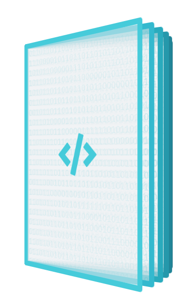

# Bevezető

Ennek a könyvnek a célja, hogy a Számalk-Szalézi Szakgimnázium Kiadványszerkesztő Technikus szakos hallgatóinak jegyzeteket biztosítson az órai gyakorlatok, és előadások mellett a Digitális kiadványok tantárgyban.












Erre a könyvre a [**Creative Commons CC BY 4.0**](https://creativecommons.org/licenses/by/4.0/deed.hu) **licenc** vonatkozik.



Ez a könyv elérhető a [Github](https://github.io)-on, az alábbi linken: [https://github.com/vargaLaszlo/digitalis-kiadvanyok](https://github.com/vargaLaszlo/digitalis-kiadvanyok)



**Offline verzió letöltésézez** a jobb oldali menüből az `Export as PDF` menüpontot kell választani \(Entire space\).


