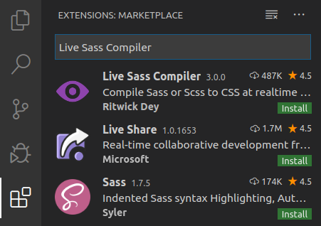
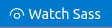
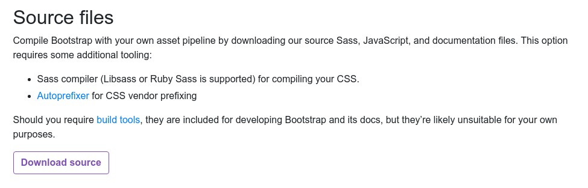
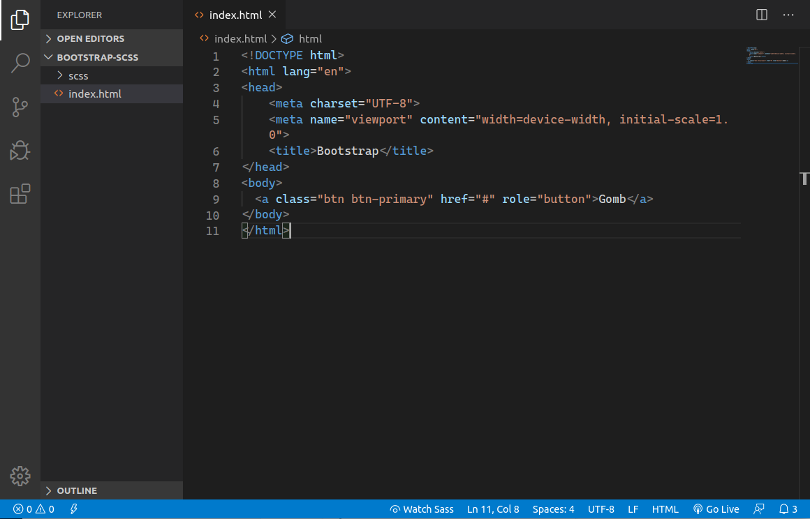
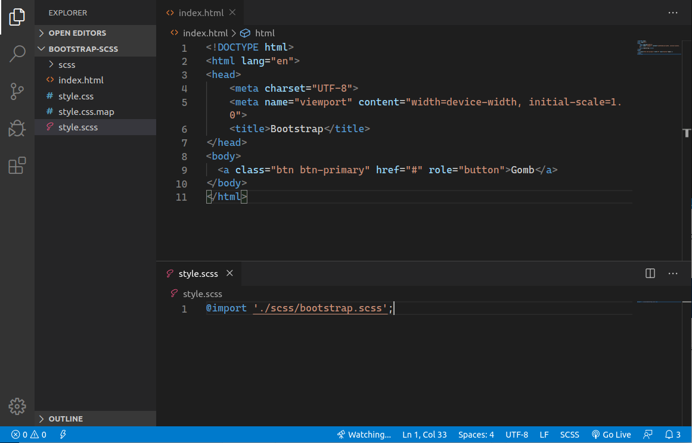
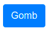
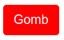

# Egyedi megjelenés

A Bootstrap-nek módosíthatjuk a beállításait, így tudunk egyedi megjelenést biztosítani a felhasználói felületeknek, a számos lehetőség közül például használhatunk egyedi színeket, betűtípust, vagy módosíthatjuk a modulháló beállításait.

## Stílus forrásállományok fordítása

Ahhoz hogy érvényesíteni tudjuk a beállításainkat, a Bootstrap stílusait az Sass forrás állományaiból kell fordítanunk, ezt rendeszerint egy fejlesztői keretrendszerrel végezzük, de lehetőség van erre a Visual Studio Code-ban is egy bővítmény segítségével. Ehhez töltsük le a _Live Sass Compiler_ bővítményt:



Telepítéshez nyissuk meg a Visual Studio Code bővítmény kezelőjét \(Extensions\), és a keresőbe írjuk be a bővítmény nevét \(_Live Sass Compiler_ \).



A találati listában a bővítmény neve mellett nyomjuk meg az `Install` gombot. Telepítés után a következő elem jelenik meg a Visual Studio Code láblécén:



Erre a gombra kattintva a Visual Studio Code le fogja fordítani CSS állományra az SCSS forrás állományokat.


A **Sass** a CSS nyelvi lehetőségeit bővíti ki dinamikus funkciókkal, amik jellemzően programozási nyelvekben találhatóak meg, például változók, ciklusok, adat struktúrák. Bővebben erről az eszközről a Sass honlapján olvashatunk: [https://sass-lang.com](https://sass-lang.com/)


## Bootstrap forrás állományok bekötése

A forrás állományokat a Bootstrap letöltés oldalán találjuk:



Kattintsunk a _Download Source_ gombra:



Egy tömörített zip állomány fog letöltődni, amit tömörítsünk ki. Csak az `scss` almappára és teljes tartalmára van szükségünk, ezt helyezzük el a HTML állomány mellett, amiben alkalmazni akarjuk:



Hozzunk létre egy **style.scss** nevű állományt, amibe behívjuk a Bootstrap forrását \(az `scss` mappában található bootstrap.scss állományt kell hivatkozni\):


```css
@import 'scss/bootstrap.scss';
```


Ha elmentettük az állományt, és megnyomjuk a _Watch Sass_ gombot, a Visual Studio Code legyártja a CSS állományunkat:



Végül be kell kötnünk a HTML állományba a legyártott CSS állományt, egy szokásos link segítségével, amit helyezzünk el a HTML állomány fejlécében:

```markup
<link rel="stylesheet" href="style.css">
```

Ha mindent jól csináltunk, és megnyitjuk az állományunkat egy böngészőben, a Bootstrap komponensei megkapják az alapértelmezett Bootstrap stílusokat. A  gomb elem például a következő képpen fog kinézni:

```markup
<a class="btn btn-primary" href="#" role="button">Gomb</a>
```



## Egyedi beállítások alkalmazása

A Bootstrap beállításait az `scss` mappában a **\_variables.scss** állományban találjuk, ezt direkt módon nem módosítjuk, mert fölül tudjuk írni a beállításait a saját **style.scss** állományunkban, a `@import` előtt. Például megváltoztathatjuk az elsődleges \(primary\) színt:


```css
$primary: red !default;

@import './scss/bootstrap.scss';
```


Fordítás után ez megváltoztatja többek között a gombunk színét is a korábbi kékről vörösre:



Minden beállítás változókban van tárolva ezek mindíg `$` jellel kezdődnek az scss állományokban, az új érték után el kell helyezni egy `!default` kapcsolót ez felülírja a később bekötött Bootstrap beállítás értékét. 

### Példák további beállításokra

#### Alapértelmezett betűtípus felülírása 

Ebben a példában egy Google betűkészlettel írjuk felül az alapértelmezett fontot:




```css
$font-family-base: 'Open Sans', sans-serif !default;

@import './scss/bootstrap.scss';
```




```markup
<!DOCTYPE html>
<html lang="en">
<head>
    <meta charset="UTF-8">
    <meta name="viewport" content="width=device-width, initial-scale=1.0">
    <title>Bootstrap - Open Sans</title>
    <link
        href="https://fonts.googleapis.com/css?family=Open+Sans&display=swap"
        rel="stylesheet">
    <link rel="stylesheet" href="style.css">
</head>
<body>
  <a class="btn btn-primary m-5" href="#" role="button">Gomb</a>
</body>
</html>
```



Ahhoz, hogy a font betöltődjön be kell kötni a HTML állományba.

#### Modulháló beállításainak módosítása

A következő példában a Bootstrap modulháló oszlopainak a számát 12-ről 16-ra módosítjuk, az oszlopok közötti csatornák \(gutter\) szélességét 30 pixelről 20 pixelre csökkentjük:

```css
$grid-columns:                16 !default;
$grid-gutter-width:           20px !default;

@import './scss/bootstrap.scss';
```

## Példa állományok

Az alábbi linken a fenti példa HTML és SCSS állományok letölthetőek:



