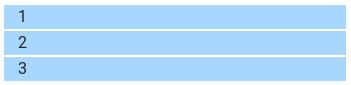

# Grid rendszer

## Konténer - container

Bár az előző fejezetben taglalt konténer elem önmagában grid nélkül is alkalmazható, a grid rendszer használatához szükséges, ugyanis grid rendszer csak konténer elemben veszi fel az oldalsó eltartásokat, ennek hiányában a böngésző lap széléhez fognak érni az elemeink.

Konténer elemet a `container`, vagy `container-fluid` osztállyal tudunk létrehozni:

```markup
<div class="container">
  ...
</div>
```

## Sor - row

A sor elem fogja össze a modulháló oszlopait, benne rendeződnek beállításaiknak megfelelő szélességű cellákra.

Sor elemet a `row` osztállyal tudunk létrehozni, és jellemzően a sorokat közvetlenül konténer elemekben helyezzük el:

```markup
<div class="container">
    <div class="row">
        ...
    </div>
</div>
```

## Oszlop - column

### Automatikus oszlopméretezés \(auto layout\)

A modulháló oszlopait a `col` osztállyal hozhatjuk létre, és közvetlenül egy sor elemben kell elhelyezni őket:

```markup
<div class="container">
    <div class="row">
        <div class="col">
            Első oszlop
        </div>
        <div class="col">
            Második oszlop
        </div>
        <div class="col">
            Harmadik oszlop
        </div>
    </div>
</div>
```

A `col` osztállyal létrehozott oszlopok sorba rendeződnek, egyenlő arányban töltik ki a rendelkezésre álló helyet:


A következő példában különböző számú oszlopokat tartalmazó sorokat hasonlíthatunk:

```markup
<div class="container">
    <!-- Egy oszlopos sor -->
    <div class="row">
        <div class="col">1</div>
    </div>
    
    <!-- Két oszlopos sor -->
    <div class="row">
        <div class="col">1</div>
        <div class="col">2</div>
    </div>
    
    <!-- Öt oszlopos sor -->
		<div class="row">
        <div class="col">1</div>
        <div class="col">2</div>
        <div class="col">3</div>
        <div class="col">4</div>
        <div class="col">5</div>
    </div>
</div>
```


### Rögzített oszlop méretek

A Grid rendszerben lehetőség van egy 12 oszlopos modulhálónak megfeleltetni az oszlopokat szélességben, ezt a `col-x` osztályokkal tehetjük meg, ahol az x helyére az elfoglalt oszlopok száma kerül. Ez alapján a `col-1` egy oszlop széles, ez a legkisebb oszlop méret, a `col-12` pedig a legnagyobb oszlopméret, ami a teljes rendelkezésre álló helyet kitölti.  Például ha 3 egyforma széles oszlopot szeretnénk egymás mellett megjeleníteni mindegyiken a `col-4` osztályt kell alkalmaznunk \(12/3=4\):

```markup
<div class="container">
		<div class="row">
				<div class="col-4">col-4</div>
				<div class="col-4">col-4</div>
				<div class="col-4">col-4</div>
		</div>
</div>
```


Egy soron belül az oszlop méreteket kombinálhatjuk:

```markup
<div class="container">
	<div class="row">
		<div class="col-6">col-6</div>
		<div class="col-4">col-4</div>
		<div class="col-2">col-2</div>
	</div>
</div>
```


### Reszponzív oszlopok

Az oszlopok beállításait **képernyő felbontástól függően befolyásolhatjuk**, böngésző ablak szélességétől függően adhatunk meg az oszlopainknak külőnböző méretet:

| Képernyő tartomány | Rövidítés | Képernyő szélesség |
| :--- | :---: | :--- |
| Alapértelmezett |  | 0 - ∞ |
| Kicsi \(small\) | `sm` | nagyobb vagy egyenlő mint **576 pixel** |
| Közepes \(medium\) | `md` | nagyobb vagy egyenlő mint **768 pixel** |
| Nagy \(large\) | `lg` | nagyobb vagy egyenlő mint **992 pixel** |
| Óriás \(extra large\) | `xl` | nagyobb vagy egyenlő mint **1200 pixel** |

Ahogy megfigyeljük minden mérettartomány egy fix értéken és a fölött lép érvénybe. 576 pixel \(kicsi\) felbontás alatt az alapértelmezett érték érvényesül, így ezt érdemes mindíg beállítani. Ha egy adott tartományra nem adunk meg értéket, az annál kisebb, vagy az alapértelmezett beállítás fog érvényesülni.

`col-` osztály után fűzve a mérettartomány rövidítését lépésenként tudjuk beállítani az adott oszlopot:

| Alapértelmezett | Kicsi | Közepes | Nagy | Óriás |
| :--- | :--- | :--- | :--- | :--- |
| `.col-` | `.col-sm-` | `.col-md-` | `.col-lg-` | `.col-xl-` |

A következő példában az oszlopaink szélessége legkisebb képernyő méreten \(mobil\) teljes képernyő szélesség, kicsi képernyő méreten \(tablet\) fél képernyő szélesség, közepes képernyő méreten egyharmad képernyő szélesség, és így tovább, ahogy növekszik a képernyő méret egyre több elem fér el egymás mellett:

```markup
<div class="container">
    <div class="row">
        <div class="col-12 col-sm-6 col-md-4 col-lg-3 col-xl-2">1</div>
        <div class="col-12 col-sm-6 col-md-4 col-lg-3 col-xl-2">2</div>
        <div class="col-12 col-sm-6 col-md-4 col-lg-3 col-xl-2">3</div>
        <div class="col-12 col-sm-6 col-md-4 col-lg-3 col-xl-2">4</div>
        <div class="col-12 col-sm-6 col-md-4 col-lg-3 col-xl-2">5</div>
        <div class="col-12 col-sm-6 col-md-4 col-lg-3 col-xl-2">6</div>
    </div>
</div>
```

Legjellemzőbb használat, hogy az elemeinket mobilon függőlegesen rendezzük, egyébként meg egymás mellett vízszintesen:

```markup
<div class="container">
    <div class="row">
        <div class="col-12 col-md-4">1</div>
        <div class="col-12 col-md-4">2</div>
        <div class="col-12 col-md-4">3</div>
    </div>
</div>
```




