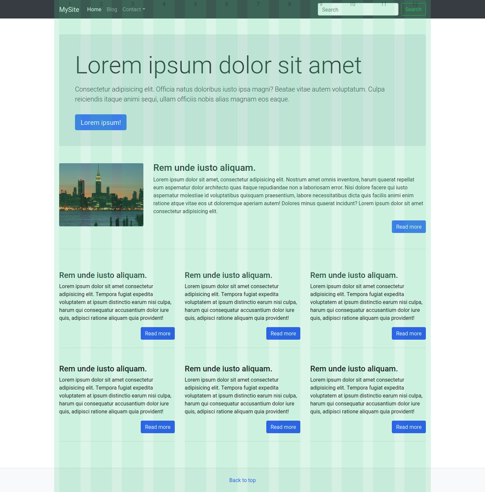

# Kezdő lépések

## Bootstrap beágyazása külső szolgáltatótól \(CDN\)

A bootstrap külső szolgáltatónál elhelyezett **CSS** állományát egyszerűen beemelhetjük HTML állományainkba egy **link** segítségével \(ezt a HTML dokumentum fejlécében kell elhelyezni\):

```markup
<link rel="stylesheet" href="https://stackpath.bootstrapcdn.com/bootstrap/4.4.1/css/bootstrap.min.css" integrity="sha384-Vkoo8x4CGsO3+Hhxv8T/Q5PaXtkKtu6ug5TOeNV6gBiFeWPGFN9MuhOf23Q9Ifjh" crossorigin="anonymous">
```

Egyes interaktív szolgálltatások eléréséhez szükség van a bootstrap javaScript állományára is, ehez a kövelkező 3 sort el kell helyezni a HTML állomány lezáró body eleme előtt:

```markup
<script src="https://code.jquery.com/jquery-3.4.1.slim.min.js" integrity="sha384-J6qa4849blE2+poT4WnyKhv5vZF5SrPo0iEjwBvKU7imGFAV0wwj1yYfoRSJoZ+n" crossorigin="anonymous"></script>
<script src="https://cdn.jsdelivr.net/npm/popper.js@1.16.0/dist/umd/popper.min.js" integrity="sha384-Q6E9RHvbIyZFJoft+2mJbHaEWldlvI9IOYy5n3zV9zzTtmI3UksdQRVvoxMfooAo" crossorigin="anonymous"></script>
<script src="https://stackpath.bootstrapcdn.com/bootstrap/4.4.1/js/bootstrap.min.js" integrity="sha384-wfSDF2E50Y2D1uUdj0O3uMBJnjuUD4Ih7YwaYd1iqfktj0Uod8GCExl3Og8ifwB6" crossorigin="anonymous"></script>
```

Amennyiben nem használunk interaktív elemeket, mint például a felugró ablakok, vagy lenyíló menük, akkor nem szükséges beemelni a JavaScript állományokat.

A következő példa dokumentumba be van emelve az összes **CSS** és **JavaScript** állomány:


```markup
<!DOCTYPE html>
<html lang="en">
<head>
    <meta charset="UTF-8">
    <meta name="viewport" content="width=device-width, initial-scale=1.0">
    <meta http-equiv="X-UA-Compatible" content="ie=edge">
    <title>Bootstrap CDN</title>
    <link rel="stylesheet" href="https://stackpath.bootstrapcdn.com/bootstrap/4.4.1/css/bootstrap.min.css" integrity="sha384-Vkoo8x4CGsO3+Hhxv8T/Q5PaXtkKtu6ug5TOeNV6gBiFeWPGFN9MuhOf23Q9Ifjh" crossorigin="anonymous">
</head>
<body>
    <div class="container">
        <div class="jumbotron my-3">
            <h1>Hello Bootstrap!</h1>
        </div>
    </div>

    <script src="https://code.jquery.com/jquery-3.4.1.slim.min.js" integrity="sha384-J6qa4849blE2+poT4WnyKhv5vZF5SrPo0iEjwBvKU7imGFAV0wwj1yYfoRSJoZ+n" crossorigin="anonymous"></script>
    <script src="https://cdn.jsdelivr.net/npm/popper.js@1.16.0/dist/umd/popper.min.js" integrity="sha384-Q6E9RHvbIyZFJoft+2mJbHaEWldlvI9IOYy5n3zV9zzTtmI3UksdQRVvoxMfooAo" crossorigin="anonymous"></script>
    <script src="https://stackpath.bootstrapcdn.com/bootstrap/4.4.1/js/bootstrap.min.js" integrity="sha384-wfSDF2E50Y2D1uUdj0O3uMBJnjuUD4Ih7YwaYd1iqfktj0Uod8GCExl3Og8ifwB6" crossorigin="anonymous"></script>
</body>
</html>
```


## Bootstrap bemelése a HTML állomány mellé

A Bootstrap állományait direkt módon beemelhetjük a HTML állományaink mellé. Ehez [töltsük le](https://getbootstrap.com/docs/4.4/getting-started/download/) a Bootstrap csomagot, a kapott zip állományt kicsomagolva igény szerint helyezzük el a HTML állomány mellett a CSS állományokat és ha szükséges a Javascritp állományokat is.

A **CSS** állomány bekötéséhez a HTML dokumentum fejlécében helyezzünk el egy **link**-et:

```markup
<link rel="stylesheet" href="css/bootstrap.min.css">
```

Válasszuk a `bootstrap.min.css` elnevezésű állományt, ez ez összes szolgáltatást tartalmazza, és a tömörített formátumú.

A **JavaScript** állományok beemeléséhez a Bootstrap állományain kívül szükséges a **jQuery** keretrendszer, és a **popper.js** felugró ablak kezelő is. Az összes JavaScript állományt helyezzük el a html dokumentum mellett \(a bootstrap js mappája erre megfelel\), és a body elem záró része előtti sorban helyezzük el a következő 3 hivatkozást:

```markup
<script src="js/jquery-3.4.1.min.js"></script>
<script src="js/popper.min.js"></script>
<script src="js/bootstrap.min.js"></script>
```

A következő példa dokumentumba be van emelve az összes CSS és JavaScript állomány:


```markup
<!DOCTYPE html>
<html lang="en">
<head>
    <meta charset="UTF-8">
    <meta name="viewport" content="width=device-width, initial-scale=1.0">
    <meta http-equiv="X-UA-Compatible" content="ie=edge">
    <title>Bootstrap CDN</title>
    <link rel="stylesheet" href="css/bootstrap.min.css">
</head>
<body>
    <div class="container">
        <div class="jumbotron my-3">
            <h1>Hello Bootstrap!</h1>
        </div>
    </div>

    <script src="js/jquery-3.4.1.min.js"></script>
    <script src="js/popper.min.js"></script>
    <script src="js/bootstrap.min.js"></script>
</body>
</html>
```


Bootstrap 4 letöltés link: [https://getbootstrap.com/docs/4.4/getting-started/download/](https://getbootstrap.com/docs/4.4/getting-started/download/)  
jQuery letöltés link: [https://jquery.com/download/](https://jquery.com/download/)  
Popper.js letöltés link: [https://cdn.jsdelivr.net/npm/popper.js@1.16.0/dist/umd/popper.min.j](https://cdn.jsdelivr.net/npm/popper.js@1.16.0/dist/umd/popper.min.js)


Az alábbi linken a fenti HTML dokumentum, és az összes hivatkozott állomány egyben letölthető: [https://www.dropbox.com/s/68s19gm5puw13nt/bootstrap.zip?dl=0](https://www.dropbox.com/s/68s19gm5puw13nt/bootstrap.zip?dl=0)


## Hasznos eszközök

### Bootstrap témák

A Bootstrap keretrendszer könnyen témázható, mi is létre tudunk belőle hozni egyedi témát, ehhez a Bootstrap forrásállományait szükséges szerkeszteni. A forrásállományok szerkesztése haladó nehézségű feladat, szerencsér elérhetőek előre elkészített színsémák a Bootswatch.com weboldalon a témák menüpontban.

A téma használatba vételéhez töltsük le a témához kapcsolódó bootstrap.min.css állományt, és kössük be a HTML állományunkba.



### Bootstrap Modulháló Chrome böngészőhöz

Ezzel az eszközzel a bootstrap modulhálóját jeleníthetjük meg a Chrome böngészőben, ami könnyíti a felület kialakítását.





### Bootstrap kódkiegészítő VScode bővítmény

A Visual Studio Code alapból nem kezeli a Bootstrap kód részleteket, ezzel a bővítménnyel elérhetővé válnak a Bootstrap HTML struktúrái a `b4` kulcsszóra.




