# Komponensek

A Bootstrap komponensei előre elkészített felhasználói felület darabkák, rendszerint egy kötött formátumú HTML struktúrából állnak, amire a Bootstrap CSS stílusai, és adott esetben a Bootstrap JavaScript hatással van.

Ebben a fejezetben bemutatásra kerülő komponensek a legjellemzőbben használtak közül lettek kiválogatva, bővebben a komponensekről az alábbi linken olvashatunk: 



## Média elem

A média elem segítségével képet helyezhetünk el egy cím és a hozzá tartozó bekezdés\(-ek\) mellett. Jellemző felhasználása blog, vagy hír lista.

```markup
<div class="media">
  
  <div class="media-body">
    <h3 class="mt-n1">Indiai futókacsa</h3>
    A házikacsa (Anas platyrhynchos domestica) a récefélék családjába
    tartozó baromfi, a tőkés réce (vadkacsa) alfaja, háziasított változata.
    Többnyire fehér színben tenyésztik, de egyes vidékeken, különösen ott,
    ahol vadon élő őseivel könnyen kereszteződhet „vad” színezetű
    példányokat is találunk.
  </div>
</div>
```

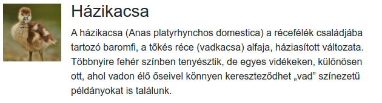

A kép és a szöveges tartalom megcserélésével vízszintesen tudjuk rendezni az elemeket:

```markup
<div class="media">
  <div class="media-body">
    <h3 class="mt-n1">Indiai futókacsa</h3>
    A házikacsa (Anas platyrhynchos domestica) a récefélék családjába
    tartozó baromfi, a tőkés réce (vadkacsa) alfaja, háziasított változata.
    Többnyire fehér színben tenyésztik, de egyes vidékeken, különösen ott,
    ahol vadon élő őseivel könnyen kereszteződhet „vad” színezetű
    példányokat is találunk.
  </div>
  
</div>
```

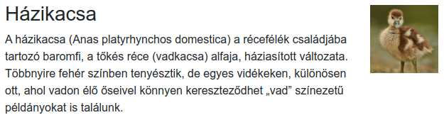

Média elemről bővebben:



## Kártya

A kártyákban különböző tartalmakat helyezhetünk el, például képet a tetején vagy az alján a `card-img-bottom` és `card-img-top` osztályokkal \(ezt a képen kell elhelyezni\).

```markup
<div class="card" style="width: 18rem;">
  
  <div class="card-body">
    <h3 class="card-title">Házikacsa</h3>
    <p class="card-text">A házikacsa (Anas platyrhynchos domestica) a récefélék családjába tartozó baromfi, a tőkés réce (vadkacsa) alfaja, háziasított változata...</p>
    <a href="#" class="btn btn-primary">Réce rendelés</a>
  </div>
</div>
```

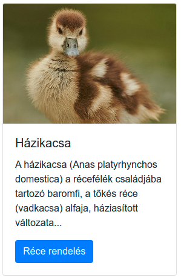

A kártyában elhelyezett `card-body` osztályú elem gondoskodik az elemek eltartásáról: 

```markup
<div class="card" style="width: 18rem;">
  <div class="card-body">
    
    <h5 class="card-title">Házikacsa</h5>
    <p class="card-text">A házikacsa (Anas platyrhynchos domestica) a récefélék családjába tartozó baromfi, a tőkés réce (vadkacsa) alfaja, háziasított változata...</p>
    <a href="#" class="btn btn-primary">Réce rendelés</a>
  </div>
</div>
```

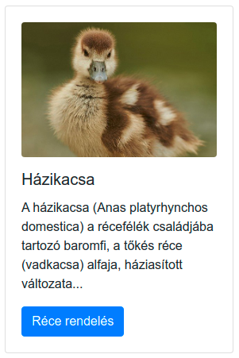

A kártyákban el lehet helyezni előre formázott listákat, ezekből  függőleges navigációs menü szervezhető: 

```markup
<div class="card" style="width: 18rem;">
    <div class="card-header font-weight-bold">
        Kacsaféléink
    </div>
    <ul class="list-group list-group-flush">
        <li class="list-group-item"><a href="#">Házikacsa</a></li>
        <li class="list-group-item"><a href="#">Indiai futókacsa</a></li>
        <li class="list-group-item"><a href="#">Tőkés kacsa</a></li>
    </ul>
</div>
```

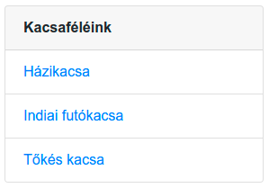

Kártyáról bővebben:



## Jumbotron

A Jumbotron, vagy marketink banner a weboldalunk nyitó eleme, méretéből kifolyólag szöveges vagy képi tartalmára irányítja a látogató tekintetét.

```markup
<div class="jumbotron">
   <h1 class="display-4">Üdvözöljük honlapunkon</h1>
   <p class="lead">Lorem ipsum, dolor sit amet consectetur adipisicing 
   elit. Autem deleniti eos possimus.</p>
   <hr class="my-4">
   <p>Lorem ipsum dolor sit amet consectetur, adipisicing elit. Animi
   eos numquam eius expedita eligendi rerum, exercitationem consequuntur
   voluptatem aut quisquam?</p>
   <a class="btn btn-primary btn-lg" href="#">Olvasson tovább</a>
 </div>
```

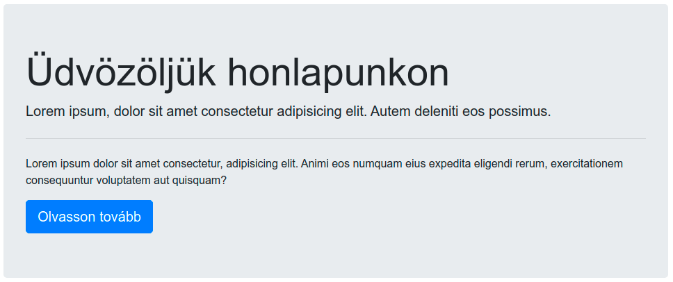

A Jumbotronnak van egy széles \(faltól falig érő\) változata. ezt a `jumbotron-fluid` osztállyal hozzuk létre.

```markup
<div class="jumbotron jumbotron-fluid">
    <div class="container">
        <h1 class="display-4">Üdvözöljük honlapunkon</h1>
        <p class="lead">Lorem ipsum, dolor sit amet consectetur
        adipisicing elit. Autem deleniti eos possimus.</p>
        <hr class="my-4">
        <p>Lorem ipsum dolor sit amet consectetur, adipisicing
        elit. Animi eos numquam eius expedita eligendi rerum,
        exercitationem consequuntur voluptatem aut quisquam?</p>
        <a class="btn btn-primary btn-lg" href="#">Olvasson tovább</a>
    </div>
</div>
```

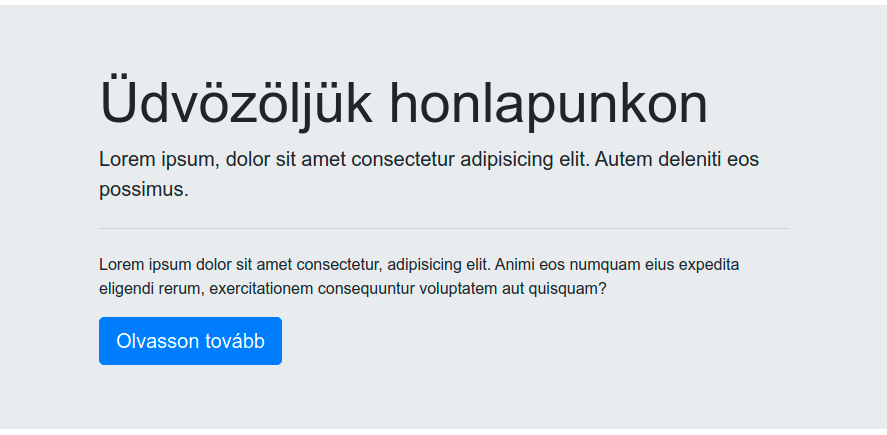

Jumbotronról bővebben:



## Navigációs sáv

A navigációs sáv \(navbar\) egy Bootstrapban készült alkalmazás, vagy weblap fejléce. Tartalmazza a szokásos fejléc elemeket, például a logót, menüt, kereső mezőt. A navigációs sáv a Bootstrap egyik leg összetettebb komponense:

```markup
<nav class="navbar navbar-expand-lg navbar-light bg-light">
  <a class="navbar-brand" href="#">Navbar</a>
  <button class="navbar-toggler" type="button" data-toggle="collapse" data-target="#navbarSupportedContent" aria-controls="navbarSupportedContent" aria-expanded="false" aria-label="Toggle navigation">
    <span class="navbar-toggler-icon"></span>
  </button>

  <div class="collapse navbar-collapse" id="navbarSupportedContent">
    <ul class="navbar-nav mr-auto">
      <li class="nav-item active">
        <a class="nav-link" href="#">Home <span class="sr-only">(current)</span></a>
      </li>
      <li class="nav-item">
        <a class="nav-link" href="#">Link</a>
      </li>
      <li class="nav-item dropdown">
        <a class="nav-link dropdown-toggle" href="#" id="navbarDropdown" role="button" data-toggle="dropdown" aria-haspopup="true" aria-expanded="false">
          Dropdown
        </a>
        <div class="dropdown-menu" aria-labelledby="navbarDropdown">
          <a class="dropdown-item" href="#">Action</a>
          <a class="dropdown-item" href="#">Another action</a>
          <div class="dropdown-divider"></div>
          <a class="dropdown-item" href="#">Something else here</a>
        </div>
      </li>
      <li class="nav-item">
        <a class="nav-link disabled" href="#" tabindex="-1" aria-disabled="true">Disabled</a>
      </li>
    </ul>
    <form class="form-inline my-2 my-lg-0">
      <input class="form-control mr-sm-2" type="search" placeholder="Search" aria-label="Search">
      <button class="btn btn-outline-success my-2 my-sm-0" type="submit">Search</button>
    </form>
  </div>
</nav>
```

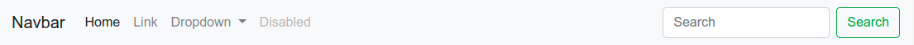

A következő példában a könnyebb áttekinthetőség miatt csak egy szintű menü, található:

```markup
<nav class="navbar navbar-expand-sm navbar-dark" style="background-color: #0ca678;">
    <a class="navbar-brand" href="#">Cég KFT.</a>
    <button class="navbar-toggler d-lg-none" type="button" data-toggle="collapse" data-target="#collapsibleNavId" aria-controls="collapsibleNavId"
        aria-expanded="false" aria-label="Toggle navigation"></button>
    <div class="collapse navbar-collapse" id="collapsibleNavId">
        <ul class="navbar-nav mr-auto mt-2 mt-lg-0">
            <li class="nav-item active">
                <a class="nav-link" href="#">Főoldal</a>
            </li>
            <li class="nav-item">
                <a class="nav-link" href="#">Termékek</a>
            </li>
            <li class="nav-item">
                <a class="nav-link" href="#">Kapcsolat</a>
            </li>
        </ul>
        <form class="form-inline my-2 my-lg-0">
            <input class="form-control mr-sm-2" type="text" placeholder="Keresés">
            <button class="btn btn-outline-light my-2 my-sm-0" type="submit">Keresés</button>
        </form>
    </div>
</nav>
```

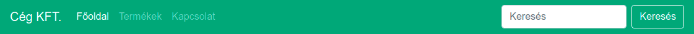

Bővebben a navigációs sávról:



## Gomb

A Bootstrap gomb komponense jelentéstartalomtól függő megjelenést biztosít a linkeknek \(`a`\), és a [gomb](../html/html-elemek.md#urlapok) elemeknek \(`button`\).

```markup
<a href="#" class="btn btn-primary">Elsődleges</a>
<a href="#" class="btn btn-secondary">Másodlagos</a>
<a href="#" class="btn btn-success">Siker</a>
<a href="#" class="btn btn-danger">Veszély</a>
<a href="#" class="btn btn-warning">Figyelmeztetés</a>
<a href="#" class="btn btn-info">Információs</a>
<a href="#" class="btn btn-light">Világos</a>
<a href="#" class="btn btn-dark">Sötét</a>
```

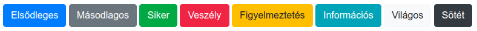

Használhatunk `a` vagy `button` elemet, a megjelenésük meg fog egyezni:

```markup
<a href="#" class="btn btn-primary">Én egy link vagyok</a>
<button type="button" href="#" class="btn btn-primary">Én egy gomb vagyok</button>
```

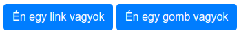

A `btn-sm` és a `btn-lg` CSS osztályokkal kis és nagy méretű gombokat tudunk létrehozni:

```markup
<a href="#" class="btn btn-primary btn-sm">Kis gomb</a>
<a href="#" class="btn btn-primary">Közepes gomb</a>
<a href="#" class="btn btn-primary btn-lg">Nagy gomb</a>
```

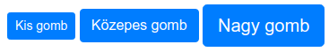

Gomb komponensről bővebben:




