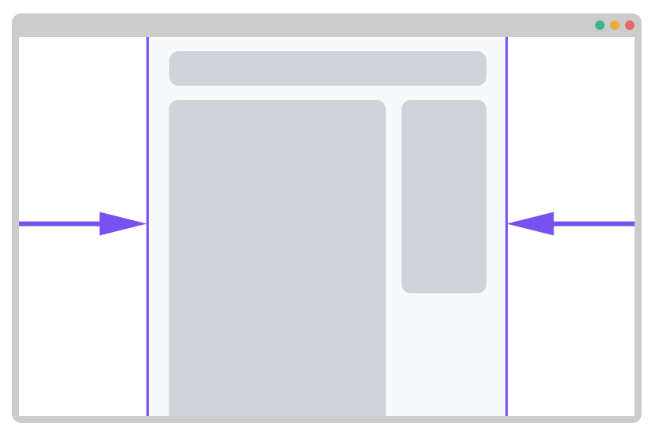

# Konténer elem

A Bootstrap rendelkezik egy konténer elemmel, ez a legalapvetőbb elem, ezen alapszik a Bootstrap modulháló rendszere a grid. 

A konténer elem felel a webes alkalmazásunk külső margójáért. 



Konténer elemet úgy tudunk létrehozni, hogy egy HTML elemen elhelyezünk egy `container` osztályt. Ez az elem rendszerint egy `div`, de más elemeken is használható a `container` osztály. 

```markup
<div class="container">
  <!-- Ide jön a középre zárt tartalom -->
</div>
```

Van egy alternatív változata, ami nem rendezi középre a tartalmat, viszont gondoskodik a jobb és bal oldali egységes eltartásról. Az alternatív konténert a `container-fluid` osztály hozza létre:  

```markup
<div class="container-fluid">
  <!-- Ide jön a középre zárt tartalom -->
</div>
```

