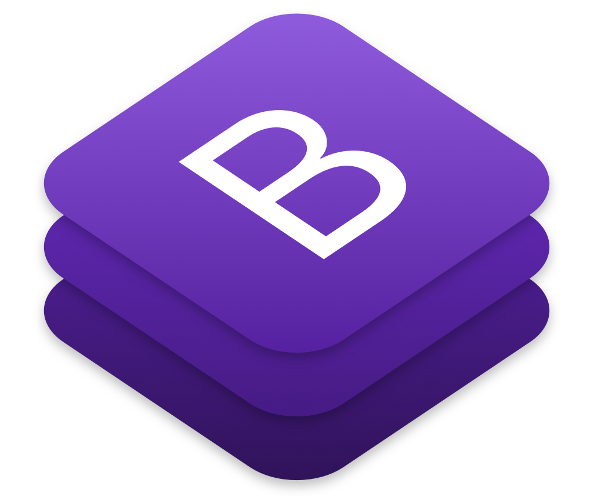

# Mi az a Bootstrap?

A [**Bootstrap**](https://getbootstrap.com) egy nyílt forráskódú, ingyenes [kliens oldali keretrendszer](../fueggelek/kliens-oldali-keretrendszerek.md).  A Twitter Inc. belső fejlesztésű rendszereként indult, 2011-ben nyilvánosan is elérhetővé tették. A jelenlegi 4-es verzió 2015-ben jelent meg. A Bootstrap számos előre elkészített felhasználói felület "darabkát" tartalmaz, úgymint navigációs menük, táblázatok, gombok, űrlapok, satöbbi ezek az úgynevezett komponensek. A komponensek jellemzően egy HTML kódrészletből, és a hozzá tartozó CSS stílus formázásból álnak, de egyes komponenseknek lehet javaScript része is. 

Bootstrap honlapja: [https://getbootstrap.com](https://getbootstrap.com)  
Bootstrap forráskódja a Github-on: [https://github.com/twbs/bootstrap](https://github.com/twbs/bootstrap)

