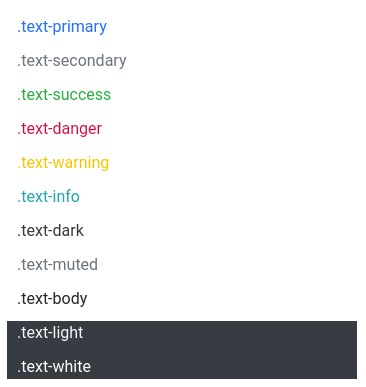
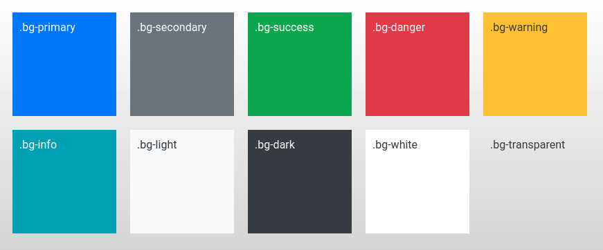
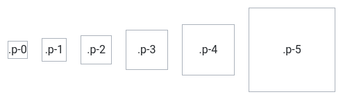
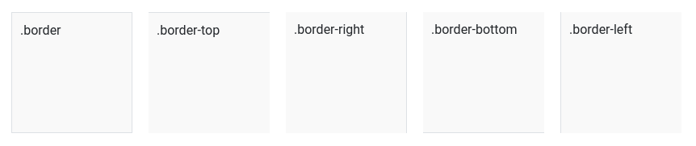

# Segédek

A segédek \(utilities\) CSS osztályok, amik segítségével egyszerű stílusokat tudunk alkalmazni a HTML elemeinkre, például be tudunk állítani nekik háttér vagy szövegszínt.

## Szövegszín

A szövegek színét a `text-` osztályokkal lehet beállítani a Bootstrap előre definiált szín palettájából:

| CSS osztály | megnevezés |
| :--- | :--- |
| `text-primary` | elsődleges szövegszín |
| `text-secondary` | másodlagos szövegszín |
| `text-success` | sikeres szövegszín |
| `text-danger` | veszélyes szövegszín |
| `text-warning` | figyelmeztető szövegszín |
| `text-info` | információs szövegszín |
| `text-light` | világos szövegszín |
| `text-dark` | sötét szövegszín |
| `text-body` | alapértelmezett szövegszín |
| `text-muted` | lehalkított szövegszín |
| `text-white` | fehér szövegszín |

Alapértelmezetten a szövegeink megkapják a `text-body` osztálynak megfelelő szövegszínt.

```markup
<p class="text-primary">.text-primary</p>
<p class="text-secondary">.secondary</p>
<p class="text-success">.text-success</p>
<p class="text-danger">.text-danger</p>
<p class="text-warning">.text-warning</p>
<p class="text-info">.text-info</p>
<p class="text-dark">.text-dark</p>
<p class="text-muted">.text-muted</p>
<p class="text-body">.text-body</p>
<div class="bg-dark">
	<p class="text-light">.text-light</p>
	<p class="text-white">.text-white</p>
</div>
```



A `text-light`, és a `text-white` csak sötét háttéren alkalmazható.

## Háttérszín

Az elemeknek a `bg-` osztályokkal lehet háttérszínt adni az előre definiált színkészletből.

| CSS osztály | megnevezés |
| :--- | :--- |
| `bg-primary` | elsődleges háttérszín |
| `bg-secondary` | másodlagos háttérszín |
| `bg-success` | sikeres háttérszín |
| `bg-danger` | veszélyes háttérszín |
| `bg-warning` | figyelmeztető háttérszín |
| `bg-info` | információs háttérszín |
| `bg-light` | világos háttérszín |
| `bg-dark` | sötét háttérszín |
| `bg-white` | fehér háttérszín |
| `bg-transparent` | átlátszó háttérszín |

A háttérszínt beállító segéd osztályok nem állítják be a szövegszínt, ezt adott esetben külön meg kell tennünk.



```markup
<div class="bg-primary text-white">.bg-primary</div>
<div class="bg-secondary text-white">.bg-secondary</div>
<div class="bg-success text-white">.bg-success</div>
<div class="bg-danger text-white">.bg-danger</div>
<div class="bg-warning text-dark">.bg-warning</div>
<div class="bg-info text-white">.bg-info</div>
<div class="bg-light text-dark">.bg-light</div>
<div class="bg-dark text-white">.bg-dark</div>
<div class="bg-white text-dark">.bg-white</div>
<div class="bg-transparent text-dark">.bg-transparent</div>
```



```css
div {
	float: left;
	margin: 10px;
	padding: 10px;
	width: 150px;
	height: 150px;
}
```





## Térközök

Az üres térközök a design, a megjelenés legalapvetőbb építőkockái közé tartoznak, így a Bootstrap is gazdag eszközkészletet biztosít a kezelésükre.

### Külső margó \(margin\)

A külső margó segítségével az elemeink közötti eltartást tudjuk beállítani. Ezt a `m-` osztályokkal tehetjük meg. A kötőjel után egy nullától ötig terjedő szám következik, ami a margó mértékét határozza meg. A nulla nem tesz ki margót, ezután ahogy növeljük az értéket úgy nő az elemek közötti eltartás:

```markup
<div class="m-0">Nincs margó</div>
<div class="m-1">Csekély margó</div>
<div class="m-2">Kis margó margó</div>
<div class="m-3">Közepes margó</div>
<div class="m-4">Nagy margó</div>
<div class="m-5">Hatalmas margó</div>
```

Az `m-` osztályokkal létrehozott külső margó minden irányban, így az elem fölött, alatt, jobbra, és balra is eltartást képez.

Megadhatjuk külön irányonként is az eltartás mértékét, az `mt-` az elem fölött, az `mr-` az elemtől jobbra, `mb-` az elem alatt, az `ml-` az elemtől balra képez külső eltartást. Tehetünk eltartást az elemtől jobbra és balra az `mx-`, illetve lentre és föntre az `m-y` osztályokkal. Ezekből többet is elhelyezhetünk az egyes elemeken, oldalanként külön állítva az eltartást.

| CSS ostály | angol megnevezés | magyar megnevezés |
| :--- | :--- | :--- |
| `m-` | margin | külső margó |
| `mt-` | margin top | felső külső margó |
| `mr-` | margin right | jobb külső margó |
| `mb-` | margin bottom | alsó külső margó |
| `ml-` | margin left | bal külső margó |
| `my-` | margin y | függőleges külső margó |
| `mx-` | margin x | vízszintes külső margó |

A következő példában egy elem felső eltartását, és oldalsó eltartását \(mindkét oldalon\) állítjuk be 2 osztállyal:

```markup
<div class="mt-3 mx-2">...</div>
```

### Belső margó \(padding\)

A külső margóhoz hasonlóan az elemek belső, a tartalom, és az elem széle közötti eltartást a `p-` osztályokkal szabályozzuk, a kötőjel után egy nullától ötig terjedő számmal, ami a belső margó mértékét határozza meg.  Nulla érték esetén az elemnek nem lesz belső margója, ahogy növeljük az értéket, úgy lesz egyre nagyobb a belső eltartás.

```markup
<div class="p-0">.p-0</div>
<div class="p-1">.p-1</div>
<div class="p-2">.p-2</div>
<div class="p-3">.p-3</div>
<div class="p-4">.p-4</div>
<div class="p-5">.p-5</div>
```



Az `p-` osztályokkal létrehozott belső margó minden irányban, így az elem tartalma fölött, alatt, jobbra, és balra is belső eltartást képez.

Megadhatjuk külön irányonként is a belső eltartás mértékét, a `pt-` az elem tetején, a `pr-` az elem jobb oldalán, a `pb-` az elem alján, a `pl-` az elem bal oldalán képez belső eltartást. Tehetünk belső margót az elem jobb és bal oldalán a `px-`, illetve alján és tetején a `py-` osztályokkal. Ezekből többet is elhelyezhetünk az egyes elemeken, oldalanként külön állítva a belső margót.

| CSS ostály | angol megnevezés | magyar megnevezés |
| :--- | :--- | :--- |
| `p-` | padding | belső margó |
| `pt-` | margin top | felső belső margó |
| `pr-` | margin right | jobb belső margó |
| `pb-` | margin bottom | alsó belső margó |
| `pl-` | margin left | bal belső margó |
| `py-` | margin y | függőleges belső margó |
| `px-` | margin x | vízszintes belső margó |

A következő példában egy elem felső, és jobb oldali belső margóját állítjuk be 2 osztállyal:

```markup
<div class="mt-1 mr-2">...</div>
```

## Keret \(border\)

Keretet adhatunk a HTML elemeknek a `border` osztállyal, ebben az esetben az elem mind a négy oldalán megjelenik a keret. Külön-külön oldalanként is megadhatjuk a keretet a `border-top`, `border-right`, `border-bottom`, és a `border-left` osztályokkal \(ezekből többet is megadhatunk egy elemnek\).



```markup
<div class="border">.border</div>
<div class="border-top">.border-top</div>
<div class="border-right">.border-right</div>
<div class="border-bottom">.border-bottom</div>
<div class="border-left">.border-left</div>
```



```css
div {
	width: 150px;
	height: 150px;
	float: left;
	margin: 10px;
	padding: 10px;
	background-color: #f9f9f9;
}
```





### Keret színek

Az elemek keretszíne a `border-` osztályokkal állítható az előre definiált színpaletta alapján:

| CSS osztály | megnevezés |
| :--- | :--- |
| `border-primary` | elsődleges keretszín |
| `border-secondary` | másodlagos keretszín |
| `border-success` | sikeres keretszín |
| `border-danger` | veszélyes keretszín |
| `border-warning` | figyelmeztető keretszín |
| `border-info` | információs keretszín |
| `border-light` | világos keretszín |
| `border-dark` | sötét keretszín |
| `border-white` | fehér keretszín |



```markup
<div class="border border-primary">.border-primary</div>
<div class="border border-secondary">.border-secondary</div>
<div class="border border-success">.border-success</div>
<div class="border border-danger">.border-danger</div>
<div class="border border-warning">.border-warning</div>
<div class="border border-info">.border-info</div>
<div class="border border-light">.border-light</div>
<div class="border border-dark">.border-dark</div>
<div class="border border-white">.border-white</div>
```



```css
div {
	width: 150px;
	height: 150px;
	float: left;
	margin: 10px;
	padding: 10px;
	background-color: #F5F5F5;
}
```




