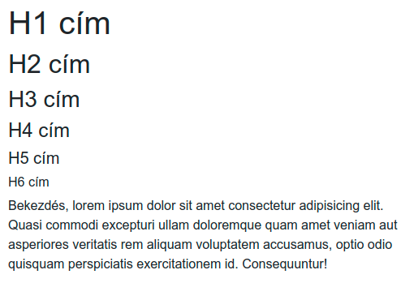
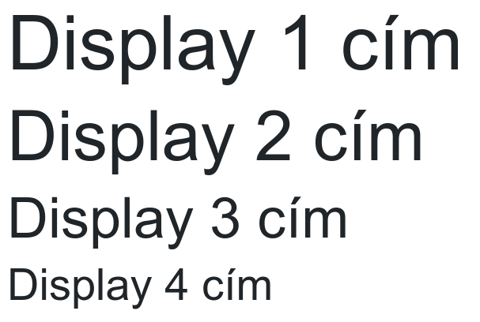
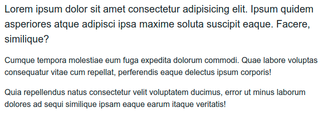
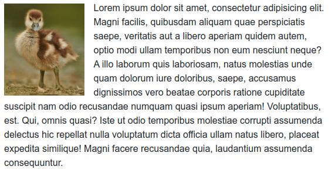
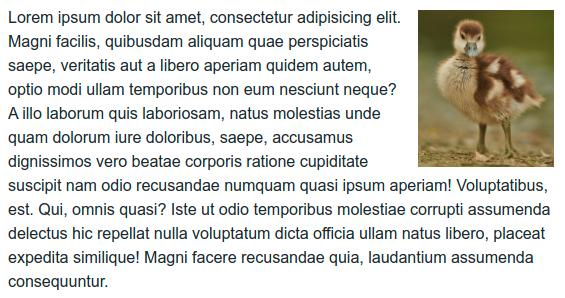
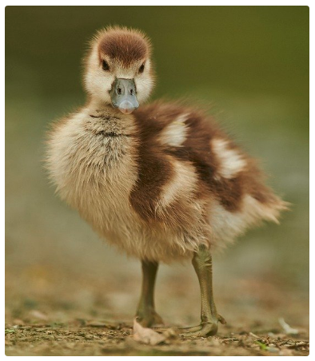

# Tartalmak

### Tipográfia

A Bootstrap a HTML elemeket előformázza, a szöveges tartalmakat egy [natív fontkészlettel](https://getbootstrap.com/docs/4.4/content/reboot/#native-font-stack) látja el, minden operációs rendszernek a megfelelő rendszer fontkészletét töltve be. 

```markup
<h1>H1 cím</h1>
<h2>H2 cím</h2>
<h3>H3 cím</h3>
<h4>H4 cím</h4>
<h5>H5 cím</h5>
<h6>H6 cím</h6>
<p>Bekezdés, lorem ipsum dolor sit amet consectetur
adipisicing elit. Quasi commodi excepturi ullam
doloremque quam amet veniam aut asperiores veritatis
rem aliquam voluptatem accusamus, optio odio quisquam
perspiciatis exercitationem id. Consequuntur!</p>
```



A megszokott címeken kívül lehetőség van nagy fontméretű, kiemelt címeket is használni, a `display-1`, `display-2`, `display-3`, `display-4` CSS osztályokkal:

```markup
<h1 class="display-1">Display 1 cím</h1>
<h1 class="display-2">Display 2 cím</h1>
<h1 class="display-3">Display 3 cím</h1>
<h1 class="display-4">Display 4 cím</h1>
```



Hasonlóan a címekhez, a bekezdéseknek is van egy kiemelt verziója, amit a `lead` osztállyal hozunk létre. A példában csak az első bekezdésre tesszük rá:

```markup
<p class="lead">Lorem ipsum dolor sit amet consectetur
adipisicing elit. Ipsum quidem asperiores atque adipisci
ipsa maxime soluta suscipit eaque. Facere, similique?</p>
<p>Cumque tempora molestiae eum fuga expedita dolorum
commodi. Quae labore voluptas consequatur vitae cum
repellat, perferendis eaque delectus ipsum corporis!</p>
<p>Quia repellendus natus consectetur velit voluptatem
ducimus, error ut minus laborum dolores ad sequi simi
ique ipsam eaque earum itaque veritatis!</p>
```



### Képek

#### Reszponzív képek

Reszponzív, környezetéhez adaptálódó méretű képet az `img-fluid` CSS osztállyal tudunk készíteni:

```markup

```

Ezek a képek nem nyomják szét a szülő elemüket, autómatikusan felveszik a rendelkezésre álló helyet szélességben.

#### Képek úsztatása szövegben

Kép szövegbe ágyazását a `float left`, és a `float-right` CSS osztályok teszik lehetővé:

```markup
<p>
Lorem ipsum dolor sit amet, consectetur adipisicing elit. Magni facilis, 
quibusdam aliquam quae perspiciatis saepe, veritatis aut a libero aperiam
quidem autem, optio modi ullam temporibus non eum nesciunt neque? A illo
laborum quis laboriosam, natus molestias unde quam dolorum iure doloribus,
saepe, accusamus dignissimos vero beatae corporis ratione cupiditate suscipit
nam odio recusandae numquam quasi ipsum aperiam! Voluptatibus, est. Qui,
omnis quasi? Iste ut odio temporibus molestiae corrupti assumenda delectus
hic repellat nulla voluptatum dicta officia ullam natus libero, placeat
expedita similique! Magni facere recusandae quia, laudantium assumenda conseq 
uuntur.</p>

<p>
Lorem ipsum dolor sit amet, consectetur adipisicing elit. Magni facilis, 
quibusdam aliquam quae perspiciatis saepe, veritatis aut a libero aperiam
quidem autem, optio modi ullam temporibus non eum nesciunt neque? A illo
laborum quis laboriosam, natus molestias unde quam dolorum iure doloribus,
saepe, accusamus dignissimos vero beatae corporis ratione cupiditate suscipit
nam odio recusandae numquam quasi ipsum aperiam! Voluptatibus, est. Qui,
omnis quasi? Iste ut odio temporibus molestiae corrupti assumenda delectus
hic repellat nulla voluptatum dicta officia ullam natus libero, placeat
expedita similique! Magni facere recusandae quia, laudantium assumenda conseq 
uuntur.</p>
```





#### Kép lekerekített sarokkal

A kép sarkának lekerekítéséhez lássuk el egy `rounded` osztállyal:

```markup

```



