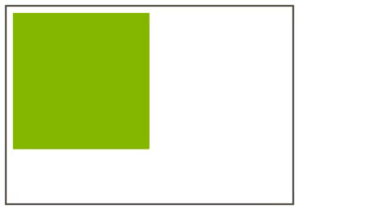

# Aránytartó téglalap, négyzet

A CSS alapesetben nem kínál fel lehetőséget arra, hogy oldal arányait rugalmasan, reszponzív módon tartó téglalapot, vagy négyzetet hozzunk létre. A szélesség meghatározására számos lehetőségünk van, ha rugalmas felületeket akarunk létrehozni, a százalékos szélesség megadás egy optimális lehetőség, de a magasságot nem lehet úgy százalékosan megadni, mint a szélességet.

Fix méretű négyzetet egyszerűen készíthetünk, ha a szélességét és magasságát pixelben adjuk meg:

```css
.square {
    width: 250px;
    height: 250px;
}
```


Ez nem egy reszponzív megoldás, és ha megpróbáljuk százalékos értékkel helyettesíteni a szélességet, és a magasságot, az elem magassága 0 lesz.

```css
.square {
    width: 50%;
    height: 50%; /* ez nem működik :( */
}
```

A magasság helyett használjuk a `padding-bottom` \(alsó belső margó\) tulajdonságot, az elem szélességével megegyező százalékos méretben.

```css
.square {
    width: 50%;
    padding-bottom: 50%;
}
```



Ha átméretezzük a böngésző ablakát a négyzet megtartja az arányait, és a böngésző ablak szélességétől függően méreteződik át.

Elegánsabb megoldás, ha álelemet használunk, ebben az esetben egyenlő arányú oldalaknál 100% `padding-bottom`-ot kell megadni:

```css
.square {
	width: 50%;
}

.square:before {
	content: '';
	display: block;
	padding-bottom: 100%;
}
```



Ha eltérő oldalarányt szeretnénk \(téglalapot, nem négyzetet\) módosítsuk a `padding` százalékos értékét az aránynak megfelelően.

