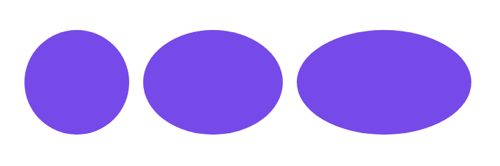

# Kör, ellipszis

## Kör

Kört a `border-radius` \(keret lekerekítés\) CSS tulajdonsággal lehet létrehozni [blokkos elemekből](../css/doboz-modell.md#toembszeru-vagy-blokkos-elemek-jellemzoi). Alapfeltétel, hogy az elem szélessége és magassága megegyezzen. A `border-radius` értéke 50%, vagy nagyobb kell legyen, hogy létrejöjjön a kör.

```css
div {
    width: 150px;
    height: 150px;
    border-radius: 50%;
}
```

## Ellipszis

Annyiban különbözik a körtől, hogy az oldalak hosszai nem ugyanakkorák, ha a szélessége nagyobb a magasságánál, fekvő ellipszis jön létre, ha a magassága nagyobb szélességénél, álló ellipszis.

```css
div {
    width: 200px;
    height: 150px;
    border-radius: 50%;
}
```





Háttérkép és keret is használható ezzel a technikával:




