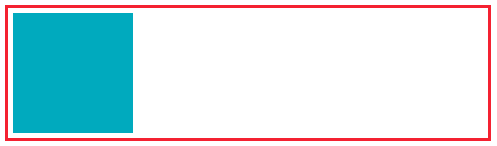
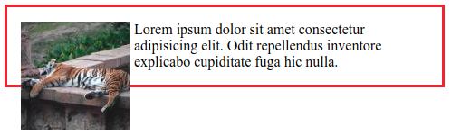
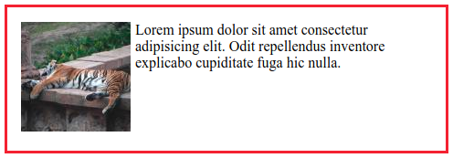

# Clearfix

A Clearfix arra a problémára ad megoldást, hogy az úsztatott elemek nem tolják szét a szülő konténerük magasságát, így például ha egy elem csak úsztatott elemeket tartalmaz, a magassága 0-val lesz egyenlő.

 Az alábbi példában a nem úsztatott elem a szülő magasságát széttolja \(a szülő elem vörös kerettel van körbevéve\).



A gyermeket balra vagy jobbra úsztatva a szülő elem magasságára már nem lesz hatással: 


Ez jellemzően akkor jelent gondot, ha szövegben úsztatunk egy képet, és a kép túllóg a szülő elem határán:



Az alábbi CSS-t elhelyezve a szülő elemen az úsztatott gyermekek befolyásolják az elem magasságát:



```css
.cf:before,
.cf:after {
  content: " ";
  display: table;
}


.cf:after {
  clear: both;
}
```





