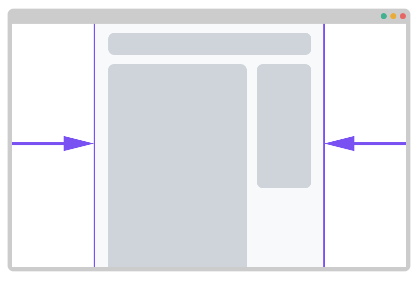

# Konténer középre rendezése

A konténer középre rendezése egy széles körben elterjedt technika, a lényege, hogy a weboldalak tartalma  egy bizonyos szélesség fölött középre van rendezve, ha a böngésző ablaka szélességben kisebb ennél a bizonyos szélességnél, a weboldal tartalma teljesen kitölti a böngésző ablakot.



```css
.container {
    width: 100%;
    max-width: 960px;
    margin-left: auto;
    margin-right: auto;
}
```

A jobb és bal oldali egyenlő eltartásért a `margin-left: auto` , és a `margin-right: auto` felel, a konténer maximális szélességét a `max-width` CSS tulajdonsággal lehet beállítani

A konténer magasságát a tartalma határozza meg \(tolja ki\), de megadhatunk neki fix értéket is.



