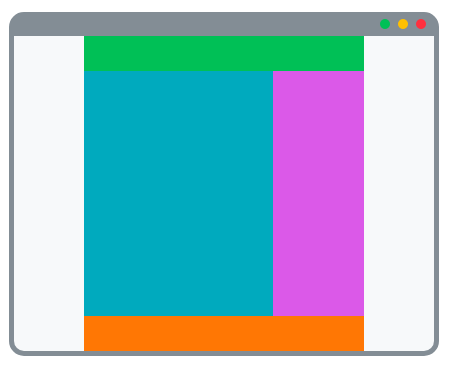

# Layout kialakítása úsztatással

Egy webes alkalmazás, vagy weboldal felületének kialakítása esetén felmerül annak az igénye, hogy elemeket helyezzünk el egymás mellett. Jellemző példa erre a weboldalak fő, és alárendelt tartalmi blokkjai, a lényegi tartalom oszlopa mellett helyezkedik el jobb vagy bal oldalon az oldalsáv, vagy oldalsó panel:



Ahhoz hogy a fő tartalmi részt, a `main`-t, és az oldalsó panelt, az `aside`-ot egymás mellé tudjuk rendezni meg kell határozni a szélességüket, erre a legmegfelelőbb a százalékos méretezés, úgy hogy az egymás mellé úsztatott elemek szélessége ne haladja meg a _100%_-ot.

```css
main {
    width: 70%;
}

aside {
    width: 30%;
}
```

A következő lépésben úsztatjuk az elemeket, balra, és jobbra.

```css
main {
    float: left;
    width: 70%;
}

aside {
    float: right;
    width: 30%;
}
```

Az irányok felcserélésével a vizuális sorrendet tudjuk szabályozni.

Az úsztatott elemek után következő elemek megjelenítése eltérhet a megszokottól, ebben az estben érdemes clearfix-et használni, vagy a soron következő elemre elhelyezni egy clear: both CSS tulajdonságot.

```css
footer {
    clear: both;
}
```

A következő példában egy weboldal főbb szerkezeti elemeinek szervezését tekinthetjük át:



```markup
<!DOCTYPE html>
<html lang="en">
<head>
    <meta charset="UTF-8">
    <meta name="viewport" content="width=device-width, initial-scale=1.0">
    <meta http-equiv="X-UA-Compatible" content="ie=edge">
    <title>Flex Layout</title>
    <link rel="stylesheet" href="layout.css">
</head>
<body>
    <div class="container">
        <header>header</header>
        <main>main</main>
        <aside>aside</aside>
        <footer class="cf">footer</footer>
    </div>
</body>
</html>
```



```css
/* Konténer középre rendezése */
.container {
    margin-left: auto;
    margin-right: auto;
    max-width: 960px;
}

/* Fő tartalmi elemek stílusa */
header {
    height: 120px;
    background-color: #339af0;
}

main {
    float: right;
    width: 70%;

    background-color: #51cf66;
    min-height: calc(100vh - 240px);
}

aside {
    float: left;
    width: 30%;

    background-color: #fcc419;
    min-height: calc(100vh - 240px);
}

footer {
    clear: both;

    height: 120px;
    background-color: #ff6b6b;
}
```









