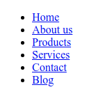
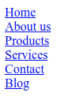
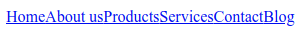
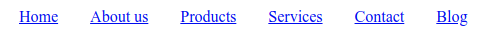
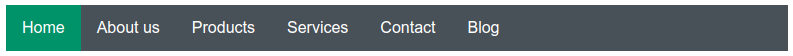

# Vízszintes menü úsztatással

A technika kiindulási alapja egy navigációs menü egy listából, és lista elemekből felépítve \(`nav` elemről [bővebben itt](../html/html-elemek.md#navigacio)\):

```markup
<nav>
	<ul>
		<li class="active"><a href="#">Home</a></li>
		<li><a href="#">About us</a></li>
		<li><a href="#">Products</a></li>
		<li><a href="#">Services</a></li>
		<li><a href="#">Contact</a></li>
		<li><a href="#">Blog</a></li>
	</ul>
</nav>
```



Első lépésként eltüntetjük a lista elemek pontjait, és a listán lévő külső és belső margót:

```css
nav ul {
	list-style-type: none;
	padding: 0;
	margin: 0;
}
```



Második lépésként balra úsztatjuk a lista elemeket, ennek következtében egy sorba rendeződnek:

```css
nav li {
    float: left;
}
```



A harmadik lépés, hogy a menüpontokat széthúzzuk, belső margó segítségével, ezt az `a` elemre tesszük. Ahhoz, hogy a belső margót rá tudjuk tenni az `a` elemre, blokkos elemmé kell alakítani, alapesetben szövegközi elem \(inline\).

```css
nav a {
    display: block;
    padding: 0 16px;
}
```





```css
nav ul {
    list-style-type: none;
    padding: 0;
    margin: 0;
}

nav li {
    float: left;
}

nav a {
    display: block;
    padding: 0 16px;
}
```



```markup
<!DOCTYPE html>
<html lang="en">
<head>
    <meta charset="UTF-8">
    <meta name="viewport" content="width=device-width, initial-scale=1.0">
    <meta http-equiv="X-UA-Compatible" content="ie=edge">
    <title>Menu</title>
    <link rel="stylesheet" href="menu.css">
</head>
<body>
    <nav>
        <ul>
            <li class="active"><a href="#">Home</a></li>
            <li><a href="#">About us</a></li>
            <li><a href="#">Products</a></li>
            <li><a href="#">Services</a></li>
            <li><a href="#">Contact</a></li>
            <li><a href="#">Blog</a></li>
        </ul>
    </nav>
</body>
</html>
```





Kész a vízszintes menü, jelen formájában már használható, a következő példában további stílusokkal látjuk el \(elemek magassága, szövegszín, háttérszín\):



```css
nav ul {
	list-style-type: none; /* Listáról leveszi a pöttyöket */
	padding: 0; /* Alapértelmezett lista margó letiltása */
	margin: 0; /* Alapértelmezett lista belső margó letiltása */
	height: 46px; /* Lista magasságának beállítása */
	background-color: #495057; /* A menü háttérszíne */
	font-family: sans-serif;
}

nav li {
	float: left; /* Egy sorba rendezi a lista elemeket */
}

nav a {
	display: block; /* Ez kell, hogy be tudjuk állítani az elem magasságát, belső margóját */
	padding: 0 16px; /* Menü elemek közötti (belső) térköz */
	text-decoration: none; /* Eltünteti a linkekről az aláhúzást */
	height: 46px; /* Menü elem magassága */
	line-height: 46px; /* Vkálisan középre rendezi a menü elemben a szöveget */
	color: white; /* A menü elemek szövegszíne */
}

nav li.active a {
	background-color: #099268; /* Aktív menü elem háttérszíne */
	
}

nav a:hover {
	background-color: #0ca678; /* Kurzor alatt lévő menü elem héttérszíne */
}
```



```markup
<!DOCTYPE html>
<html lang="en">
<head>
    <meta charset="UTF-8">
    <meta name="viewport" content="width=device-width, initial-scale=1.0">
    <meta http-equiv="X-UA-Compatible" content="ie=edge">
    <title>Menu</title>
    <link rel="stylesheet" href="menu.css">
</head>
<body>
    <nav>
        <ul>
            <li class="active"><a href="#">Home</a></li>
            <li><a href="#">About us</a></li>
            <li><a href="#">Products</a></li>
            <li><a href="#">Services</a></li>
            <li><a href="#">Contact</a></li>
            <li><a href="#">Blog</a></li>
        </ul>
    </nav>
</body>
</html>
```







