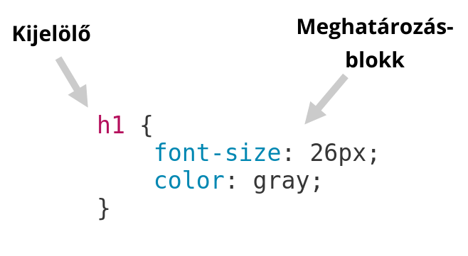
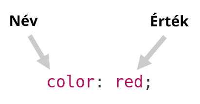

# CSS stílusok felépítése

## CSS elhelyezése HTML állományokban

### Szövegközi stílusok \(inline style\)

A CSS stílusokat egy HTML elem **style** tulajdonságában elhelyezve csak arra az egy elemre fognak vonatkozni.

```markup
<p style="color: blue; font-size: 1.5em;">Lorem ipsum dolor sit amet</p>

<input id="form-helper" type="text" style="display: none;">
```

### Beágyazott stíluslapok

A **CSS** stylusokat elhelyezhetjük egy **HTML** állomány fejlécében egy **style** elemben.  
A **style** elemben **CSS** nyelvi szabályok lesznek érvényesek.

```markup
<style>
    p {
        font-size: 1.5em;
    }
    
    p.blue {
        color: blue;
    }
</style>
```

### Külső stíluslapok

A **CSS definícióinkat** elhelyezhetünk **CSS** állományokban, ezeket az állományokat link elemmel kapcsolhatjuk a **HTML** állományunkba.

```markup
<link rel="stylesheet" type="text/css" href="style.css">
```

A külső CSS állomány kiterjesztése **.css** lehet.


A külső CSS állomány nagy előnye, hogy több HTML oldalba is be lehet kötni ugyan azt a CSS állományt, így csökken a letöltendő adatmennyiség, és a stílusokat egy központi helyen tudjuk kezelni.


### CSS importálása

Egy CSS állományba behívhatunk egy másik CSS állományt **@import** segítségével.

```css
@import url('style.css');
```

## Megjegyzések

Megjegyzés \(comment\) **/\*  \*/** jelek használatával hozható létre CSS-ben

A /\* és a **\*/** karaktersorozatok közötti részt a böngésző figyelmen kívül hagyja.

```css
/*
    Ez egy megjegyzés.
*/
```

## Stílusok felépítése

### CSS stílus \(CSS rule\)



A **kijelölő** célozza be az elemeinket a HTML struktúrának megfelelően.  
  
A **meghatározásblokk** tartalmazza a kijelölt elemekre vonatkozó tulajdonságokat.

## Kijelölők \(selector\)

A **kijelölőket** lehet csoportosítani **vesszővel** elválasztva több elemre is vonatkoztathatjuk ugyan azt a szabályt.

```css
h1,
h2,
h3,
h4 {
    ...
}
```

A kijelölő szűrhet bizonyos elemkombinációkra, ekkor a szülőkön keresztül célozzuk meg az adott elemet.

```css
h1 > span {
    ...
}

main article.today h2 {
    ...
}
```

## Meghatározások

A meghatározásokat a kijelölő utáni **kapcsos zárójelben** helyezzük el, egymástól **pontosvesszővel** elválasztva. Az utolsó után nem kell pontosvessző  
\(általában ki szoktuk tenni\).

```css
p {
    color: #323232;
    font-size: 1.25em;
    line-height: 1.125em
}
p {
    color: #323232;
    font-size: 1.25em;
    line-height: 1.125em
}
```

Egy meghatározás kulcsszóból, vagy névből, és a hozzá tartozó értékből áll, **kettősponttal** elválasztva. 



Léteznek gyorsírásos szabályok, amikben **több értéket** is megadhatunk. Ebben az esetben az értékeket **szóközzel** kell elválasztani.

```css
p {
    margin: 10px auto 15px auto;
    padding: 0px 5px;
    font: small-caps italic bold 16px Helvetica;
}
```

