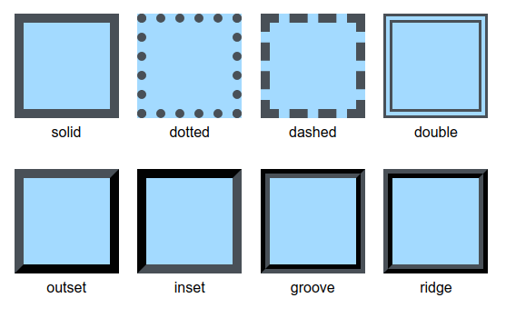

# Doboz modell

## Tömbszerű \(vagy blokkos\) elemek jellemzői

A **blokkos** elemek vízszintesen kitöltik, a rendelkezésre álló helyet, mellettük más elem nem lehet, az elem maga előtt és után sortörést hoz létre. Magasságuk a tartalmuktól függ, a tartalom tolja szét a **blokkos** elemeket függőlegesen. 

A böngészők blokkos elemként jelenítik meg az ebbe a kategóriába tartozó HTML elemeket - [lásd HTML elemek listája](https://digikiad.gitbook.io/digitalis-kiadvanyok/html/html-elemek#felsorolt-elemek-listaja).

CSS-el fel lehet ruházni ezzel a megjelenítési móddal a nem blokkos elemeket is.

```css
span {
    display: block;
}
```

## Tartalom - content

Ha külön nem határozzuk meg egy blokkos elem szélességét, és magasságát, az elem 100% széles lesz,  vízszintesen teljesen kitölti a rendelkezésre álló helyet. Az elem magasságát a tartalma határozza meg, például a benne lévő szöveg. Tartalom hiányában az elem _0px_ magasságú.


A blokkos elemeknek megadhatjuk a szélességégét, magasságát a `width` és a `height` CSS tulajdonságokkal, ez felülbírálja az alapbeállításokat, az elem magassága függetlenül méretezhető a tartalmától, szélessége függetlenül méretezhető a rendelkezésre álló helytől. 

Alapestben a böngésző határozza meg a `width` és `height` értékét, ez az _auto_, vagyis a fentebb taglalt elvek alapján számítja a szélességet, és magasságot.

```css
div {
    width: 60%; /* szélesség */
    height: 640px; /* magasság */
}
```

A szélességnek, és a magasságnak megadhatunk minimum és maximum értéket is:

```css
div {
    min-width: 15%;     /* legkissebb szélesség */
    min-height: 15em;   /* legkisebb magasság */
    max-width: 125px;   /* legnagyobb szélesség */
    max-height: 55%;    /* legnagyobb magasság */
}
```

A `min-height`, és `min-width` CSS tulajdonságokban meghatározott érték alá nem csökken az elem szélessége és magassága \(alapértéke _0px_\).

A `max-height`, és `max-width` CSS tulajdonságokban meghatározott érték fölé nem növekszik az elem szélessége és magassága \(alapértéke _none_, vagyis nincs felső méret korlát\).

## Belső margó - padding

A blokkos elemeknek meg lehet adni belső margót a `padding` CSS tulajdonsággal, ez felveszi a háttér színét, és belső eltartása hozzáadódik a tartalom szélességéhez és magasságához \(alapértéke _0px_\), a tartalom és az oldal széle között képezve eltartást \(úgy kell elképzelni, mint egy hagyományos képkeret esetén a paszpartut a festmény és maga a képkeret között\).


A `padding` -et megadhatjuk külön külön oldalanként, a `padding-top`, `padding-right`, `padding-bottom` és `badding-left` CSS tulajdonságokkal:

```css
div {
    padding-top: 10px;     /* Felső padding */
    padding-right: 20px;   /* Jobb padding */
    padding-bottom: 3em;  /* Alsó padding */
    padding-left: 15%;    /* Bal padding */
}
```

Vagy gyorsírásos módszerrel, felsorolhatjuk az összes oldalt is \(fentről kezdve az óra járásával megegyező irányban következnek az oldalak\):

```css
div {
    /* Gyorsírásos padding oldalankén különböző értékkel */
    padding: 10px 5px 3px 1px;
}
```

Meghatározhatjuk egy érték megadásával az összes oldal `padding` értékét is, feltételezve, hogy az összes oldal belső margójának mérete megegyezik:

```css
div {
    padding: 3em;      /* Gyorsírásos padding */
}
```

## Keret - border

A blokkos elemeknek lehet kerete, a keret megjelenik vizuálisan, és hozzáadódik az elem magasságához és szélességéhez. Ha a keretnek vannak átlátszó részei az elem háttere látszódik ezeken a területeken.


### **Keret stílus**

A `border-style` \(keret stílus\) tulajdonsággal határozhatjuk meg a keret vizuális megjelenését \(alapértéke a _none,_ vagyis nincs keret\).

Lehetséges értékei:

* _none, hidden - nincs keret_
* _solid - folytonos vonal_
* _dotted - pontozott_
* _dashed - szaggatott vonal_
* _double - dupla vonal_
* _outset - kiemelkedő_
* _inset - süllyesztett_
* _groove - bemélyített_
* _ridge - kidomborodó_



```css
div {
    border-top-style: none;      /* Felső keret stílus */ 
    border-right-style: solid;  /* Jobb keret stílus */
    border-bottom-style: dotted; /* Alsó keret stílus */
    border-left-style: dashed;   /* Bal keret stílus */
}
```

A keret stílust is megadhatjuk gyorsírásos formában \(fentről kezdve az óra járásával megegyező irányban következnek az oldalak\):

```css
div {
    /* Gyorsírásos keret stílus oldalanként különböző értékekkel */
    border-style: solid none dotted dashed;    
}
```

Lehetőség van az összes oldal keretének `border-style` értékét is beállítani egy értékkel, feltételezve, hogy az összes oldal keret stílusa megegyezik:

```css
div {
    border-style: solid;    /* Gyorsírásos keret stílus */    
}
```

### **Keret szélesség**

A `border-width` \(keret szélesség\) tulajdonságnak az értéke adja a keret vastagságát. Negatív értéket nem vehet fel \(alapértéke _medium_, vagyis közepes\).

```css
div {
    border-top-width: 1px;     /* Felső keret szélesség */
    border-right-width: 1em;   /* jobb keret szélesség */
    border-bottom-width: 5px;  /* Alsó keret szélesség */
    border-left-width: 1.2rem; /* Bal keret szélesség */
}
```

A keret szélesség megadható gyorsírásos formában, oldalanként eltérő értékkel \(fentről kezdve az óra járásával megegyező irányban következnek az oldalak\):

```css
div {
    /* Gyorsírásos keret szélesség oldalanként különböző értékekkel */
    border-width: 1px 2px 3px 4px;
}
```

Egy értékkel meghatározva is megadhatjuk az összes oldal keret szélességét, feltételezve, hogy minden oldalon megegyezik az értéke:

```css
div {
    border-width: 15px;     /* Gyorsírásos keret szélesség */
}
```

### **Keret szín**

A `border-color` a keret színét határozza meg. Értéke lehet bármely CSS színrendszer szerinti szín \(alapértéke felveszi a szövegszínt, vagyis a `color` tulajdonságban meghatározott színt\).

```css
div {
    border-top-color: transparent;        /* Felső keret szín */
    border-right-color: red;              /* Jobb keret szín */
    border-bottom-color: rgb(65, 65, 89); /* Alsó keret szín */
    border-left-color: #448383;           /* Bal keret szín */
}
```

A keret színt is megadhatjuk gyorsírásos formában \(fentről kezdve az óra járásával megegyező irányban következnek az oldalak\):

```css
div {
     /* Gyorsírásos keret szín oldalanként eltérő színnel */
    border-color: #e1e1e1 #d3d3d3 #d4d4d4 #e2e2e2;            
}
```

Meghatározhatjuk egy érték megadásával az összes oldal `border-color` értékét is, feltételezve, hogy az összes oldal keretének színe megegyezik:

```css
div {
    border-color: purple;             /* Gyorsírásos keret szín */
}
```

### **Gyorsírásos keret**

Gyorsírásos módszerrel megadhatjuk **oldalanként** a kereteket, ehhez meg kell adnunk a keret színét, stílusát és szélességét szóközökkel elválasztva `border-top`, `border-right`, `border-bottom` vagy `border-left` CSS tulajdonságokban meghatározva:

```css
div {
    border-top: 5px solid black;       /* Gyorsírásos felső keret */
    border-right: none;                /* Gyorsírásos jobb keret */
    border-bottom: 3px double #449b44; /* Gyorsírásos alsó keret */
    border-left: 1px dashed red;       /* Gyorsírásos bal keret */
}
```

Egy még kompaktabb megoldás, amikor az összes oldal keretét egy `border` tulajdonságban írjuk le, feltételezve, hogy a keret minden oldalon egyező stílussal színnel, és vastagsággal rendelkezik:

```css
div {
    border: 1px solid purple;          /* Gyorsírásos keret */
}
```

## Külső margó - margin

A `margin`, vagy külső margó az elemek közötti eltartást határozza meg. Értéke lehet negatív, ebben az esetben egymásra csúsznak az elemek. Alapértéke _0px_.

```css
div {
    margin-top: 1.25em;     /* Felső margó */
    mergin-right: auto;     /* Jobb margó */
    margin-bottomm: 33px;   /* Alsó margó */
    margin-left: -25px;     /* Bal margó */
}
```


A `margin` esetében is van gyorsírásos variáns,  oldalanként külön értékkel \(fentről kezdve az óra járásával megegyező irányban következnek az oldalak\):

```css
div {
    /* Gyorsírásos margin oldalankén különböző értékkel */
     margin: 0 auto 15px auto;
}
```

Be tudjuk állítani egy érték megadásával az összes oldal `margin` értékét is, feltételezve, hogy az összes oldal margójának mérete megegyezik:

```css
div {
    margin: 3em;      /* Gyorsírásos margin */
}
```

A `margin`-nak van egy speciális értéke, ez az _auto_, vagy automatikus margó, ha ezt vízszintesen, vagyis jobb és, vagy bal oldalt megkapja egy elem, a margója az adott oldalon addig nyúlik, amíg a rendelkezésre álló hely el nem fogy. Ez lehetővé teszi, hogy automatikus margóval balra középre, vagy jobbra rendezhetjük a blokkos megjelenítésű elemeket.

```css
div {
    margin-top: 50px;
    margin-right: 50px;
    margin-bottom: 50px;
    margin-left: auto;  /* Jobbra tolja az elemet */
}
```


```css
div {
    margin-top: 50px;
    margin-bottom: 50px;
    /* A bal és jobb oldali auto margin középre rendezi az elemet: */
    margin-right: auto;
    margin-left: auto; 
}
```



Alapesetben függőlegesen hatástalan az automatikus margó, ha egy elem `margin-top` vagy `margin-bottom` tulajdonságát _auto_-ra állítjuk, akkor a böngésző azt nullának fogja venni, ez alól kivételt képez a _flex_ \(rugalmas\) __megjelenítési mód, ahol a rugalmas elemekre vertikálisan is alkalmazható az automatikus margó.


## Doboz méretezése - box-sizing

A `box-sizing` tulajdonság alapján számolja a böngésző az elemek méretét.

Két lehetséges értéke lehet, az alapérték a _content-box_ ebben az estben az elem tartalmának szélességéhez, magasságához **hozzáadódik** a belső margó és a keret szélessége, magassága.

A második lehetséges érték a _border-box_, amikor a szélességbe, és magasságba **beleszámít** a belső margó és a keret szélessége, magassága.

```css
div {
    box-sizing: content-box;
}

div {
    box-sizing: border-box;
}
```

## Ábra


