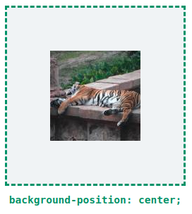
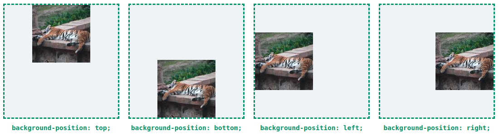
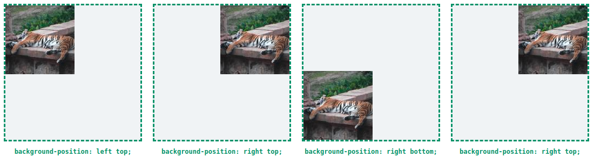

# Háttérszínek, háttérképek

## Háttérszín

A _background-color_ segítségével színt adhatunk elemeink hátterének. Átlátszó szín esetén az elem mögött lévő elemek is \(részlegesen\) látszódni fognak.  
  
A háttérszín az elem teljes hátterét kitölti, látható a belső margó \(padding\), és a keret átlátszó része alatt \(border\). Alapértéke a _transparent_, vagyis átlátszó.

```css
div {
	background-color: purple;
}

ul li {
	background-color: rgba(14%, 75%, 10%, 0.75);
}
```

## Háttérkép

A _background-image_ értékeként egy kép elérési útvonalát adhatjuk meg, **url\('elérési útvonal'\)** formában.  
  
A kép valós méretében jelenik meg az elem hátterében.  
  
Alapértéke a none, vagyis nincs.

```css
div {
    background-image: url('images/background.png');
}

ul li {
    backgroud-mage: url('http://mydomain.hu/picture.jpg');
}
```

## Háttérkép ismétlődése

A _background-repeat_ segítségével szabályozhatjuk a háttérkép ismétlődését.

Értékei:

* _repeat_ - ismétlődés \(ez az alapérték\)
* _repeat-x_ - ismétlődés vízszintesen
* _repeat-y_ - ismétlődés függőlegesen
* _no-repeat_ - nincs ismétlődés

```css
div {
    background-repeat: repeat;
}

ul li {
    backgroud-repeat: no-repeat;
}
```

## Háttérkép helyzete

A **background-position** a kép helyzetét határozza meg vízszintesen, és függőlegesen.

Megadhatjuk kulcsszavakkal, ezek:

* _center_ - középen
* _top_ - fent
* _bottom_ - lent
* _left_ - balra
* _right_ - jobbra





Két értéket is megadhatunk első a vízszintes, második a függőleges helyzetet adja meg.



Hosszértéket, vagy százalékot is felvehet, ebben az esetben a bal felső sarok  
lesz az origó \(innen eltolva jelenik meg a kép\).

```css
div {
	background-position: center;
}

ul li {
	backgroud-repeat: right bottom;
}
```

## Háttérkép méretezése

A _background-size_ határozza meg, hogy az elem hátterének mekkora hányadát fedje a háttérkép. Alapértéke az _auto_ vagyis a kép eredeti  
méretében jelenik meg.

Megadhatjuk hosszmértékben a méretet, például pixelben, vagy százalékban, ami az elem méretéhez képest értendő.

Kulcsszavas értékei:

* _auto_ - eredeti méret \(alapérték\)
* _cover_ - a háttérkép teljesen lefedi az elemet
* _contain_ - a kép addig növekszik, amíg vízszintesen, vagy függőlegesen be nem tölti az elemet.

```css
div {
	background-size: cover;
}

ul li {
	backgroud-size: auto contain;
}
```

## Gyorsírásos háttér

A _background_ gyorsírásos forma, amivel egy menetben több háttér jellemzőt is megadhatunk.

```css
div {
	background: #c5c6c7 center no-repeat cover url('img/background.png');
}

ul li {
	backgroud: none;
}
```

