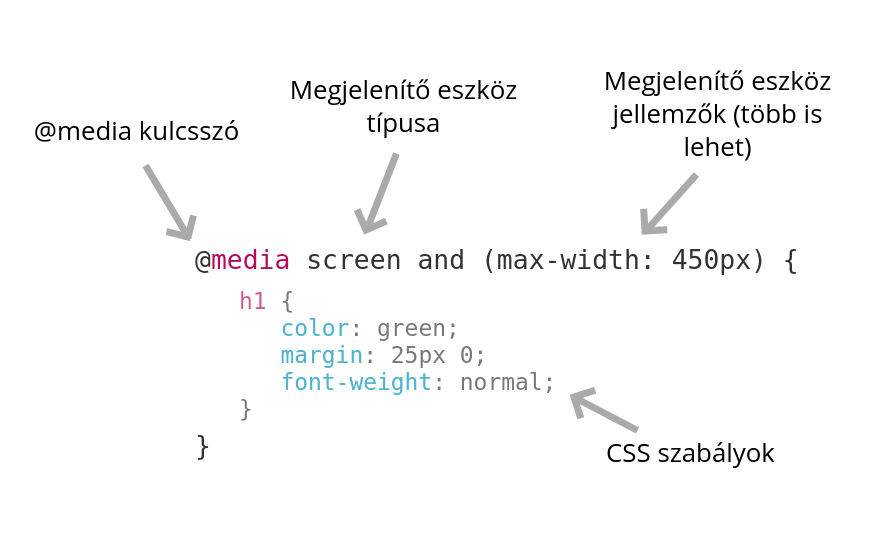

# @media

A @media direktíva a megjelenítő eszköz típusa, és tulajdonságai alapján léptet életbe CSS szabályokat.

Segítségével eltérő kinézetet valósíthatunk meg eltérő képernyőfelbontásokon, vagy eszközökön.



## Megjelenítő eszköz típusa \(media types\)

A közvetlenül a @media kulcsszó után kell megadni. Lehetséges értékei:

* _all_ - minden típus
* _print_ - nyomtatás
* _screen_ - kijelző
* _speech_ - felolvasóprogram

Nem kötelező megadni, ebben az esetben az alapértéket, az _all_-t veszi fel.

```css
p {
    color: black;
}

@media print {
    p {
        color: black;
    }
}
```

A fenti példában a bekezdések színe képernyőn vörös, kinyomtatva viszont fekete színű lesz.

## Megjelenítő eszköz tulajdonsága \(media features\)

### **Megjelenítő eszköz szélesség alapján**

Mobil eszközök esetén ez a megjelenítő eszköz szélessége, asztali böngésző esetén a böngésző ablaka mérvadó.

```css
/* Pontos szélesség */
@media (width: 600px) {
    ...
}

/* Legkisebb szélesség */
@media (min-width: 601px) {
    ...
}

/* Legnagyobb szélesség */
@media (max-width: 599px) {
    ...
}
```

### **Megjelenítő eszköz magasság alapján**

```css
/* Pontos magasság */
@media (height: 600px) {
    ...
}

/* Legkisebb magasság */
@media (min-height: 601px) {
    ...
}

/* Legnagyobb magasság */
@media (max-height: 599px) {
    ...
}
```

### Megjelenítő eszköz orientációja alapján

...

### **További eszköz tulajdonságok**

Reszponziv webalkalmazások építéséhez az eddig felsorolt eszköz tulajdonságok bő eszközkészletet biztosítanak, de rajtuk kívül még további tulajdonságok is elérhetőek. További példák:

* _aspect-ratio_ - képernyő arány
* _resolution_ - pixel sűrűség \(retina\)
* _color_ - megjelenítő eszköz színei
* _monochrome_ - monokróm e a kijelző
* _pointer_ - pozicionáló eszköz típusa \(egér\)

## Logikai operátorok

### **not \(nem\)**

A `not` operátorral megfordíthatunk egy @media direktívát. 

```css
@media not print {
    ...
}
```

Ebben a példában minden eszköz típusra, ami nem _print_ érvényes CSS szabály.

### **and \(és\)**

Az `and` operátorral összekapcsolhatjuk az eszköztípusokat és jellemzőket, így több szabálynak kell megfelelnie az adott eszközön, hogy érvénybe lépjen a @media-ba foglalt CSS.

```css
@media screen and (min-width: 800px) {
    ...
}
```

A fenti példában média típust, és média tulajdonságot is megadtunk.

### **, \(vagy\)**

A `,` operátorral több eszköz szabályt is megadhatunk, ha egy közülük érvényes, a @media direktívában lévő CSS szabály\(-ok\) érvénybe lépnek.

```css
@media (max-width: 100px), (min-width: 200px) {
    ...
}
```

Ebben a példában 100px alatt és 200px felett is érvényesül a CSS.

