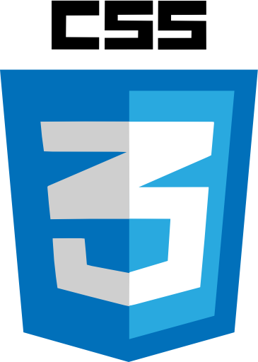

# Mi az a CSS?

## Mi a CSS?

A **CSS** egy a webes szabványok közül. A webes szabványok közül a legfontosabb a **HTML**, a **CSS és** a **JavaScript**, ezek hármasa együtt alkotja a weboldalak technológiai alapját.

A **CSS** egy mozaikszó, jelentése **C**ascading **S**tyle **S**heets - Egymásba ágyazható stíluslapok.

A **CSS** a webes alkalmazások megjelenését szabályozó stílusnyelv:

* A stíluslapok definiálják, hogy hogyan jelenjenek meg vizuálisan a HTML elemek.
* Segítenek, hogy a tartalom, és a megjelenés elkülönüljön egymástól.
* Külső állományban is elhelyezhető, így több HTML állomány is használhatja ugyanazt a CSS-t.
* Egy elemre több stílus is hatással lehet.

## CSS rövid története

Korábban a HTML tartalmazta a megjelenésre vonatkozó utasításokat.

A fejlesztői igények növekedésével végül 1994-ben [Håkon Wium Lie](https://hu.wikipedia.org/w/index.php?title=Håkon_Wium_Lie&action=edit&redlink=1), és [Bert Bos](https://hu.wikipedia.org/w/index.php?title=Bert_Bos&action=edit&redlink=1) kidolgozta a CSS alapjait.

1996-ban adta ki hivatalos ajánlásként a W3C Consortium a CSS level 1 -et.

A CSS 2. kiadása 1998-ban lett hivatalos ajánlás, ez a kiadás radikálisan kibővítette az első kiadás lehetőségeit.

2005-ben a 3. kiadás szakított az eddig fejlesztési formával, nem egységes dokumentumként, hanem modulokra bontva folyik a fejlesztés, így lehetőség van építőelemenként fejleszteni a szabványt.

