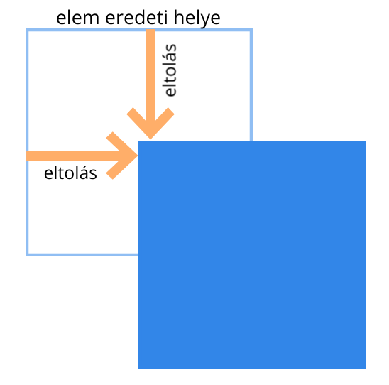
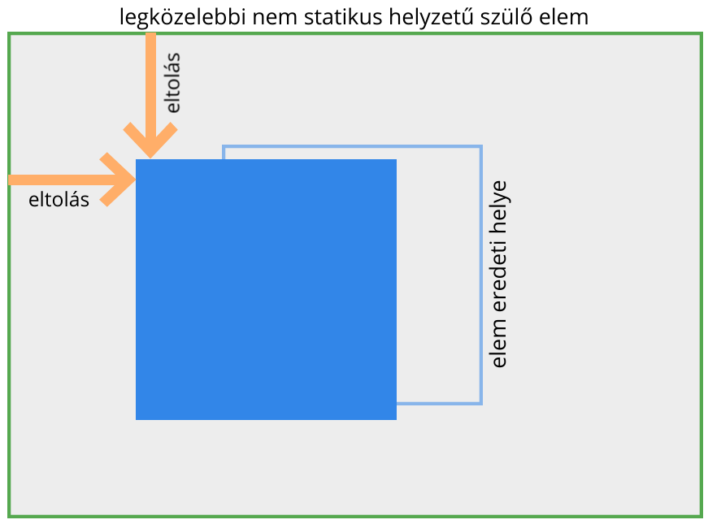
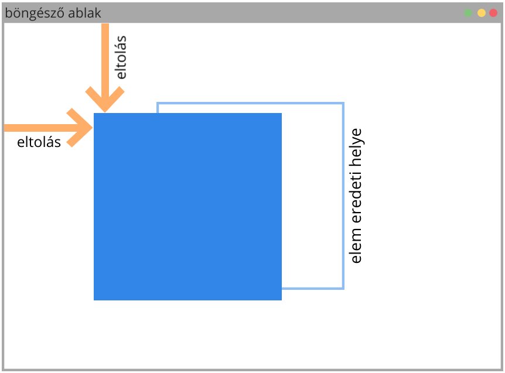
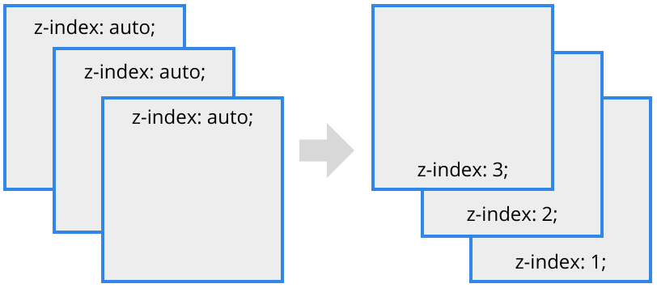

# Pozicionálás

## Dokumentumfolyam

A _dokumentumfolyam_ az elemek sorozata, ennek a sorozatnak a sorrendje alapján rajzolja ki a böngésző a HTML elemeket.

A pozicionálás az elemek a böngésző által, a dokumentumfolyam alapján meghatározott eredeti helyét módosítja. Az elem pozicionálásának típusát a `position` CSS tulajdonsággal lehet beállítani.

## Statikus pozíció \(static\)

Ez az alapállapot, ebben az estben az elem statikus, _nem_ változik a pozíciója \(nincs pozicionálva\).

```css
div {
    position: static;
}
```

## Eltolás

A nem statikus helyzetű elemek helyzetét tudjuk módosítani a következő tulajdonságokkal:

* `left` - eltolás balról
* `right` - eltolás jobbról
* `top` - eltolás fentről
* `bottom` - eltolás lentről

Az eltolás alapértéke _auto_ ez nem befolyásolja az elem helyzetét. Megadhatjuk hosszmértékben, vagy százalékban. Százalékos érték esetén a pozicionálás típusától függő \(szülő-\)elem mérete alapján számolja ki a böngésző az eltolás mértékét. Felvehet negatív értéket is.

```css
top: 33px;      /* Felső eltolás */
right: 55%;     /* Bal eltolás */
bottom: -5em;   /* Alsó eltolás */
left: 9px;      /* Bal eltolás */
```

## Viszonylagos pozíció \(relative\)

Viszonylagos pozicionálás esetén az elem eredeti helyéhez képest eltolódik a megadott mértékben.

Az elem eredeti helye megmarad a dokumentum- folyamban, az utána következő elemeket eltolja, ugyanúgy, mintha statikus helyzetű lenne a pozicionált elem.

```css
div {
    position: relative;
    left: 50px;
    top: 50px;
}
```



## Független pozíció \(absolute\)

Független pozíció esetén a legközelebbi nem statikus pozicionálású szülő elemhez képest történik az eltolás \(ha az elem közvetlen szülője például `relative` pozíciójú, akkor ahhoz képest\).   
  
Ha nincs nem statikus szülő, akkor a _body_ elemhez képest történik az eltolás.​

```css
div {
    position: absolute;
    left: 50px;
    top: 50px;
}
```



Az abszolút pozicionálású elem nem lesz ráhatással a dokumentumfolyamra \(eltűnik\). Eredeti helyére becsúsznak az őt követő elemek, illetve nem tolja ki szülőelemeinek magasságát sem.

## Rögzített pozíció \(fixed\)

Rögzített pozíció esetén a böngésző ablakához képest történik az eltolás, ebben az esetben a pozicionált elem nem scrollozódik együtt a többi elemmel \(rögzített\).

Eredeti helyére becsúsznak az őt követő elemek, illetve nem tolja ki szülőelemeinek magasságát sem - hasonlóan a független pozicionálású elemekhez.

```css
div {
    position: fixed;
    left: 50px;
    top: 50px;
}
```



## Z magasság \(z-index\)

A dokumentumfolyam meghatározza az elemek egymásra lapolódását is, a később jövő  
elemek a korábbiak fölé kerülnek.

Ezen módosíthatunk a _z-index_ tulajdonsággal.

```css
div {
    position: relative;
    z-index: 150;
}
```

A böngésző ablak síkjára merőleges tengelyen \(z\) mozgathatjuk vele az elemeket. A pozitív érték emel az elemen, a negatív érték süllyeszt. Értéke egész szám lehet \(negatív is\), alapértéke az `auto` vagyis  
a dokumentumfolyam alapján számított magasság.



