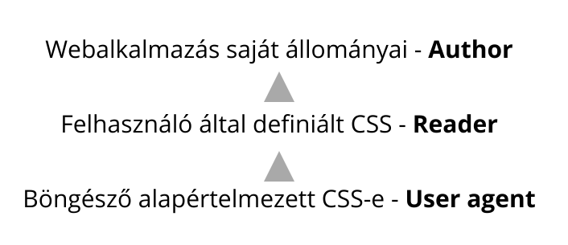

# Rangsor

## Mi az a rangsor?

Egy elemre jellemzően több CSS szabály is vonatkozhat, amik felülbírálhatják egymást, a böngészők rangsorolással döntik el, hogy mely szabály lesz érvényes az adott elemre \(melyik az erősebb\).

## Eredet

Három forrásból származhat stílus:  
A böngésző alapértelmezett készlete, a felhasználó által definiált, és a webalkalmazás saját CSS-e, ez utóbbi felülbírálja a többit.



A **User agent CSS** a böngésző alapértelmezett formázásai egy alapot adnak a weboldalak tartalmának, így az minden nemű stílus formázás nélkül is értelmezhető lesz, ez a leggyengébb, legegyszerűbben felülírható stílus. A felhasználó által definiálható **Reader CSS** valamivel erősebb, de mindkettőt felülbírálja a webalkalmazások saját CSS stílusai, az **Author CSS**. 

## Sorrend

A korábbi szabályokat  felülírják a későbbiek. Minél később található a kódban egy stílus, annál erősebb. Ez az állományok bekötési sorrendjére is érvényes.

```css
div {
    color: red;
    color: blue; /* a későbbi érvényesül */
}

span {
    color: green;
}

span {
    color: purple; /* a későbbi érvényesül */
}
```

## Szűkítés

4 szinten hoz létre minden szabály [kijelölője](kijelolok.md) alapján a böngésző egy rangsort, a magasabb értékkel rendelkező szabály fog érvényesülni, felülbírálva a sorrendet. A szűkítés értékét a kijelölő alapján határozza meg a böngésző.

| Kijelölő típusa | Súlyozás értéke |
| :--- | :--- |
| [Szövegközi stílusok](css-stilusok-felepitese.md#szoevegkoezi-stilusok-inline-style) | **1.0.0.0** |
| [Egyedi azonosító kijelölő](kijelolok.md#azonosito-kijeloelo) | **0.1.0.0** |
| [Osztály kijelölő](kijelolok.md#osztaly-kijeloelo), [álosztály](kijelolok.md#alosztalyok) | **0.0.1.0** |
| [Elem kijelölő](kijelolok.md#elem-kijeloelo) | **0.0.0.1** |
| [Általános kijelölő](kijelolok.md#altalanos-kijeloelo) | **0.0.0.0** |

A szűkítés értékei összeadódnak, és a kapott érték alapján a rangsorolja a böngésző a CSS szabályokat. Ezek nem helyi értékek, egy darab egyedi azonosító a kijelölőben bármennyi osztályt felülbírál.

```css
div {}                    /* értéke: 0.0.0.1 */
label.name {}             /* értéke: 0.0.1.1 */
.name {}                  /* értéke: 0.0.1.0 */
#contact {}               /* értéke: 0.1.0.0 */
div#contact {}            /* értéke: 0.1.0.1 */
div#contact .name {}      /* értéke: 0.1.1.1 */
div#contact label.name {} /* értéke: 0.1.2.1 */
```


A szűkítésnél megfigyelhetjük, hogy a kijelölők súlyozása az általánostól egyre erősödik a specifikusabb, szűkebb kijelölők felé. Leggyengébb az általános kijelölő, ami minden elemre vonatkozik, legerősebb az azonosító kijelölő, ami csak egy bizonyos elemre.



A HTML elemen a `style` tulajdonságban elhelyezett **szövegközi stílusok** erősebbek a többi stílusnál, szűkítési értékük mindig 1.0.0.0, ezt a CSS állományban, elhelyezett  CSS nem tudja felülbírálni \(kivételt képez a következő fejezetben tárgyalt _fontosság_\).


## Fontosság \(!important\)

**!important** jelöléssel ellátott szabály mindig erősebb a nem important szabálynál, két important közözött a további rangsorolási szabályok érvényesülnek. Az fontosság felülbírálja az eredetet, a sorrendet, és a szűkítést is.

```css
div {
    color: red !important;
}
```


Az !important jelölés ismételt használata egy idő után nehezen olvashatóvá teszi a kódot a szűkítés folyamatos felülbírálása miatt, ezért használata kerülendő, csak akkor érdemes használni, ha minden más lehetőséget kimerítettünk.


