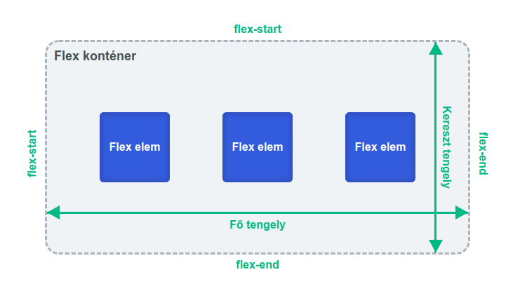

# Rugalmas dobozok

## Mi az a rugalmas dobozok

A Flexbox, vagy rugalmas dobozok egy lineáris elem rendezési metódus. Egy konténer elemeit lehet vele sorba, vagy oszlopba rendezni. Az elemek méretét, helyzetét, sorrendjét rugalmasan szabályozhatjuk. Ehhez a konténer megjelenítés \(display\) értékét kell flex-re állítani:

```css
div {
    display: flex;
}
```

## Rugalmas irány - flex-direction

...

## Rugalmas törés - flex-wrap

...

## Tartalom rendezése - justify-content

...

## Elemek igazítása - align-items

...

## Sorok, oszlopok igazítása - align-content

...

## Rugalmas elemek tulajdonságai

...

### **Sorrend - order**

**...**

### **Rugalmas nyúlás - flex-grow**

**...**

### **Rugalmas összehúzódás - flex-shrink**

**...**

### **Önigazítás - align-self**

**...**

## Ábra




