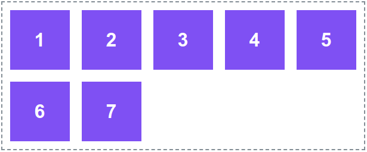
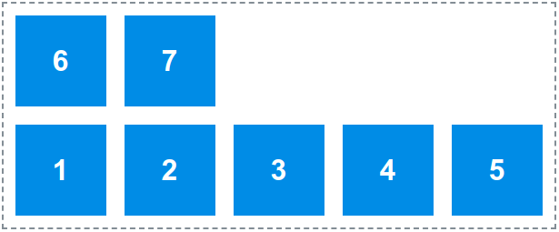
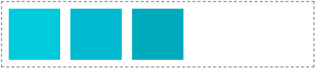
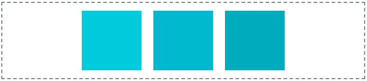
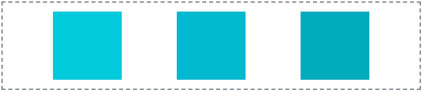
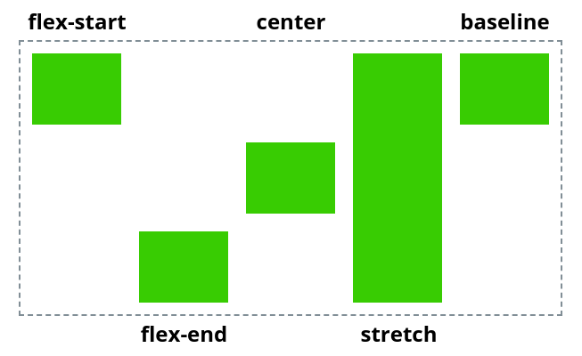

# Rugalmas dobozok

## Mi az a rugalmas dobozok

A Flexbox, vagy rugalmas dobozok egy lineáris elem rendezési metódus. Egy konténer elemeit lehet vele sorba, vagy oszlopba rendezni. Az elemek méretét, helyzetét, sorrendjét rugalmasan szabályozhatjuk. Ehhez a konténer megjelenítés \(display\) értékét kell flex-re állítani:

```css
div {
    display: flex;
}
```

## Rugalmas irány - flex-direction

A `flex-direction` CSS szabállyal adhatjuk meg a rugalmas elemek rendeződésének  
​ fő irányát \(fő tengely\).

### Sor - row

Sorba rendezve az elemek vízszintesen rendeződnek egy sorba, és sorrendben balról jobbra következnek eymás után. Ez az alapértelmezett beállítás.


```css
.row {
    flex-direction: row;
}
```

### Fordított sor - row-reverse

Ugyanaz mint a sor, csak az elemek jobbról balra rendeződve jönnek egymás után a sorrendjük szerint.


```css
.row-reverse {
    flex-direction: row-reverse;
}
```

### Oszlop - column

Az elemek függőleges oszlopba rendezve jelennek meg, sorrendjük szerint fentről lefelé.


```css
.column {
    flex-direction: column;
}
```

### Fordított oszlop

Ugyanúgy mint az oszlop esetében, a fordított oszlopban nis függőlegesen rendezve jelennek meg az elemek, de a sorrendjük szerint lentről fölfelé alakul a sorrendjük.


```css
.column-reverse {
    flex-direction: column-reverse;
}
```

## Rugalmas törés - flex-wrap

A `flex-wrap` szabályozza az elemek több sorba törését. Ha nincs törés, az elemek összenyomódnak, és arra törekednek, hogy elférjenek egy sorban.

### **Nincs törés - no-wrap**

Alapesetben az elemek egy sorban helyezkednek el, és rugalmasan összenyomódnak.


```css
.nowrap { 
    flex-wrap: nowrap;
}
```

### **Törés - wrap**

A törés engedélyezése esetén, ha elfogy az elemek helye egy sorban, akkor új sorba törnek.



```css
.wrap { 
    flex-wrap: wrap;
}
```

### **Fordított törés - wrap-reverse**

A elemeink törhetnek még _fölfelé_ is.



```css
.wrap-reverse { 
    flex-wrap: wrap-reverse;
} 
```

## Tartalom rendezése - justify-content

A _justify-content_ határozza meg, hogy merre rendeződjenek az elemek a rugalmas konténerben, illetve hogy a közöttük lévő térközöket hogyan számolja ki a böngésző.

Némi hasonlóságot mutat a szöveg rendezéssel \(text align\) csak itt nem szövegsorokat rendezünk balra, vagy jobbra, esetleg középre, hanem rugalmas elemeket.

### Kezdőponthoz rendezés - flex-start



### **Végponthoz rendezés - flex-end**


### **Középre rendezés - center**



### **Eltartás az elemek közé - space-between**


### **Eltartás az elemek közé - space-around**


### **Egyenlő eltartás - space-evenly**



## Elemek igazítása - align-items

...

## Sorok, oszlopok igazítása - align-content

...

## Rugalmas elemek tulajdonságai

...

### **Sorrend - order**

**...**

### **Rugalmas nyúlás - flex-grow**

**...**

### **Rugalmas összehúzódás - flex-shrink**

A `flex-shrink` tulajdonság határozza meg, hogy a többi elemhez képest mekkora mértékben húzódjon össze az adott elem.

### **Önigazítás - align-self**

Az `align-self` ugyan úgy működik, mint az `align-items` \([elemek igazítása](rugalmas-dobozok.md#elemek-igazitasa-align-items)\), csak ez egyetlen elemre vonatkozik.



```css
.flex-start {
  align-self: flex-start;
}

.flex-end {
  align-self: flex-end;
}

.center {
  align-self: center;
}

.stretch {
  align-self: stretch;
}

.baseline {
  align-self: baseline;
}
```

## Ábra


