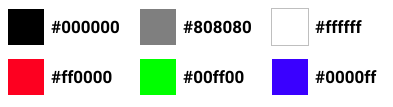

# Színek, színrendszerek

## Hexadecimális - **\#rrggbb**

RGB szín, 256^3 bit mélységben, amit színenként egy két helyi értékű 16 számrendszerben kifejezett szám ad meg. \(16\*16=256\)

```css
#000000; /* Fekete */
#808080; /* 50%-os szürke */
#ffffff; /* Fehér */


#ff0000; /* Vörös */
#00ff00; /* Zöld */
#0000ff; /* Kék */
```



## Hexadecimális rövid - \#rgb

Mint a hexadecimális, csak kevesebb árnyalatot tartalmaz, 256^3 helyett csak  
16^3 eltérő árnyalatot lehet kifejezni vele. Hexadecimális színek közül azokat, amelyeknél egy szín két helyi értéke egyezik.

**\#000000 = \#000  
\#777777 = \#777  
\#112233 = \#123  
\#ffffff = \#fff**

## RGB színek **- rgb\(r, g, b\)**

Megadhatjuk a színeket direkt rgb értékük alapján, vagy egy 0-255 ig terjedő számmal, vagy százalékosan is.

```css
rgb(0, 0, 0) /* Fekete */
rgb(128, 128, 128) /* 50%-os szürke */
rgb(255, 255, 255) /* Fehér */

rgb(255, 0, 0)  /* Vörös */
rgb(0, 255, 0)  /* Zöld */
rgb(0, 0, 255)  /* Kék */

rgb(53%, 76%, 29%) /* Százalékos rgb */
```


## RGBA színek **- rgba\(r, g, b, a\)**

Hasonló mint az RGB, de itt van egy alfa csatorna is, ami meghatározza a szín átlátszóságát, az alfa csatorna értéke egy 0 és egy közötti szám, tört érték esetén részleges az átlátszóság.

```css
rgba(0, 255, 0, 0.1)  /* 10%-ban átlátszatlan zöld */
rgba(0, 255, 0, 0.5)  /* 50%-ban átlátszatlan zöld */
rgba(0, 255, 0, 0.9)  /* 90%-ban átlátszatlan zöld */
```


## HSL színek **- hsl\(h, s, l\)**

HSL \(Színezet telítettség fényesség\) alapú színrendszer, az első értéke 0 -től 360 -ig terjedő szög érték, ami a HSL színkörön jelöl ki egy színt, második értéke a telítettség, harmadik a világosság, ez a kettő százalékos.


```css
hsl(0, 0%, 0%) /* Fekete */
hsl(0, 0%, 50%) /* 50%-os szürke */
hsl(0, 0%, 100%) /* Fehér */

hsl(0, 100%, 50%)  /* Vörös */
hsl(120, 100%, 50%)  /* Zöld */
hsl(240, 100%, 50%)  /* Kék */
```


## HSLA színek **- hsla\(h, s, l, a\)**

Itt is van alfa csatorna mint az RGBA esetében.

```css
hsla(120, 255%, 50%, 0.1)  /* 10%-ban átlátszatlan zöld */
hsla(120, 255%, 50%, 0.5)  /* 50%-ban átlátszatlan zöld */
hsla(120, 255%, 50%, 0.9)  /* 90%-ban átlátszatlan zöld */
```


## Kulcsszavas színek

Színeket megadhatunk a nevük alapján is, kulcsszavas formában. A modern böngészők 140 kulcsszavas színt támogatnak.

```css
black /* Fekete */
gray /* 50%-os szürke */
white /* Fehér */

red  /* Vörös */
lime  /* Zöld */
blue  /* Kék */
```


## Átlátszó

A transparent \(átlátszó\) kulcsszóval adhatunk meg \(teljesen\) átlátszó színt.

```css
transparent
```

