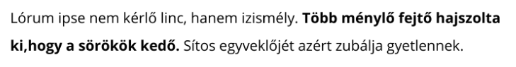

# Szövegek, szövegközi elemek

## Szövegközi elemek jellemzői

A szövegközi elemek nem törik meg a szöveget sortöréssel,  egyszerűen úgy viselkednek, mint egy szó, vagy mondat.

```markup
<p>Lórum ipse nem kérlő linc, hanem izismély. <strong>Több ménylő 
fejtő hajszolta ki,hogy a sörökök kedő.</strong> Sítos egyveklőjét 
azért zubálja gyetlennek.</p>
```



A szövegközi megjelenítésű elemekre nem érvényesülnek a doboz modell tulajdonságok. Nem határozhatjuk meg a szélességüket, és a magasságukat, illetve nem működik a margó.

A `padding` \(belső margó\), és a `border` \(keret\) használható, a blokkos elemektől némileg eltérő módon.

CSS-el megváltoztathatjuk az elemek megjelenítési módját szövegközire:

```css
div {
    display: inline;
}
```

## Betütípusok, betücsaládok

### **Betűcsalád \(font-family\)**

Betűcsaláddal határozhatjuk meg az elemeink szövegének a betűtípusát. Vesszővel elválasztva több betűtípust is megadhatunk, ezeket sorrendben megpróbálja betölteni a böngésző, ha az elsőt nem találja, megkísérli a következőt.

```css
p {
    font-family: Arial, Helvetica, sans-serif;
}
```

A fenti példában az első az **Arial** betűtípus, ami "minden" Windows-os gépen megtalálható, a második a **Helvetica**, ami nagyon hasonlít az Arial betűtípusra, de OSX operációs rendszeren elterjedt. A **sans-serif** általános betűcsalád \(generic-family\), a böngésző az ebbe a kategóriába eső elérhető fontok közül próbál egyet betölteni.

Több font felsorolásával, és általános betűcsalád megadásával biztosíthatjuk, hogy a böngésző kezelni tudja a szöveg betűt**í**pusát, hiányzó fontok esetén is.

**Általános betűcsaládok:**

* _serif_
* _sans-serif_
* _cursive_
* _fantasy_
* _monospace_

**Web biztos fontok**

Web biztos fontok azok a betűkészletek, amik széles körben elérhetőek a különböző operációs rendeszereken. Az első nagyobb csomagot a Microsoft adta ki 1996-ban **Core fonts for the Web** néven.

Az alábbi fontokat tartalmazza: _Andalé Mono, Arial, Arial Black, Comic Sans MS, Courier New, Georgia, Impact, Times New Roman, Trebuchet MS, Verdana, Webdings_

#### **@font-face**

A font face segítségével mi is betölthetünk betűkészleteket a HTML állományainkba.

```css
@font-face {
  font-family: 'MyWebFont';
  src: url('webfont.woff2') format('woff2'),
       url('webfont.woff') format('woff'),
       url('webfont.ttf')  format('truetype');
  font-weight: normal;
}

body {
  font-family: 'MyWebFont', sans-serif;
}
```

### Betűméret \(font-size\)

A betűmérettel határozhatjuk meg a szöveg méretét. A böngészők a **nagy** **M** betű alapján méretezik a betűket \(em méret\), ezért az elterjedt mértékegységek a em, és a rem, illetve a pixelben megadott méret.

```css
p {
    font-size: 16px;
}

span {
    font-size: 1.125em;
}
```

### Betűvastagság \(font-weight\)

A betűvastagságot megadhatjuk kulcsszóval, vagy számmal \(100-as lépésekben\). Az hogy az adott érték érvényesül-e  
a szövegre nagyban függ az adott betűtípustól.

**Használható kulcsszavak:**  
_normal, bold, bolder, lighter_  
  
**Használható számértékek:**  
_100-900_ -ig, ahol a _400_ a normal méret, _700_ a bold

```css
p {
    font-size: 16px;
}

span {
    font-size: 1.125em;
}
```

### Betűstílus \(font-style\)

A betűstílussal tehetünk dőltté egy szöveget. Alapértéke a _normal_, a dőlt értékei _italic_ vagy _oblique_.

```css
p {
    font-weight: normal;
}

span {
    font-weight: 700;
}
```

