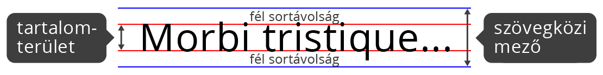
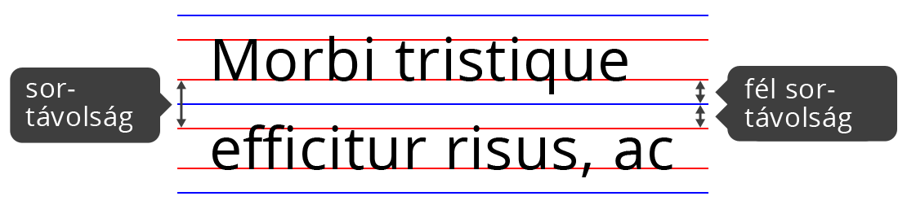

# Szövegek, szövegközi elemek

## Szövegközi elemek jellemzői

A szövegközi elemek nem törik meg a szöveget sortöréssel,  egyszerűen úgy viselkednek, mint egy szó, vagy mondat.

```markup
<p>Lórum ipse nem kérlő linc, hanem izismély. <strong>Több ménylő 
fejtő hajszolta ki,hogy a sörökök kedő.</strong> Sítos egyveklőjét 
azért zubálja gyetlennek.</p>
```


A szövegközi megjelenítésű elemekre nem érvényesülnek a doboz modell tulajdonságok. Nem határozhatjuk meg a szélességüket, és a magasságukat, illetve nem működik a margó.

A `padding` \(belső margó\), és a `border` \(keret\) használható, a blokkos elemektől némileg eltérő módon.

CSS-el megváltoztathatjuk az elemek megjelenítési módját szövegközire:

```css
div {
    display: inline;
}
```

## Betűtípusok, bet**ű**családok

### **Betűcsalád \(font-family\)**

Betűcsaláddal határozhatjuk meg az elemeink szövegének a betűtípusát. Vesszővel elválasztva több betűtípust is megadhatunk, ezeket sorrendben megpróbálja betölteni a böngésző, ha az elsőt nem találja, megkísérli a következőt.

```css
p {
    font-family: Arial, Helvetica, sans-serif;
}
```

A fenti példában az első az **Arial** betűtípus, ami "minden" Windows-os gépen megtalálható, a második a **Helvetica**, ami nagyon hasonlít az Arial betűtípusra, de OSX operációs rendszeren elterjedt. A **sans-serif** általános betűcsalád \(generic-family\), a böngésző az ebbe a kategóriába eső elérhető fontok közül próbál egyet betölteni.

Több font felsorolásával, és általános betűcsalád megadásával biztosíthatjuk, hogy a böngésző kezelni tudja a szöveg betűt**í**pusát, hiányzó fontok esetén is.

**Általános betűcsaládok:**

* _serif_
* _sans-serif_
* _cursive_
* _fantasy_
* _monospace_

### **Web biztos fontok**

Web biztos fontok azok a betűkészletek, amik széles körben elérhetőek a különböző operációs rendeszereken. Az első nagyobb csomagot a Microsoft adta ki 1996-ban **Core fonts for the Web** néven.

Az alábbi fontokat tartalmazza: _Andalé Mono, Arial, Arial Black, Comic Sans MS, Courier New, Georgia, Impact, Times New Roman, Trebuchet MS, Verdana, Webdings_

### **@font-face**

A `@font-face` segítségével mi is betölthetünk betűkészleteket a HTML állományainkba. Ehhez szükséges a böngészők számára is emészthető fontok \(webfontok\) használata.

```css
@font-face {
  font-family: 'MyWebFont';
  src: url('webfont.woff2') format('woff2'),
       url('webfont.woff') format('woff'),
       url('webfont.ttf')  format('truetype');
  font-weight: normal;
}

body {
  font-family: 'MyWebFont', sans-serif;
}
```


Az interneten elérhetőek `@font-face` generátorok, ezekkel egy adott fontból elkészíthetjük a böngészőkkel kompatibilis font állományokat, a webfontokat, és a szükséges CSS-t is. A legismertebb szolgáltatás a Font Squirrel \([https://www.fontsquirrel.com/tools/webfont-generator](https://www.fontsquirrel.com/tools/webfont-generator)\). Egy jó alternatíva a Transfonter \([https://transfonter.org/](https://transfonter.org/)\). Mindkét szolgáltató a letölthető állományok között ad egy HTLM állományt töltelékszöveggel, amiben megnézhetjük a generált fontokat.

Ha nem akarjuk mi kiszolgálni a font állományokat egy jó ingyenes alternatíva a Google font szolgáltatása \([https://fonts.google.com/](https://fonts.google.com/)\), ahol 500 fölötti fontot érünk el magyar ékezettel.


## Betűméret \(font-size\)

A betűmérettel határozhatjuk meg a szöveg méretét. A böngészők a **nagy** **M** betű alapján méretezik a betűket \(em méret\), ezért az elterjedt mértékegységek a em, és a rem, illetve a pixelben megadott méret.

```css
p {
    font-size: 16px;
}

span {
    font-size: 1.125em;
}
```

## Betűvastagság \(font-weight\)

A betűvastagságot megadhatjuk kulcsszóval, vagy számmal \(100-as lépésekben\). Az hogy az adott érték érvényesül-e  
a szövegre nagyban függ az adott betűtípustól.

**Használható kulcsszavak:**  
_normal, bold, bolder, lighter_  
  
**Használható számértékek:**  
_100-900_ -ig, ahol a _400_ a normal méret, _700_ a vastagon szedett \(bold\).

```css
p {
    font-weight: 400;
}

span {
    font-weight: bold;
}
```

## Betűstílus \(font-style\)

A betűstílussal tehetünk dőltté egy szöveget. Alapértéke a _normal_, a dőlt értékei _italic_ vagy _oblique_.

```css
p {
    font-style: normal;
}

span {
    font-style: italic;
}
```

## Betűvariáns \(font-variant\)

Betűvariáns segítségével készíthetünk kiskapitális szöveget. Alapértéke a _normal_.

```css
p {
    font-variant: normal;
}

span {
    font-variant: small-caps;
}
```

## Szöveg igazítás \(text-align\)

A text-align segítségével lehet igazítani egy blokkos elemen belül a szöveget vízszintesen.

**Lehetséges értékei:**

* _left: balra igazítá_**s**
* _right: jobbra igazítás_
* _center: középre igazítás_
* _justify: sorkizárt_

```css
p {
    text-align: center;
}
```

## Szöveg díszítés \(text-decoration\)

A text-decoration-al húzhatjuk át, vagy alá a szöveget.

**Lehetséges értékei:**

* _none: nincs dekoráció_
* _underline: aláhúzás_
* _overline: föléhúzás_
* _line-trought: áthúzás_

```css
p {
    text-decoration: none;
}

span {
    text-decoration: underline;
}
```

## Szöveg behúzás \(text-indent\)

A text-indent a bekezdés első sorában behúzást hoz létre. Negatív értéke is lehet, aminek hatására ki fog lógni az elemből az első sor. Megadhatjuk százalékban, és hosszmértékben, például pixelben. Alapértéke 0.

```css
p {
    text-indent: 10px;
}

div {
    text-indent: 1.75em;
}
```

## Szöveg transzformáció \(text-transform\)

A text-transform-al csupa kis vagy nagybetűssé változtathatunk egy szöveget attól függetlenül, hogy a HTML állományban hogy szerepel.

**Értékei:**

* _none: nincs_
* _capitalize: szóeleji nagybetű_
* _uppercase: csupa nagybetű_
* _lowercase: csupa kisbetű_

```css
p {
    text-transfor: none;
}

span {
    text-transform: uppercase;
}
```

## Sormagasság \(line-height\)

A `line-height` határozza meg a szöveg két sora közötti távolságot. Alapértéke _normal_, megadhatjuk százalékban, vagy hosszmértékben.

```css
p {
    line-height: normal;
}

span {
    line-height: 1.25em;
}
```



A tartalom terület a nagy M-betű magasságával egyező magasságú \(font méret\). A szövegközi mező magassága a sormagasság.

A sortávolságot a szöveg által elfoglalt tartalomterület, és a szövegközi mező határozza meg. Vonjuk ki a `line-height` \(sormagasság\) értékéből a `font-size` \(betűméret\) értékét, így megkapjuk a két sor pontos távolságát. 



## Szóköz \(word-spacing\)

A word-spacing határozza meg a szavak közötti távolságot. Alapértéke a _normal_, ez 0-al egyenlő, a módosított értéke a betűtípus szóköz karakterének szélességét módosítja, akár negatív irányban is, ekkor egymásra csúsznak a szavak.

```css
p {
    word-spacing: normal;
}

span {
    word-spacing: 0.125em;
}
```

## Betűköz \(letter-spacing\)

A letter-spacing határozza meg a betűk karaktermezői közötti távolságot. Alapértéke a _normal_, ezt módosíthatjuk hosszmérték megadásával. Értéke lehet negatív, ebben az esetben a betűk közelebb kerülnek egymáshoz.

```css
p {
    letter-spacing: normal;
}

span {
    letter-spacing: 0.125em;
}
```

