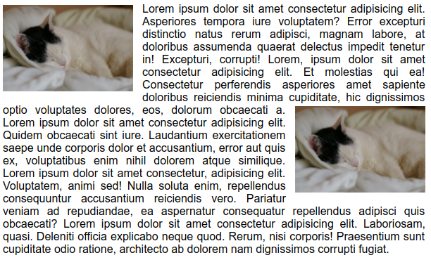
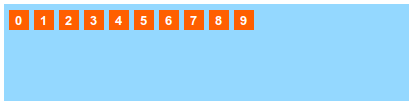
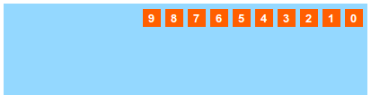
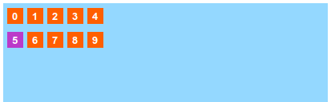

# Úsztatás

## Úsztatás \(float\)

Az úsztatott elemek a tartalmazó konténerük felső sarkába igyekeznek, az úsztatás irányában. Az előttük lévő tartalom alá úsznak be, az utánuk következő tartalom pedig körülfolyja őket.

Az úsztatott elemek nem hoznak létre sortörést, és nem tolják szét a tartalmazó konténerüket.

Ha nincs közöttük nem úsztatott elem vízszintesen egy vonalba rendeződnek az úsztatás  
irányának megfelelően.

```css
.img-left {
    float: left;
}

.img-right {
    float: right;
}
```

### Úsztatott elemek viselkedése szövegben.

Az úsztatott elemeket a szöveges tartalom, és a szövegközi elemek körbefolyják, körbeveszik.



### Úsztatott elemek egymásra gyakorolt hatása

Az úsztatott blokkos elemek megpróbálnak egy sorba rendeződni, ezt úgy kell elképzelni, mintha betűk, vagy szavak lennének egy szövegben. Nem képeznek sortörést, és nem tolják szét az őket tartalmazó elemeket függőlegesen, így ezeknek az elemeknek be kell állítani a magasságát, vagy egyéb módon kell gondoskodni arról, hogy ne 0 legyen a magasságuk.

```css
div {
    float: left;
}
```



```css
div {
    float: right;
}
```



## Úsztatás törése \(clear\)

A `clear` értékkel rendelkező elem mellé nem kerülhet úsztatott elem \(abban az esetben sem, ha maga úsztatott elem\). Beállíthatjuk, hogy csak az elem bal, vagy jobb oldalán `left`, `right`,  
vagy mindkét oldalán `both` akadályozza az úsztatott elemeket. Alapérték a `none`, vagyis nincs.

```css
div {
   clear: none;
}

span {
    clear: left;
}
```

### Úsztatott elemek törése

```css
.float-left {
	float: left;
}

.clear-left {
	clear: left;
}
```



