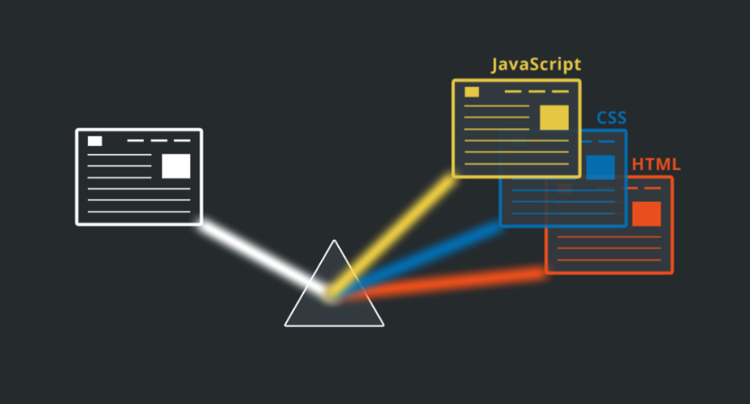

# Világhálóról dióhéjban

A Világháló az interneten működő egymással [hiperhivatkozásokkal](../html/bevezetes-a-html-be.md#hiperhivatkozasok) kapcsolódó weboldalak összessége. A felhasználók akik igénybe akarnak venni egy szolgáltatást a világhálón, internetképes eszközeikkel tehetik meg ezt \(ez lehet hagyományos számítógép, okostelefon, konzol, még akár egy hűtőszekrény is\). Az eszközön lévő böngésző vagy egyéb alkalmazás \(kliens\) egy kérést küld az interneten keresztül a kiszolgálónak \(szerver\). A kiszolgáló a kérésnek \(request\) megfelelően összeállítja a választ \(response\) csomagok formájában, és visszaküldi a kliensnek. A válaszként kapott csomagok alapján jeleníti meg a felhasználó gépén a kliens például a lekért weboldalt.

A szerver vagy kiszolgáló területét nevezzük backend-nek, a kliens oldal területét frontend-nek, vagy kliens oldalnak.

Kliens oldalán alkotóelemeire bontva egy weboldalt, három fő elkülöníthető technológiát tudunk azonosítani:

Az első a [**HTML**](../html/bevezetes-a-html-be.md), vagy hipertext jelölőnyelv, ez a szabvány a weboldalak strukturális felépítését \(tartalmi szerkezetét\) biztosítja.  
A második a [**CSS**](../css/mi-a-css.md), vagy egymásba ágyazható stíluslapok, ami a weboldalak megjelenéséért felel.  
A harmadik a **JavaScript**, ami a web programozási nyelve, és a weboldalak viselkedését vezérli.

A kiszolgáló oldalán némileg összetettebb a helyzet, számtalan megoldással találkozhatunk. Napjainkban  a hagyományos weboldalak között igen elterjedt de közel sem az egyetlen megoldás, hogy a kiszolgálón egy PHP szerver oldali scriptnyelv futtatására alkalmas Unix környezet fut \(LAMP - Linux Apache MySql PHP\), maga a weboldal "programja" egy tartalomkezelő rendszer, ilyen például a Wordpress, vagy a Drupal.

