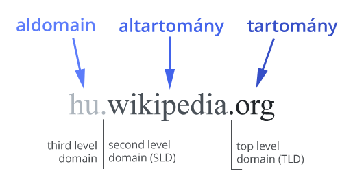

# Mi szükséges egy weboldal elindításához?

## Domain név

A **domain név** egy könnyen megjegyezhető szöveges cím, amin a webes szolgáltatásokat és a honlapokat elérhetjük.

A domain nevek formátumát a **DNS** \(Domain Name System\) szabvány szabályozza, tartományokra, és altartományokra osztva a hálózatokon, például az interneten elérhető számítógépeket.

A domain név több egységből épül fel \(ezek között a szeparátor szerepét egy pont `.` tölti be\). 

Az első egység a **tartomány** \(Top Level Domain - TLD\), ami lehet top domain \(például .org, .gov, .com, .net\), vagy nemzeti tartomány \(például .eu, .hu, .de, .at\). Például a Wikipedia domain nevében a tartomány az org: wikipedia.**org.**

A második egység \(jobbról balra\) az **altartomány** \(Second Level Domain - SLD\). A gyakorlatban ez azonosít egy tartomány alá besorolt számítógépet. Például a Wikipedia domain nevében ez a wikipedia: **wikipedia**.org

A harmadik opcionális egység az altartomány alá további címek besorolását teszi lehetővé, ez az **aldomain** \(subdomain vagy Third Level Domain\). Például a Wikipédián a különböző nyelvű Wikipédia alegységeket így azonosítják, a magyar wikipédia címe **hu**.wikipedia.org, a német nyelvű wikipedia címe **de**.wikipedia.org.

Domaint az úgynevezett domain regisztrátor cégeknél lehet igényelni, regisztrációs díj ellenében.

[Domain.hu weboldal a magyar domain regisztrátorok listájával.](http://www.domain.hu/domain/)


Hogyan találja meg a beírt webcímhez tartozó szervert a böngészőnk? A webszerverek nem rendelkeznek nevesített címmel, amin elérhetjük őket az az IP címük \(Internet Protokoll cím\), ezt használják a számítógépek egymás azonosítására. Az IP címek hasonlítanak a telefonszámokra, a felhasználók számára nehezen olvasható, és megjegyezhető számsorozatokból állnak, példaként egy népszerű magyar internetes oldal IP címe: [79.172.213.245](http://194.143.245.39/). De hogy lesz ebből .hu végződésű domain név?  A böngészők lekérik az adott webcímhez, vagy domain-hez tartozó IP címet a DNS \(Domain Name System\) kiszolgálóktól. A DNS kiszolgálók vagy szerverek hálózata egyfajta internetes telefonkönyvként működik. A böngésző először lekéri a webcímhez tartozó IP címet \(feloldja\) a DNS hálózat szervereitől, ezután küldi el a kérést az IP címen található webszervernek \(request\). Természetesen a mi számítógépünk is rendelkezik az interneten IP címmel, erre küldi el a választ \(response\) a webszerver.


## Tárhely

### Hagyományos tárhelyek

Általában egy szerverparkban elhelyezett számítógép, amin több felhasználói fiók \(tárhely\) található. A tárhelyekhez rendszerint tartozik egy adminisztrációs felület, mint például a [Webmin](http://www.webmin.com/), amin keresztül a rendszer beállításait a tárhely bérlője is el tudja látni \(például mentés/helyreállítás\). A tárhelyhez [FTP képes fájlkezelővel](https://filezilla-project.org/) lehet csatlakozni, és ennek segítségével lehet a weboldalak állományait le, és feltölteni.

### Felhő alapú tárhelyek

Felhő alapú tárhelyen az igényeinknek megfelelő virtuális szerverek létrehozására van lehetőség, ez a költségek hatékony minimalizálhatóságát is lehetővé teszi, de szükséges hozzá némi szaktudás, cserébe jóval nagyobb szabadságot kapunk \(akár bármikor ki is törölhetjük egy óvatlan mozdulattal a gépet\). Számos cég kínál felhő alapú tárhelyet, például: [Amazon Web Services \(AWS\)](https://aws.amazon.com/), [Microsoft Azure](https://azure.microsoft.com/hu-hu/), [Google Cloud](https://cloud.google.com/products/compute/)...

### Szerver oldali technológiák

A [**PHP**](https://php.net/) egy szerver oldali programozási nyelv, ugynevezett scriptnyelv. A webszerverek a PHP kódból készítik el a weboldal HTML állományait, és ezt kapja meg a kliens.

A [**MySQL**](https://www.mysql.com/) egy nyílt forráskódú adatbázis szerver, segítségével adatokat, például egy weboldal adatait tárolhatjuk egy webszerveren.

A **LAMP** egy szoftver csomag, tartalmaz minden alapvető komponenst, amiből egy webes kiszolgáló felépül:

* **L**inux \(operációs rendszer\)
* **A**pache \(HTTP szerver\)
* **M**ySQL \(adatbázis kezelő\)
* **P**HP \(script futtató környezet\)


A fenti technológiai lista \(stack\) csak egy a lehetséges kombinációk közül, webmotortól függően, ettől teljesen eltérő infrastruktúrák is előfordulhatnak. Példák szerver oldali script nyelvekre: [Perl](https://www.perl.org/), [Python](https://www.python.org/), [Ruby on Rails](https://rubyonrails.org/), [Node.js](https://nodejs.org/en/). Példák adatbázis kiszolgálókra: [MariaDB](https://mariadb.com/), [MongoDB](https://www.mongodb.com/).


