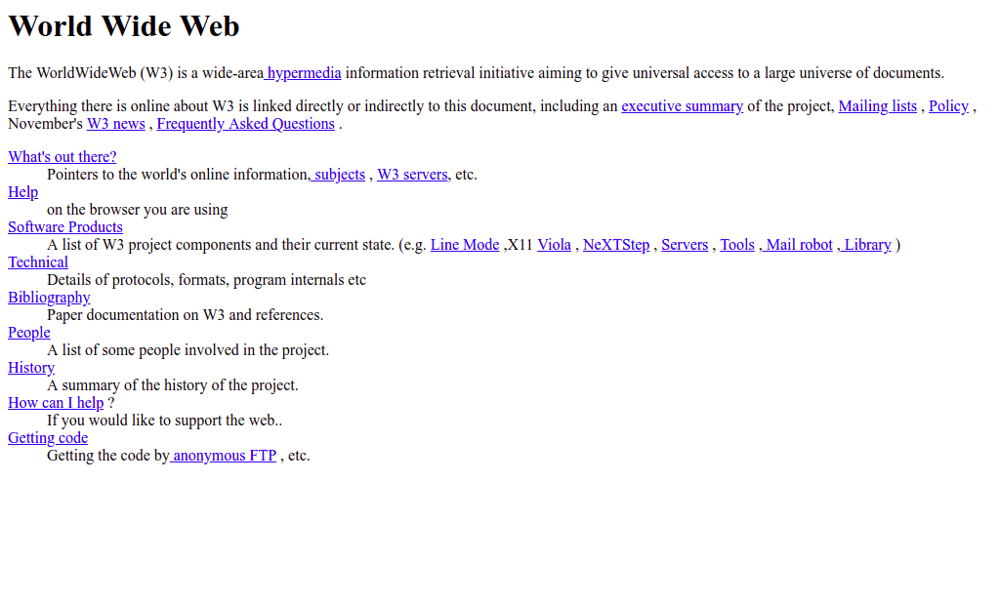

# Online tervezőgrafika

A **Internet**, és később a **Világháló** megjelenése megreformálta az élet minden területét, így a hagyományos tervezőgrafikai műfajokat \(plakátok, meghívók, oklevelek, könyv-, lemez-, CDés DVD-borítók, szórólapok, hirdetések stb.\) is, új ág keletkezett: az online tervezőgrafika.

Az új tervezőgrafikai műfajok: 

* webtervezés \(desktop, tablet, mobil\)
* webes hirdetések, bannerek
* animált média, videók
* weboldalakhoz, webáruházakhoz kapcsolódó grafika
* közösségi oldalakra borítóképek \(G+, FB, Instagram, Twitter\)
* közösségi oldalakra, blogokra bejegyzés-illusztrációk
* online prezentációk \(Prezi\)

## Online tervezőgrafika korszakai

A online tervezőgrafika egy fiatal műfaj, közege a Világháló, ami csupán 30-éves múltra tekint vissza:

A Világháló az 1990-es évek előtt még nem létezett, ennek elméleti koncepcióját 1989-ben dolgozta ki [Tim Berners-Lee](https://twitter.com/timberners_lee) a [CERN](https://home.cern/) kutatója, az [első weboldal](http://info.cern.ch/hypertext/WWW/TheProject.html), és [internetes böngésző](http://line-mode.cern.ch/) is az ő nevéhez fűződik, szűk körben 1990-ben, széles nyilvánosság előtt 1991-ben mutatta be az új médiumot. 

### 1990-es évek

Kilencvenes évek közepén jelentek meg az első böngészők, amik képeket is meg tudtak már jeleníteni, ezt tekinthetjük a webdesign hajnalának.

A hagyományos tervezőgrafikai megközelítéseket ültették át online környezetbe \(könyv, magazin\)

Feltűnik az interaktivitás a javaScript programozási nyelv megjelenésének köszönhetően. A weboldalakon elérhetővé válik a navigáció, gombok, űrlapok.

Ebben a korszakban még nem álltak rendelkezésre a felület kialakítását megkönnyítő CSS technikák, így a fejlesztők a weboldalak felületét táblázatokból és frame-ekből építették fel, ezek a technológiák mára már teljesen elavultak.

* 1990-ben adja ki az Adobe a Photoshop 1.0-át
* 1996 CSS 1
* 1996 Macromedia kiadja a Flash 1.0-át
* 1998 Létrejön a Google internetes kereső

### 2000-es évek első fele

Megjelennek a fejlett LCD monitorok, nagyobb felbontással.

* Fejlettebb webdizájnok \(még mindig táblázatos struktúra\)
* Fash animációk az oldalakon
* Teljes weboldalak Flash-ben elkészítve
* Egyszerűbb munkafolyamat \(csak monitorra kellett tervezni\) 
* Egyedüli kihívás az egységes megjelenés a különböző böngészőkben

### 2000-es évek második fele	

2007-ben megjelenik az első **okostelefon**, az iPhone, ez alapvetően változtatta meg az élet szinte minden területét \(folyamatos online jelenlét, tartalomfogyasztás, információszerzés, navigáció, játékok, stb\). 

Megváltozik a világháló is Az Apple nem engedi az iPhone készüékekre a Flash animációkat, így ez a technológia lassan visszaszorul. 

Az új felhasználói felületek új kihívásokat támasztanak, már nem csak az asztali gépekre kell tervezni, fejleszteni, tenyérnyi kijelzőre is, és megjelenik az érintőképernyő mint beviteli eszköz.

### 2010-es évek

Megjelenik az internetképes eszközök széles skálája, például a 4-es iPhone a korábbiaknál nagyobb felbontással, az iPad az első tablet, az Android-os telefonok, és a Windows Phone készülékek. A fejlesztőknek már számtalan eszközre, és képernyő felbontásra kell optimalizálni a weboldalakat, létrejön a **reszponzív design**.

A mobil ökoszisztémák virágzása elhozza az alkalmazások korszakát, megjelennek a **webalkalmazások**, és elterjednek HTML5 CSS3 alapú felhasználói felületek az alkalmazások között.

Háttérbe szorul az anyagi valóságot mimelő felhasználói felület, tért nyer a minimalizmus, és a **flat design**. Erre legjobb példa a Google Android operációs rendszere, a [Material Design](https://material.io/design/)-al.

Megjelennek a fejlett **keretrendszerek**, mint a [Bootstrap](https://getbootstrap.com/), vagy a [Zurb Foundation](https://foundation.zurb.com/).

Töretlen a CSS fejlődése: animációk, flexbox, CSS grid rendszer, …

Megfordult tendencia: az online tervezőgrafikai megközelítéseket ültetjük át hagyományos környezetbe \(könyv, magazin\)

## Online tervezőgrafika szempontjai

Weboldaltervezés előtt tudni érdemes:

* Mi a célja a weboldalnak \(eladás, informálás, szórakoztatás\)
* Ki a célcsoport \(nem, kor, ágazat\)
* Milyen motorra készül \(nyílt forráskódú, egyedi programozás\)
* Technikai lehetőségek
* Milyen eszközökön fogják nézni \(Asztali, laptop, mobil, tablet\)

