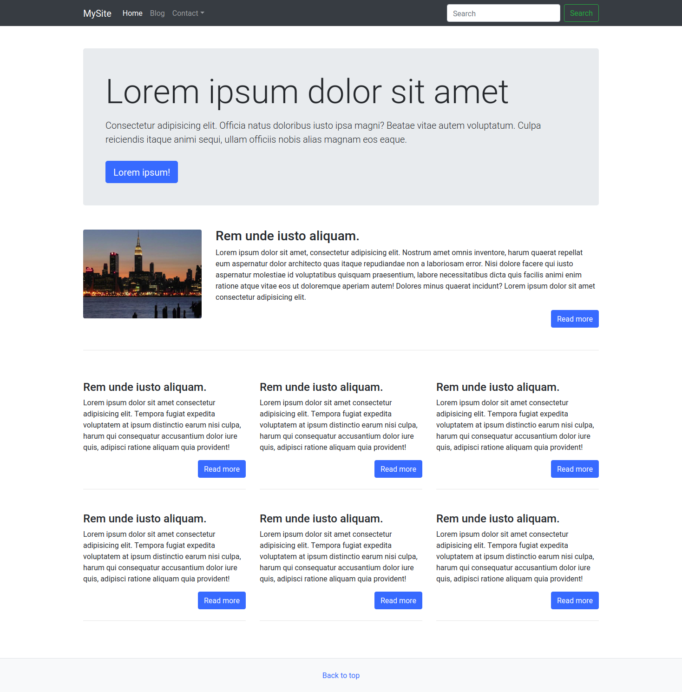

# Weblaptervezéshez szükséges ismeretek

## Alapfogalmak

A **HTML** \(**H**yper**T**ext **M**arkup **L**anguage\) a weboldal alapja, olyan, mint egy ház alapja, csupasz falai, teteje.



 A **CSS** \(**C**ascading **S**tyle **S**heets\) felel a weboldal kinézetéért, olyan, mint a ház színe, dekorációja, bútorzata.



A **JavaScript** programozási nyelv felel az oldalak működésért, olyan mint egy ház gépészete, elektromos rendszere \(ha itt megnyomok egy kapcsolót, amott felgyúl a villany\).

## Grafikai szoftverek

Az [Adobe](https://www.adobe.com/) termékei de facto iparági szabványként működnek, a webes grafikusok jelentős része [Adobe Photoshop](https://www.adobe.com/hu/products/photoshop.html)-ot használ, és [PSD](https://en.wikipedia.org/wiki/Adobe_Photoshop#File_format) formátumú állományokkal látja el a fejlesztőket.

Photoshop mellett az [Adobe Illustrator](https://www.adobe.com/hu/products/illustrator.html), és a [Fireworks](https://www.adobe.com/hu/products/fireworks.html) is népszerű. Az Adobe termékek nyílt forráskódú alternatívája a [Gimp](https://www.gimp.org/) ingyenes képszerkesztő, és az [Inkscape](http://www.inkscape.org/) vektorgrafikus szerkesztő.

Animációs területen az Adobe Flash elvesztette a piaci monopóliumát, az Adobe beszüntette a platform támogatását, ezt a piaci rést a HTML5-ös animált bannerek töltik be, ezek szerkesztésére jött létre az ingyenes [Google Web Designer](https://webdesigner.withgoogle.com/).

## Szövegszerkesztők

A grafikai munkákon túl a fejlesztők szövegszerkesztőt \(Text editor\), és integrált fejlesztői környezetet \(Integrated Development Environment azaz IDE\) használnak, ezek a programok fel vannak ruházva a forráskódok irását, szerkesztését segítő funkciókkal, úgy mint intelligens kód kiegészítés \([Emmet](https://emmet.io/), [Intelli Sense](https://code.visualstudio.com/docs/editor/intellisense)\), kód színezés, hibakiemelés, stb. Számos ingyenes és fizetős program létezik, a teljesség igénye nélkül: [Visual Studio Code](https://code.visualstudio.com/), [Atom](https://atom.io/), [Notepad++](https://notepad-plus-plus.org/download/v6.9.2.html), [Brackets](http://brackets.io/), [Sublime Text](s://www.sublimetext.com), [Adobe Dreamweaver](https://www.adobe.com/hu/products/dreamweaver.html)...



## Drótváz

A **drótváz** készítés egy módszer, amely segítségével kialakíthatjuk egy weboldal felépítését. A drótvázat elsősorban olyan weboldalak tartalmának és funkcionalitásának meghatározására használjuk, melyek figyelembe veszik a felhasználói igényeket és a felhasználói viselkedést. A drótvázakat a fejlesztési folyamat korai szakaszában használjuk az oldal alapvető kialakítása előtt, megelőzi a tényleges online grafikai tervezést, és a \(szöveges\) tartalmak kialakítását. A drótváz kiváló eszköz arra, hogy költséges fejlesztés nélkül megismerjük az ügyfél igényeit, a fejlesztők pontos képet kapjanak az elkészítendő alkalmazás működéséről, ezen felül teret ad a kisérletezésnek, segítségével alacsony költségen kipróbálhatóak a projektekkel kapcsolatos ötletek.

A drótváz készülhet kézi rajzzal papíron, táblán, de vannak speciálisan erre a célra szolgáló szoftverek, mint példáula a [Scetch](https://www.sketch.com/), vagy az [Adobe XD](https://www.adobe.com/hu/products/xd.html), egy jó ingyenes nyílt forráskódú alternatíva a [Pencil Projekt](https://pencil.evolus.vn/). Jellemző még ezen a területen az [Adobe Illustrator](https://www.adobe.com/hu/products/illustrator.html) használata.

A **prototípus** a következő lépés a drótváz után, ez már kattintható, bár a funkcionalitás csak mímelt \(angol kifejezéssel mock, magyarosítva mokkolt\). Jellemzően  HTML, és CSS segítségével készül, erre a feladatra kiválóan alkalmas a [Bootstrap](https://getbootstrap.com/) keretrendszer is, ezzel gyorsan és hatékonyan lehet felületeket kialakítani. Egyes drótváz készítő programokból lehet kattintható prototípust előállítani.

Bővebbebb cikk a témáról: [Using wireframes to streamline your development process](https://www.webdesignerdepot.com/2009/07/using-wireframes-to-streamline-your-development-process/)

## Grid rendszerek, vagy modulháló

A **grid**, vagy **modulháló** a tervezés legalapabb alapja, nem újkeletű dolog \(többszáz éve használja a nyomtatott grafika\), de új értelmet nyert a reszponzív webdizájnban, ahol fix szélességek helyett dinamikusan alkamazkodó arányokat célszerű használni.

### A modulháló \(grid system\) részei

#### Sorok \(row\)

#### Oszlopok \(column\)

#### Csatornák \(Gutter vagy Gap\)

#### Margók

#### Régiók/területek

#### Modulháló használata

Weboldalunkhoz nem kell megírni külön a grid rendszert, számos kész rendszer a rendelkezésünkre áll: [960 Grid System](https://960.gs/), [csswizardry-grids](https://csswizardry.com/csswizardry-grids/), [Neat Grid](https://neat.bourbon.io/docs/latest/)

Grid rendszert készen beépítve megtaláljuk a jelentősebb CSS/HTML keretrendszerekben: [Bootstrap - Grid System](https://getbootstrap.com/docs/4.0/layout/grid/), [Zurb Foundation - The Grid](https://foundation.zurb.com/grid.html)

A [Bootstrap Grid System](https://getbootstrap.com/docs/4.0/layout/grid/) érdekessége, hogy a Bootstrp egyép funkciói nélkül is beépíthetjük, és használhatjuk.

