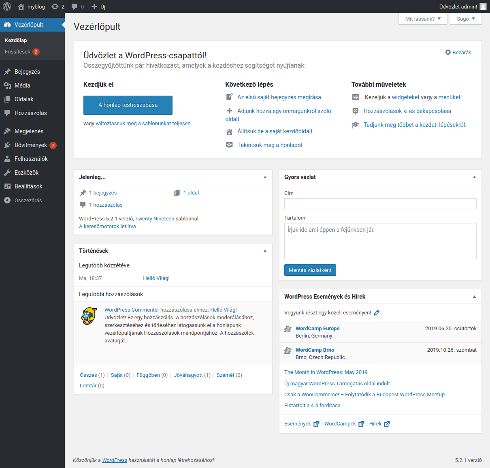
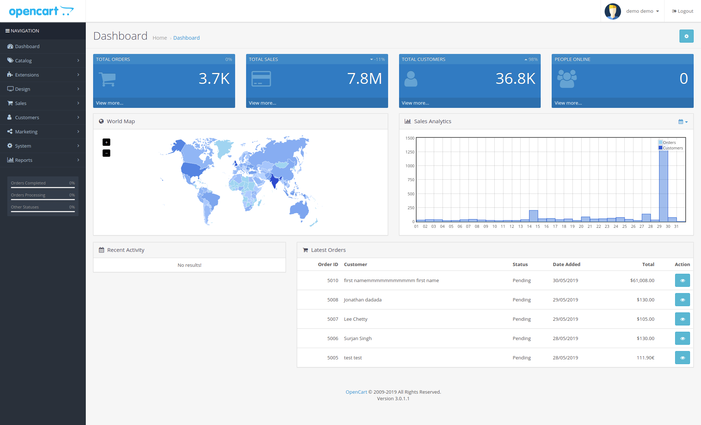

# Webmotorok, tartalomkezelők, webshopok

## Egyedi motorok

Egyedi programozású rendszereket számos cég készít, jellemzően egyedi igényeket elégítenek ki.

### Egyedi rendszerek előnyei

* Nincsenek ismert hibák, amit a hackerek \(könnyen\) kihasználhatnának.
* Azt az igényt elégíti ki, amire a megrendelőnek szüksége van.
* Nem tartalmaz felesleges funkciókat, így könnyebben optimalizálható.

### Egyedi rendszerek hátrányai

* Nincs mögötte a közösség ereje, tudása.
* Jellemzően a legalapvetőbb funkciókon kívül mindent le kell fejleszteni.
* Nem jönnek ki új frissítések, csak ha ezért fizetünk.
* Megszűnik a fejlesztő cég nem biztos hogy \(könnyen\) találunk kompetens fejlesztőt.
* Az egyedi rendszerek költségvonzata is magasabb.


Egyedi motorok esetében is szokás keretrendszer\(-eket\) használni, ezek általában a legalapvetőbb funkciókat, struktúrát tartalmazzák, példák keretrendszerekere: Smarty, Symfony, Laravel, Zend Framework, Django.


## Webes tartalomkezelő rendszerek 

A webes tartalomkezelő rendszerek \(CMS - Content Management System\) adatok \(tartalmak\) kezelésére szolgálnak, és lehetőséget biztosítanak több felhasználó kollaboratív együttműködésére.

Webes tartalomkezelők legjellemzőbb képességei:

* Tartalmak kezelése, szerkesztése \(szöveges, képi, multimédia\)
* Különböző tartalomtípusok kezelése \(aloldal, blogbejegyzés, hír, publikáció, termék, naptár időpont stb.\)
* Tartalmak rendszerezésének lehetősége \(kategóriák, cimkék, stb.\)
* Több felhasználó kezelése
* Felhasználói szintek \(szuperadmin, admin, szerkesztő, tag, stb.\)
* Látogatói statisztikák biztosítása
* Adatok exportálása, importálása
* Frissítéskezelő
* Bővíthetőség modulokkal, pluginokkal
* Különböző a design-t, és a megjelenést befolyásoló témák

Jellemző a bőség zavara, mind fizetős, mind ingyenes rendszerből számolatlan áll rendelkezésre, legelterjedtebb ezek közül:

### WordPress

A [**WordPress**](https://wordpress.org/) egy nyílt forráskódú, ingyenes tartalomkezelő rendszer, eredetileg blogmotor volt, elsődleges célja a blog funkciók kiszolgálása, de sokoldalúsága, és számtalan bővítményének hála nagyon széles körben bevethető, akár webshop funkciókkal is fel lehet ruházni. 2003 óta létezik, és aktívan fejlesztik, számos technológia, például a Gutenberg interaktív szerkesztő a Wordpress-ből nőtt ki. [Magyar közösség](http://wphu.org/) aktív, és [magyar nyelvű kézikönyv](https://wphu.org/wordpress-kezikonyv/) is elérhető. Telepítése egyszerű, 5 perc alatt elvégezhető \(híres 5 perces telepítés\). A WordPressnek jelentős elterjedsége van, a Világháló öszes weblapjának 33.9%-a WordPress alapú, a tartalomkezelők piacán 60.7%-ot mondhat magáénak \(2018-as adatok alapján\).

### Drupal

A [**Drupal**](https://www.drupal.org/) 2000 óta létző nyílt forráskódú, ingyenes CMS, általános célra készült, a funkcionalitása bővítmények segítségével fejleszthető, bővíthető, a kinézete témázható \(itt sminknek hívják\). Telepítése, konfigurálása bonyolult a többi ingyenes CMS-hez képest. A magyar közösség aktív, létezik több magyar [kézikönyv](https://www.drupal.org/hu/docs/user_guide/hu/index.html), fontos a Drupalaton, a Balatonnál megtartott éves Drupál konferencia. Sok magyar fejlesztőcég dolgozik ezzel a tartalomkezelővel \(pl. Penceo, Cheppers\).

### Joomla

A [**Joomla**](https://www.joomla.org) 2005-ben jött létre nyílt forráskódu ingyenes rendszerként egy korábbi tartalomkezelőből a Mambo-ból. Bővíthető, és témázható CMS. A mai napig aktív a fejlesztése. Korábbi kiemelkedő népszerűségét átvette a WordPress.

### Typo3

**A** [**Typo3**](https://typo3.org/) jellemzően német nyelvterületen elterjedt 2001 óta létező nyílt forráskódú ingyenes tartalomkezelő rendszer.


Tartalomkezelő rendszerek népszerűségének összehasonlítása a Google Trends-en: [https://trends.google.com/trends/explore?date=all&q=wordpress,drupal,joomla,typo3](https://trends.google.com/trends/explore?date=all&q=wordpress,drupal,joomla,typo3)


## Webshopok

A webshopok **termékek és szolgáltatások forgalmazásra specializált tartalom kezelő rendszerek**. A CMS alap funkciókon túl fel vannak ruházva az áruforgalom lebonyolításához szükséges képességekkel:

* Árucikkek kezelése, szerkesztése
* Raktárkészlet kezelése
* Vásárlók kezelése
* Kosár
* Online fizetés
* Online számlázás
* Szállítási költségkalkuláció
* Visszaigazoló emailek kezelése
* Könyvelés, statisztika

Webáruház motorok tekintetében is bőséges kínálatból választhatunk:

### Magento

A [Magento](https://magento.com/home_page) egy nyílt forráskódú e-kereskedelmi platform. Az Adobe 2018-ban megvásárolta a Magentót fejlesztő céget, és bemelte a Magentót a saját [felhő szolgáltatásába \(Adobe Commerce Cloud\)](https://www.adobe.com/commerce/magento.html).

### Opencart

Régi motoros a webshopok között az 1998 óta létező Opencart, ez szintén egy népszerű, nyílt forráskódú ingyenes rendszer.

### WooCommerce

A [WooCommerce](https://woocommerce.com/) plugin a WordPress-t ruházza fel webshop funkcionalítással. Létezik hozzá egy speciális WordPress téma, a [Storefront](https://woocommerce.com/storefront/), ez biztosítja a webshop megjelenést. Hatalmas előnye, hogy a WordPress-el együtt is gyorsan és egyszerűen telepíthető.


Webshop motorok népszerűségének összehasonlítása a Google Trends-en: [https://trends.google.hu/trends/explore?date=all&q=WooCommerce,Magento,Shopify,Opencart,PrestaShop](https://trends.google.hu/trends/explore?date=all&q=WooCommerce,Magento,Shopify,Opencart,PrestaShop)


## Egyéb alternatívák

### Statikus oldal generáló \(Static Site Generator\)

A statikus oldal generáló szöveges állományokból, például [markdown](https://www.markdownguide.org/getting-started) állományokból állít elő egy teljes weboldalt, ezt a műveletet rendszerint az oldal szerzője, fejlesztője végzi el egy asztali gépen. Nagy előnye ezeknek a rendszereknek, hogy nincs szükség számításigényes szerveroldali technológiákra, adatbázisokra, így ezek az oldalak kifejezetten gyorsak, és biztonságosak. Hátrányuk az interaktivitás hiánya \(nincsenek háttérműveletek\). 

Statikus oldal generálók: [Jekyll](https://jekyllrb.com/), [Hyde](http://hyde.github.io/), [Gatsby](https://www.gatsbyjs.org/)

### Felhő alapú weboldalkészítő \(Cloude based website builder\)

A kétezres évek közepén jelentek meg a felhő alapú weboldal készítő alkalmazások, és egyszerű kezelhetőségük miatt egyre növekszik a népszerűségük.

A felhő alapú weboldalkészítők egy online felületen drag and drop \(fogd és vidd\) technikával gyorsan összerakható, és szerkeszthető weboldalakat kínálnak.

#### Felhő alapú weboldalkészítő előnyei

* Gyorsan megtanulható a használata
* Nem szükséges csak minimális technikai háttér ismeret
* Számos előre elkészített sablon, és bővítmény

#### Felhő alapú weboldalkészítő hátrányai

* Kötve vagyunk a platformhoz, nem a miénk az oldal kódja, emiatt nem költöztethető
* Korlátozottan optimalizálható teljesítmény, SEO szinten
* Korlátozott funkcionalitása miatt egyedi igényeinket adott esetben nem tudja kielégíteni

Felhő alapú weboldal készítők: [WIX](https://www.wix.com/), [Squarespace](https://www.squarespace.com/), [site123.com](https://app.site123.com/), [Weebly](https://www.weebly.com/), [Unbounce](https://unbounce.com)

