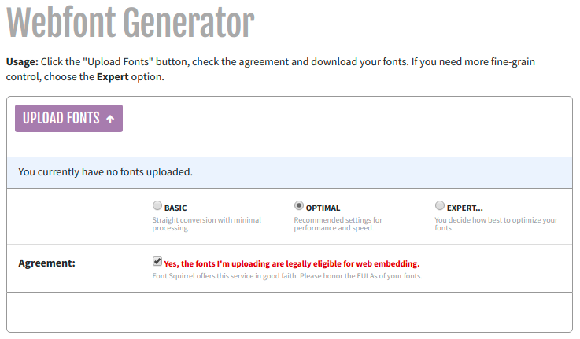
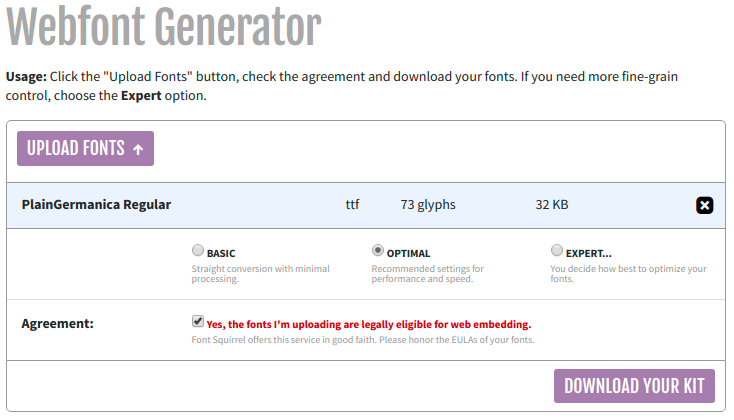
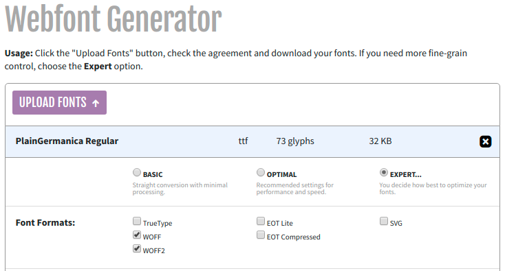
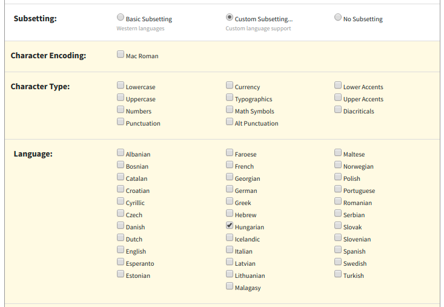
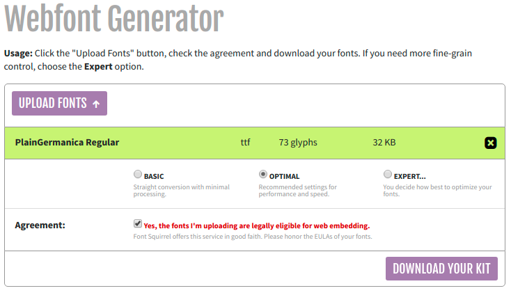
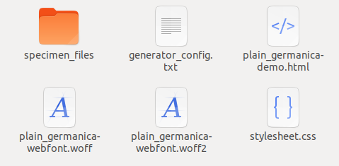
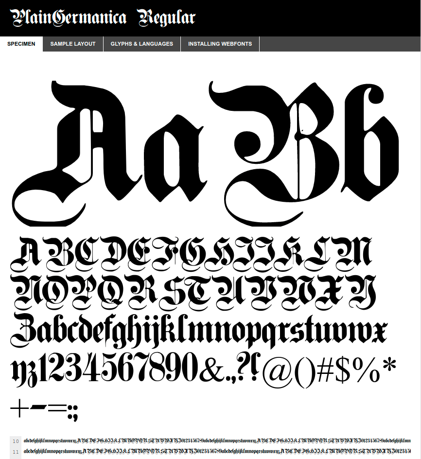

# Font Squirrel

## Mi az a Font Squirrel?

A Font Squirrel egy webfont szolgáltatás, ingyenes, és fizetős webfontok mellett kínálnak egy webfont generátort. A generátorral hagyományos betűtípusokból készíthetünk a böngészők által is támogatott webfontokat, a generátor fontok bekötéséhez szükséges CSS-t is elkészíti.

A webfont generátor a `Generator` menüpont alatt érhető el:   
[https://www.fontsquirrel.com/tools/webfont-generator](https://www.fontsquirrel.com/tools/webfont-generator)

A webfontokról bővebben:



## Font Squirrel használata



A webfont előállításához szükség van egy font állományra, ez lehet például egy TTF \(True Type Font\), amit a böngészők nem támogatnak.

A kívánt fontot az `Upload Fonts` gombbal lehet feltölteni. Párhuzamosan több fontot is fel lehet tölteni.

A generáláshoz el kell fogadni a jogi nyilatkozatot, hogy van jogunk az adott fontot felhasználni. 

A feltöltött fontokat kilistázza a generátor, az `x` -re kattintva ki tudjuk venni a fontokat a listából.



Az `Expert` beállításokat kiválasztva számos beállítás közül kiválaszthatjuk például a generálandó webfont formátumokat. A webfont formátumokról bővebben: [@font-face](https://digikiad.gitbook.io/digitalis-kiadvanyok/css/szoevegek-szoevegkoezi-elemek#font-face).



Magyar ékezetes betűtípus generálásához a fontnak támogatnia kell a megfelelő ékezeteket, és az `Expert` beállításokban ki kell választanunk a nyelvi támogatást \(Subsetting &gt; Custom Subsetting &gt; Language\):



A generált állományokat a `Download your kit` gombra kattintva lehet letölteni.



A letöltés egy tömörített _zip_ állomány, ami tartalmazza a legenerált webfont állományokat, egy CSS állományt a generált `@font-face` stílussal, és egy demó HTML állományt, amiben megtekinthetjük a fontot egy próbaszövegen \(a használatba vételhez tömörítsük ki\).



A demó állomány böngészőben megnyitva:



A legenerált CSS állomány tartalma \(ami a fontok bekötéséhez szükséges `@font-face`\):

```css
@font-face {
    font-family: 'plaingermanicaregular';
    src: url('plain_germanica-webfont.woff2') format('woff2'),
         url('plain_germanica-webfont.woff') format('woff');
    font-weight: normal;
    font-style: normal;

}
```

