# Glitch.com

## Mi az a Glitch.com?

A [Glitch.com](https://glitch.com/) egy online szolgáltató, webes alkalmazásokat lehet szerkeszteni, és publikálni vele. Kiváló eszköz arrar a célra, hogy [prototípusokat](../digitalis-kiadvanyok/weblaptervezeshez-szuekseges-ismeretek.md#drotvaz), egyszerű statikus weboldalakat osszunk meg másokkal.  A publikálás ingyenes, néhány korlátozással \(havidíjjas előfizetéssel ezek a korlátozások kikerülhetőek\).

### Publikálás lépései: 

#### Regisztráció

Regisztrálni az alábbi címen lehet: [https://glitch.com/signup](https://glitch.com/signup).

_Facebook_, _Google_ és _GitHub_ fiókkal tudunk regisztrálni, de lehetőség van email címet is megadni.

**Projekt létrehozása**

Felső menüből válasszuk ki a\(új projekt\) gombot. Ekkor a rendszer megkérdezi, hogy milyen projektet szeretnénk létrehozni, ekkor válasszuk a 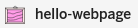 opciót, amivel egy egyszerű statikus weboldalt hozhatunk létre. 

Létrehozás után átkerülünk a projekt szerkesztőfelületére:

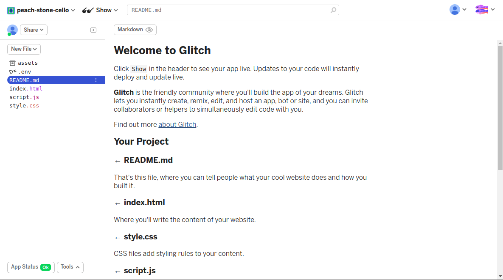

Az első állomány amit megnyit a felület a `README.md` ami egy kis súgó, érdemes elolvasni a tartalmát.

A bal oldali menüből az `index.html` állományt kiválasztva nyílik meg a szerkesztőfelület, ez egy online szövegszerkesztő \(korlátozott lehetőségekkel\):

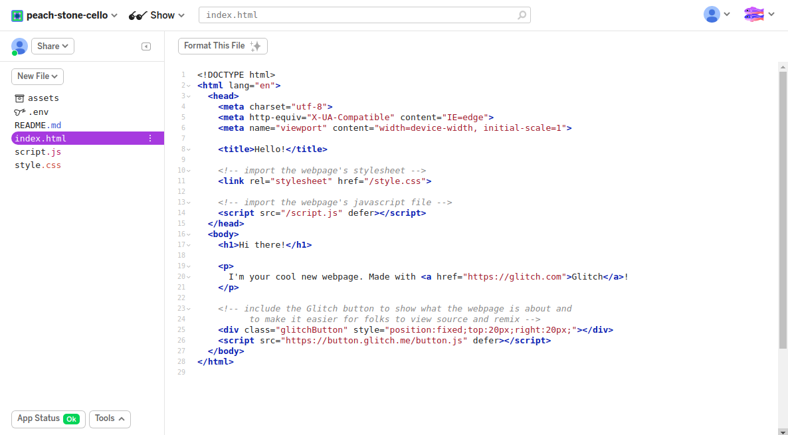

Az új projektet a 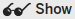 menüpont alatt tudjuk megnézni, új ablakban vagy osztott képernyős nézetben tekinthetjük meg, mindkét esetben azonnal látjuk a módosításainkat az oldalon.

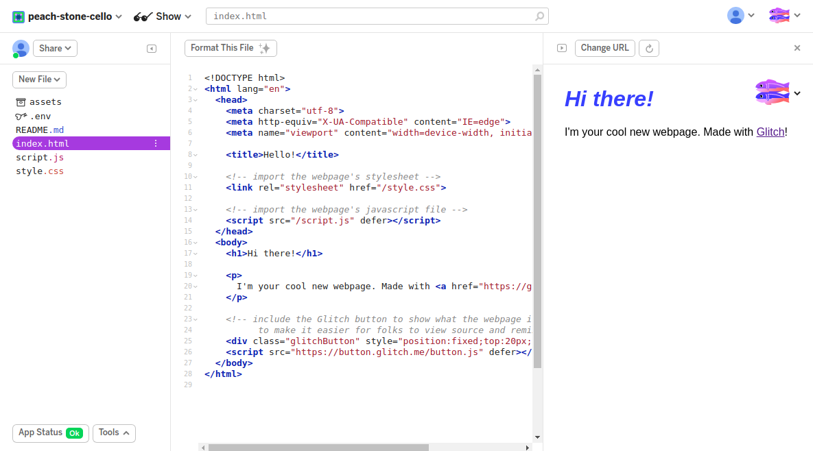

A projekt nevét és [URL](../digitalis-kiadvanyok/mi-szuekseges-egy-weboldal-elinditasahoz.md#domain-nev)-jét a Glitch.com a létrehozásnál véletlenszerűen határozza meg, ha szeretnénk módosítani a bal felső sarokban lévő menüben tehetjük meg, a kinyíló kis ablakban kattintsunk a projekt nevére. Ugyanitt adhatunk egy leírást is a projekthez.

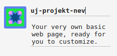

#### Képek feltöltése

...

## VS Code összekötése a Glitch.com -al

Lehetőség van a Glitch.com-on elhelyezett projektjeink szerkesztésére a [Visual Studio Code](../vs-code/mi-a-vs-code.md)-ban, ennek számos előnye van, töbek között a VS Code több segítséget ad, és jobb átláthatóságot biztosít.

### VS Code és a Glotch.com összekötésének lépései

#### Glitch.com plugin telepítése a VS Code-ba

A bal oldali függőleges menüből nyissuk meg a VS Code bővítmény kezelőjét \(Extensions\), a keresőbe írjuk be a `Glitch` kulcsszót, és válasszuk ki a Glitch bővítményt és nyomjuk meg az 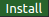 gombot.

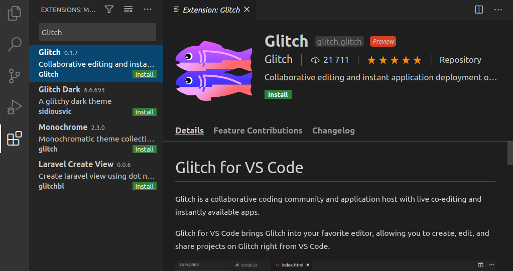

#### Projekt megnyitása szerkesztésre

Projektet a VS Code [parancsértelmezőjével](../vs-code/vs-code-anatomiaja.md#parancs-paletta) megnyitni, nyomjuk meg a Ctrl+Shift+p billentyű kombinációt \(vagy a menüből View/Command Palette\). A megjelenő ablakba írjuk be, hogy Glitch:

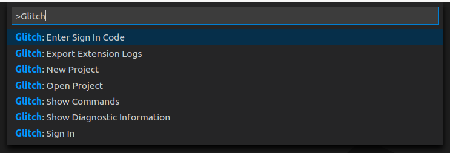

Listában megjelennek a Glitch-el kapcsolatos parancsok, válasszuk ki az Open Projekt \(Projekt megnyitása parancsot\).

Ahhoz hogy az online projektet tudjuk szerkeszteni, a szövegszerkesztőnket be kell jelentkeztetni a Glitch.com rendszerébe, ha ezt még nem tettük meg a VS Code felkínálja a bejelentkezést. 

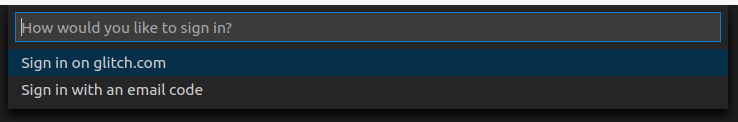

Válasszuk ki az online autentikációt \(Sing in on glitch.com\). A VS Code megnyitja az alapértelmezett böngészőt, amiben engedélyezhetjük a VS Code kapcsolódását.

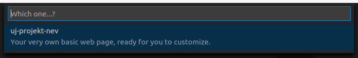

Visszatérve a VS Code-ba már ki tudjuk választani a korábban az online felületen létrehozott projektünket. Minden amit szerkesztünk, és elmentünk azonnal megjelenik a projekten.

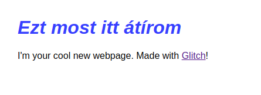

