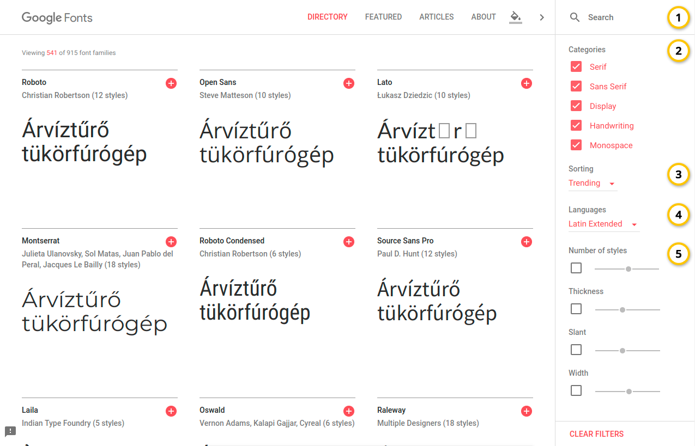
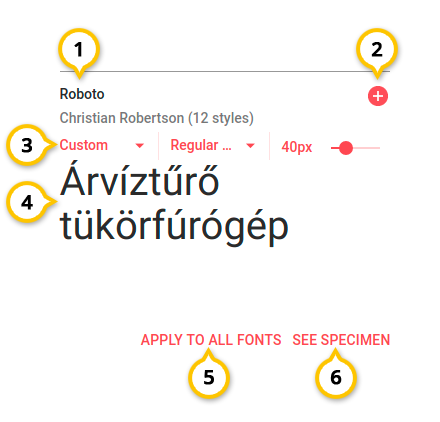
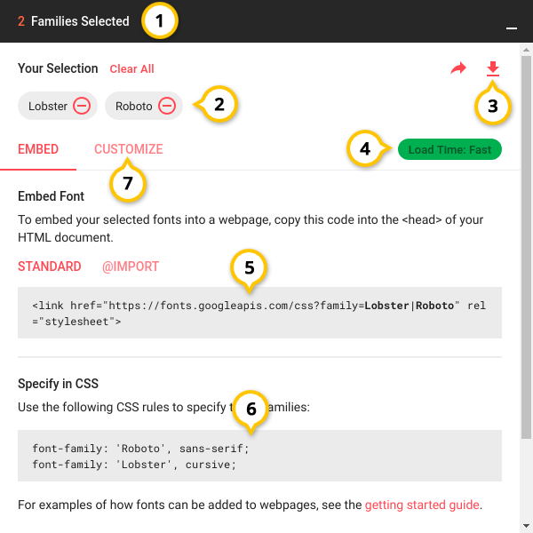
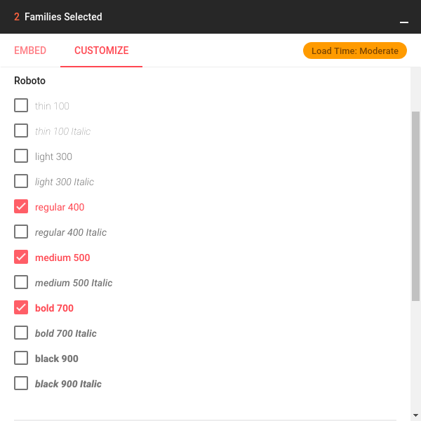
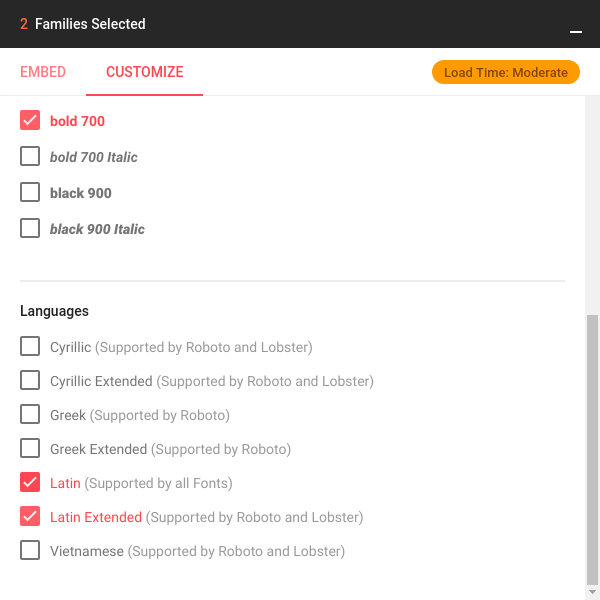
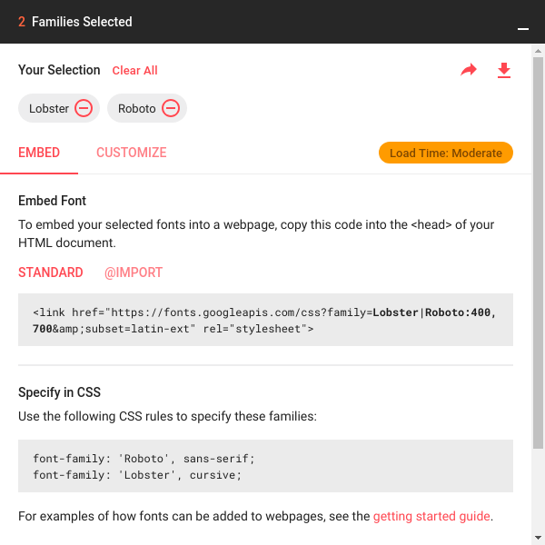
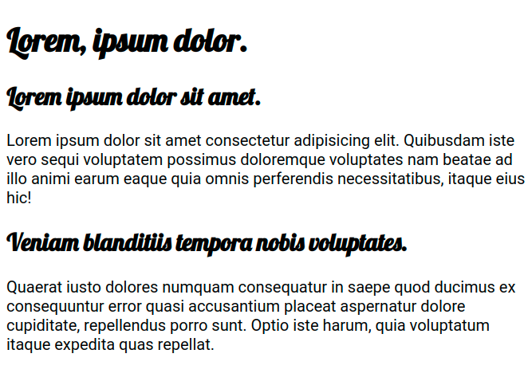

# Google Fonts

## Mi az a Google Fonts?

A Google Fonts a Google 2010 óta üzemelő ingyenes webfont szolgáltatása. Hozzávetőleg 900 fontot bocsátanak rendelkezésre, ebből 4-500 font támogatja a magyar ékezeteket.

A Google Fonts-on elérhető fontok a [SIL Open Font License](https://en.wikipedia.org/wiki/SIL_Open_Font_License) hatálya alá esnek, üzleti felhasználásuk is szabad, és ingyenes.

A szolgáltatás az alábbi linken érhető el: [https://fonts.google.com/](https://fonts.google.com/)



## Google Fonts használata

### Kereső 

A Google Fonts-ban számos font található meg \(~900\), hogy a felhasználó könnyen megtalálja a neki megfelelő fontokat, a Google Fonts rendelkezik keresővel:



1. Szöveges kereső - itt a fontok nevére, szerzőjére kereshetünk.
2. Font kategóriák - Kiválaszthatjuk, hogy a találatok között mely kategóriába tartozó fontok jelenjenek meg \(lásd [általános betűcsaládok](https://digikiad.gitbook.io/digitalis-kiadvanyok/css/szoevegek-szoevegkoezi-elemek#betutipusok-betucsaladok)\).
3. Rendezés - Rendezhetjük a fontokat név, dátum, népszerűség szerint.
4. Nyelvek - Támogatott nyelvekre szűrhetünk, a magyar ékezetes fontok szűréséhez a `Latin Extended` \(Latin bővített\) karakterkészletet kell kiválasztani.
5. Szűrés font tulajdonságai alapján - Betűvastagság, variációk száma, vastagság, dőltség, és a karakterek szélessége alapján szűrhetünk.

### Font lista

A font listában próbálhatjuk ki, és hasonlíthatjuk össze a szűrőfeltételeknek megfelelő fontokat.



1. Font neve, szerzője
2. Font hozzáadása a kiválasztott fontok közé
3. Nézet beállításai
   1. Előre definiált szövegek \(például számok, karakterek, bekezdés, ...\)
   2. Font vastagság választó
   3. Font méret választó
4. Próba szöveg, itt nézhetjük meg, hogy néz ki szöveg megjelenése az adott fonttal.
5. Ezzel az opcióval a kiválasztott próbaszöveg beállítást a listában lévő többi fontra is be tudjuk állítani.
6. Az adott font részletes adatlapjának a megtekintése.

### Fontok kiválasztása, beépítése

Fontokat a  jellel választhatunk ki letöltésre, vagy beépítésre. Ha van kiválasztott fontunk a képernyő alján megjelenik egy ablak \(fekete sáv\), ezt felnyitva kapjuk meg a lehetséges beállításokat.



1. Kiválasztott fontok száma.
2. Kiválasztott fontok listája, mínuszra kattintva lehet őket eltávolítani.
3. Kiválasztott fontok letöltése, ez nem webfontot szolgál ki, grafikai programokban lehet használni \(Photoshop, Illustrator\), vagy rendszerfontként lehet telepíteni az operációs rendszerünkben.
4. Betöltődési sebesség, minél több fontot választunk ki a projektünkben, annál jobban terheli a felhasználó sávszélességét.
5. HTML `link` elem a fontok bekötéséhez, alternatívaként használhatunk `@import` CSS direktívát \(erről bővebben: [linkek](https://digikiad.gitbook.io/digitalis-kiadvanyok/html/html-elemek#linkek) és [CSS import](https://digikiad.gitbook.io/digitalis-kiadvanyok/css/css-stilusok-felepitese#css-importalasa)\).
6. A CSS szabályok, amivel HTML elemekre alkalmazhatjuk a betöltött fontokat.
7. Részletes beállítások

### Részletes beállítások

A részletes beállítások alatt választhatjuk ki a fonthoz tartozó vastagság értékeket, és a karakterkészletet \(nyelv\).

Fontonként kiválaszthatjuk a használni kívánt betűvastagság értékeket:



Magyar ékezethez a `Latin Extended` karakterkészletre van szükség:



## Példa HTML állomány

A következő példában a Lobster, és a Roboto fontokat kötjük be egy HTML állományba. A fontokból a magyar ékezetes `Latin Extended` karakterkészletet használjuk:

Kiválasztott fontok a Google Fonts-on:



HTML állomány:


```markup
<!DOCTYPE html>
<html lang="hu">
<head>
    <meta charset="UTF-8">
    <meta name="viewport" content="width=device-width, initial-scale=1.0">
    <meta http-equiv="X-UA-Compatible" content="ie=edge">
    <title>Google Font példa</title>

    <!-- A Lobster és a Roboto fontokat importáljuk egy link segítségével -->
    <link href="https://fonts.googleapis.com/css?family=Lobster|Roboto:400,700&amp;subset=latin-ext" rel="stylesheet">

    <style>
        /* Címeknek a Lobster fontot állítjuk be CSS-el: */
        h1, h2 {
            font-family: 'Lobster', cursive;
        }

        /* Bekezdéseknek a Roboto fontot állítjuk be CSS-el: */
        p {
            font-family: 'Roboto', sans-serif;
        }
    </style>
</head>
<body>
    <h1>Lorem, ipsum dolor.</h1>
    <h2>Lorem ipsum dolor sit amet.</h2>
    <p>Lorem ipsum dolor sit amet consectetur adipisicing elit. Quibusdam iste vero sequi voluptatem possimus doloremque voluptates nam beatae ad illo animi earum eaque quia omnis perferendis necessitatibus, itaque eius hic!</p>
    <h2>Veniam blanditiis tempora nobis voluptates.</h2>
    <p>Quaerat iusto dolores numquam consequatur in saepe quod ducimus ex consequuntur error quasi accusantium placeat aspernatur dolore cupiditate, repellendus porro sunt. Optio iste harum, quia voluptatum itaque expedita quas repellat.</p>
</body>
</html>

```


Az állomány böngészőben megnyitva:



