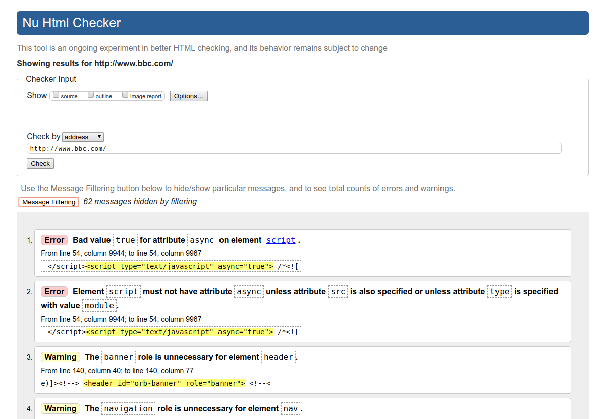
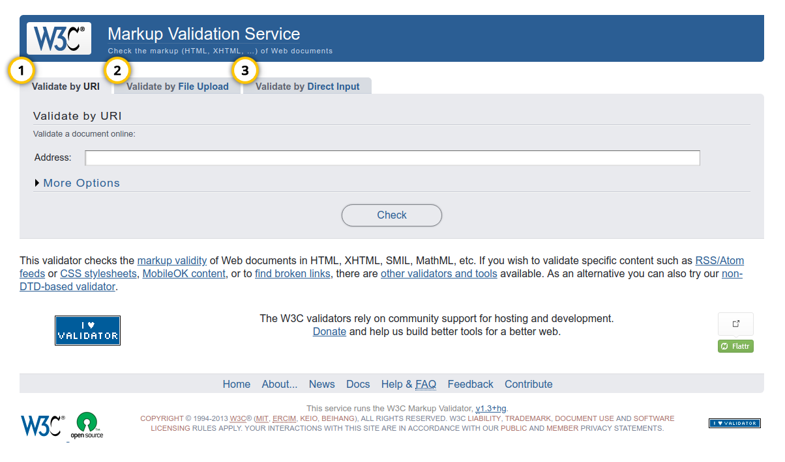
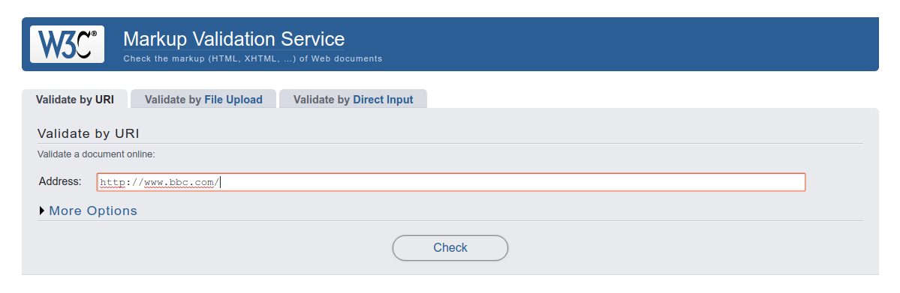
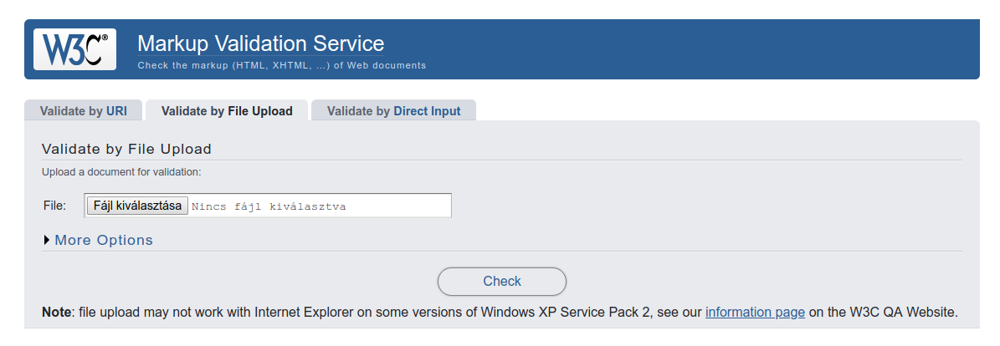
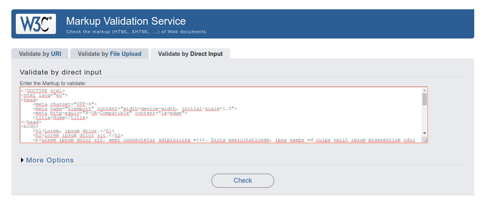
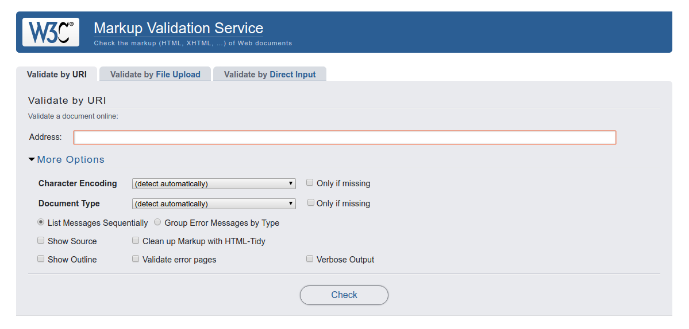
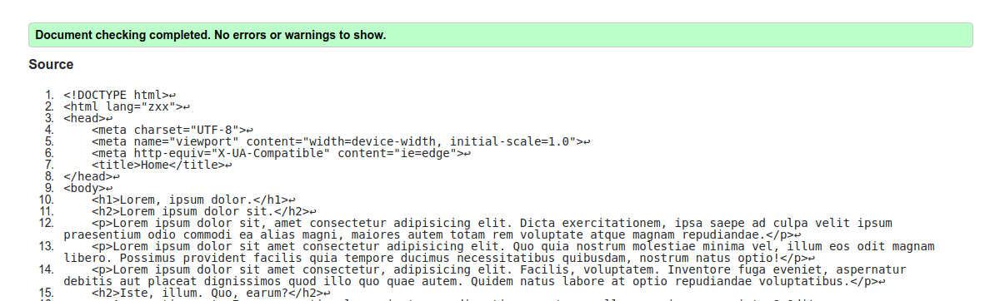
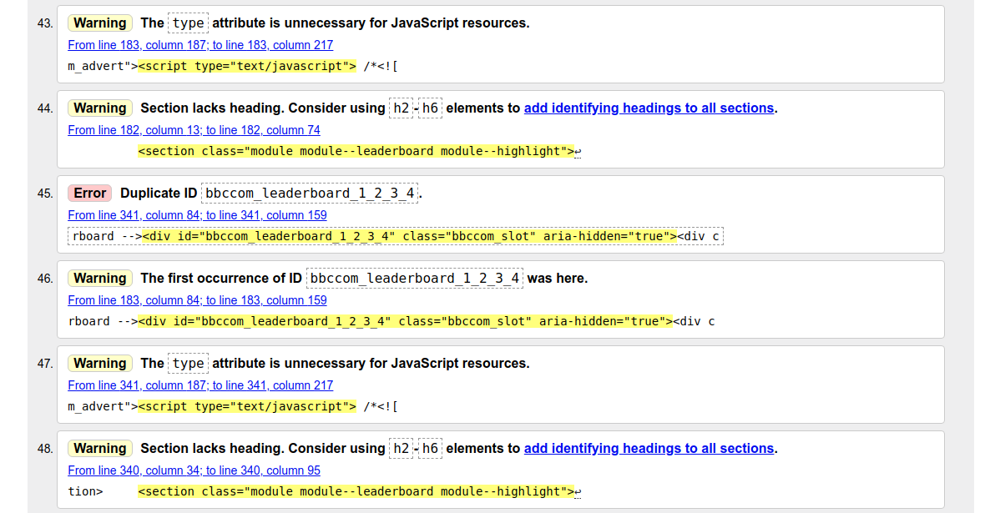
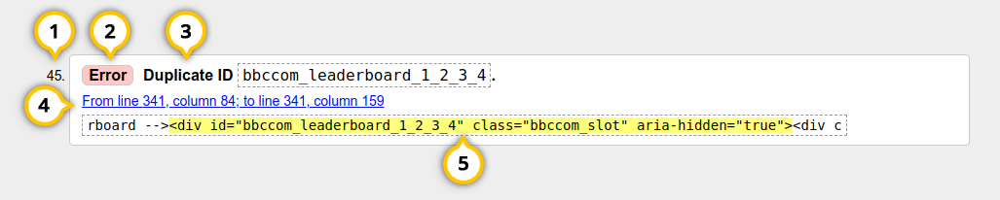

# W3C Validator

## Mi az a W3C Validator?

A [**W3C Validator**](https://validator.w3.org/) a [W3C](https://www.w3.org/) nemzetközi szervezet \(World Wide Web Consortium\) jelölőnyelv ellenőrző eszköze. Ezzel az eszközzel lehet weboldalak vagy beküldött **HTML** állományok kódját ellenőrizni, hogy azok megfelelnek e a **HTML** szabványnak. A **HTML** mellett **XML** és **XHTML** dokumentumokat is lehet vele ellenőrizni.

A **W3C Validator** elérhetősége: [**https://validator.w3.org/**](https://validator.w3.org/)\*\*\*\*

## W3C Validator használata

### Kód beküldése ellenőrzésre

Három módon küldhetünk be HTML kódot ellenőrzésre, a nekünk megfelelő módot a [validator űrlapjának tetején](https://validator.w3.org/) a tabokon választhatjuk ki.

1. Megadhatunk egy URL-t vagy webcímet ellenőrzésre.
2. Feltölthetünk egy állományt a számítógépünkről, a feltöltött állományt fogja ellenőrizni a validator.
3. Copy/paste-el bevághatunk egy teljes, vagy részleges HTML állomány tartalmat ellenőrzésre.

### További beállítások

A további beállítások a **More Options** menüből érhetőek el:

#### Karakter kódolás \(Character encoding\)

A validator alapbeállításnál megpróbálja felismerni a dokumentum karakter kódolását, de mi is beállíthatunk egy konkrét karakter kódolási táblát a legördülő menüből.

#### Dokumentum tipus \(Document Type\)

A !doctype meghatározás alapján próbálja meg értelmezni a dokumentumot a validator, ennek hiányában HTML 4.01 Transitional dokumentum típust fogja használni. A legördülő menüből mi is kiválaszthatjuk a megfelelő típust.

#### Hiba üzenetek csoportosítása

Két lehetőség van, az első esetben sorrendben jeleníti meg az üzeneteket, ahogy halad végig a dokumentumon a validator \(List Messages Sequentially\), a második eset, amikor kategóriánként csoportosítja a hiba üzeneteket \(Group Error Messages by Type\).

#### Forráskód mutatása \(Show Source\)

A validator mutatja a forráskódot, és kiemeli benne a hibás elemeket.

#### Forráskód tisztítása \(Clean up Markup with HTML-Tidy\)

A validátor a HTML-Tidy segítségével megkisérli javítani az esetleges hibákat.

#### Cím hierarchia mutatása \(Show Outline\)

Ebben az esetben kapunk egy visszajelzést a dokumentum cím szerkezetéről.

#### Bőbeszédű kimenet \(Verbose Output\)

Bizonyos esetekben részletesebb visszajelzést kapunk így a hibákról.

### Visszajelzések

Ha megvannak a kívánt beállítások, és a Check gombbal beküldtük az ellenőrizendő kódot, a validator összeállítja nekünk a jelentését.

#### Hibaüzenet felépítése

1. Hiba sorszáma
2. Hiba tipusa, hiba \(error\), vagy warning \(figyelmeztetés\)
3. Hiba konkrét leírása
4. Hiba helye a kódban \(line: sor, column: oszlop\)
5. A hibás kódszakasz kiemelve.

