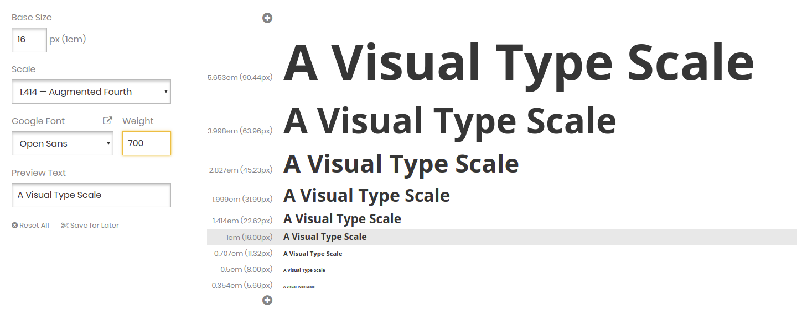

# Type Scale

A [Type Scale](https://type-scale.com/) egy tipográfiai skála kalkulátor, segítségével vizuálisan kiprobálhatjuk a címek, és a kenyérszöveg arányait. [Google fontokat](https://fonts.google.com/) használ, és a stílusok exportálhatóak CSS állományként, amit egyből be is köthetünk a HTML állományainkba.

A Type Scale elérhető az alábbi linken: [https://type-scale.com](https://type-scale.com/)

