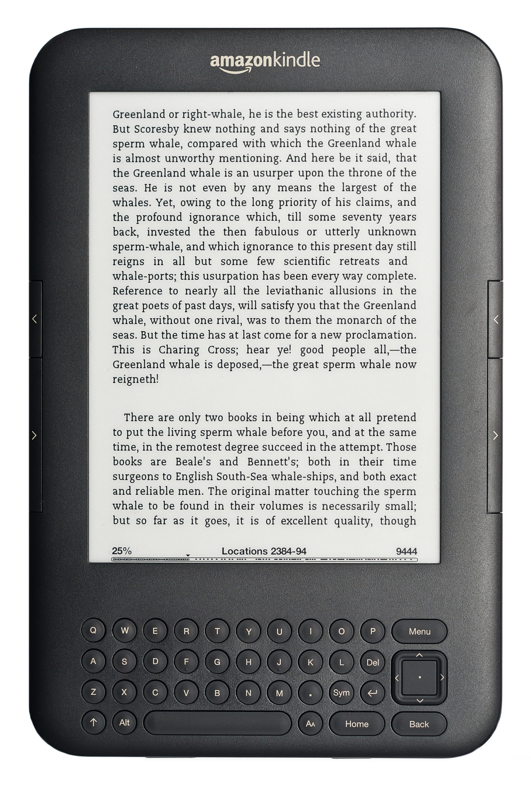

# Az eKönvekről dióhélyban

### Mi is az az eKönyv?

Az elektronikus könyv a fizikai könyvek elektronikus változata.

A fizikai könyvekhez hasonlóan szöveget és képet tartalmaz, de az új eKönyv formátumok támogatják a multimédiás tartalmakat, audió és videó anyagok beágyazását is lehetővé teszik.   
  
Az eKönyv létrehozása, terjesztése, és fogyasztása elektronikus úton történik. 

A fogyasztó számos lehetőség közül választhat, eKönyv olvasó program szinte minden platformon elérhető, erre jó példa az Amazon Kindle alkalmazása, ami telepíthető mobiltelefonra, tabletre, vagy akár PC-re is. Komoly áttörést mégis a dedikált ekönyvolvasó készülékek hoztak, ezek jellemzően saját beépített könyvesbolttal is rendelkeznek, így a fogyasztó bármikor és bárhol bővítheti a könyvtárát.

### eKönyv formátumok

Az internet megjelenésével már elérhetővé váltak a letölthető szöveges dokumentumok, ezek még nem rendelkeztek a könyvekre jellemző adottságokkal \(borító, tartalomjegyzék\), vagy a szöveg formázásának lehetőségével, vagy képi elemekkel, a legjellemzőbb ilyen formátum a **txt**, ez a mai napig használatban van. Később megjelentek a szövegszerkesztő szoftverek, és az ezekben használt dokumentumformátumok, mont a **doc**. Ezeket a formátumokat tekinthetjük az eKönyvek őseinek. 

**Pdf** - Általános dokumentumformátum, a legelterjedtebb eKönyv típus, bár felépítéséből adódóan a fizikai eKönyv olvasókon nehézkesen használható \(kötött layout\).

**Mobipocket** - Platformfüggetlen formátum, a korai Kindle készülékek preferált formátuma, kiterjesztése .mobi, vagy .prc lehet.

**Epub** - Platformfüggetlen, széles körben alkalmazott formátum, HTML-CSS alapokra épül, emiatt könnyen, változatosan formázható a tartalma.

**AZW** - Az Amazon saját ekönyvformátuma, amit digitális másolásvédelemmel láttak el \(DRM\)

### Történeti áttekintés

* **1993** - ****Adobe bemutatja a **PDF** formátumot
* **1998** - Az első dedikált eKönyv olvasó készülékek megjelenése \(The Softbook, Rocket eBook Reader\)
* **1999 -** Open eBook formátum \(később ebből alakul ki az ePub és a Mobipocket\)
* **2000 -** Első csak elektronikusan megjelenő könyv \(Stephen King - Riding the Bullet\)
* **2004** - Első eInk kijelzős ekönyv olvasó \(Sony Libré\)
* **2007** - Amazon piacra dobja az első Kindle olvasóját
* **2010 -** Apple bemutatja a iPad-ot, és fél millió kötetet kínál az iBookstore-ban
* **2010 -** Az Amazon könyvesboltban több eKönyv kerül értékesítésre, mint fizikai kötet

Fénykép forrása: NotFromUtrecht - A feltöltő saját munkája, CC BY-SA 3.0, 

