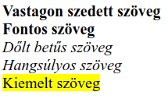

# HTML elemek

## HTML elemek

### Gyökérelem

A **html** tag az összes többi elem szülője. Ebbe kerül az oldal teljes tartalma.

```markup
<html>
<!-- Ide kerül az oldal tartalma -->
</html>
```

Jellemző, hogy az oldalak nyelvét a html elemen a **lang** tulajdonsággal határozhatjuk meg.

```markup
<html lang="hu">
```


### HTML dokumentum fejléce

A **head** a dokumentum fejléce, ezt nem jeleníti meg a böngésző, a dokumentum metaadatait tartalmazza.

```markup
<html>
    <head>
        ...
    </head>
</html>
```


### HTML elemek a fejlécben

**Az oldal címe**

A &lt;title&gt; tagben megadott szöveg azonosítja a HTML dokumentumot, és ez jelenik meg a böngészőablak címsorában. Kötelezően szerepelnie kell a &lt;head&gt; elemben.

```markup
<title>Az oldal címe</title>
```


#### **Az oldal meta adatai**

A &lt;meta&gt; elemben helyezhetünk el információkat a weboldalunkról \(ez nem jelenik meg a látható tartalomban\). A &lt;meta&gt; elemeknek egy **név** \(name\) és egy **tartalom** \(content\) tulajdonsága van. A név határozza meg a meta információ típusát, a tartalom pedig a hozzá rendelt információt.

```markup
<meta name="description" content="Oldal rövid leírása">
```

Kivétel a **charset** amivel az oldal karakter kódolását határozhatjuk meg, ez csak egy charset tulajdonsággal rendelkezik.

```markup
<meta charset="UTF-8">
```

**Példák meta információra:**

* **Description:** rövid leírás az oldalról
* **Keywords:** Az oldalhoz kapcsolódó kulcsszavak
* **Author:** Az oldal szerzője
* **Viewport:** Utasítás a böngészőnek az oldal megjelenítésének módjáról

```markup
<meta name="description" content="Oldal rövid leírása">
<meta name="keywords" content="Kulcsszavak, vesszővel, elválasztva">
<meta name="author" content="Szerző Krisztina">
<meta name="viewport" content="width=device-width, initial-scale=1.0">
```


**Linkek**

A **&lt;link&gt;** elemmel hivatkozhatunk külső állományokra, ezek egy részét be fogja tölteni a böngésző. Linkkel köthetünk be például egy CSS állományt a dokumentumunkba.

```markup
<link rel="shortcut icon" type="image/png" href="favicon.ico" />
<link rel="stylesheet" type="text/css" href="style.css" />
```


### HTML dokumentum törzse

A **&lt;body&gt;** a dokumentum törzse, ezt jeleníti meg a böngésző vizuálisan, ennek az elemnek a gyermeke az összes böngészőben megjelenő elem.

```markup
<html>
    <head>
        ...
    </head>
    <body>
        ...
    </body>    
</html>
```


### Szöveges elemek

#### **Címek**

A HTML dokumentum tartalmát 6 cím mélységig lehet fejezetekre, alfejezetekre bontani, ezt a **&lt;h1&gt;** - **&lt;h6&gt;** elemekkel tehetjük meg.

```markup
<h1>1-es cím</h1>
<h2>2-es cím</h2>
<h3>3-as cím</h3>
<h4>4-es cím</h4>
<h5>5-ös cím</h5>
<h6>6-os cím</h6>
```

**Bekezdések**

Az oldal szöveges tartalmát bekezdésekben **&lt;p&gt;** helyezhetjük el.

```markup
<p>Lorem ipsum dolor sit amet, consectetur 
adipiscing elit. Praesent et ligula magna. 
Aliquam vestibulum fringilla tincidunt. 
Etiam in leo mi. Nunc magna quam, 
consectetur eget elit in, cursus lacinia 
justo. Aenean condimentum suscipit lectus 
sit amet pharetra. Maecenas varius ac 
libero nec varius. Praesent aliquam 
tincidunt tortor, nec imperdiet nisi 
pharetra a.</p>
```

**Listák**

Két típusát különböztetjük meg, számozott lista **&lt;ol&gt;**, és pontozott lista **&lt;ul&gt;**, mindkettőnek gyermekei a lista elemek **&lt;li&gt;**.

**Számozott lista:**

```markup
<ol>
    <li>Ez egy lista elem</li>
    <li>Ez is egy lista elem</li>
    <li>És ez is</li>
</ol>
```

**Pontozott lista:**

```markup
<ul>
    <li>Ez egy lista elem</li>
    <li>Ez is egy lista elem</li>
    <li>És ez is</li>
</ul>
```

A listákat egymásba is lehet ágyazni, így lehet több szintű listákat létrehozni.

```markup
<ol>
    <li>Ez egy lista elem</li>
    <li>Ez is egy lista elem</li>
    <li>És ez is, de ennek vannak gyermekei
        <ul>
            <li>Ez egy lista elem</li>
            <li>Ez is egy lista elem</li>
            <li>És ez is</li>
        </ul>
    </li>
</ol>
```


[ Kódpélda](https://codepen.io/_lacus/pen/qPXBjQ)



### Képek

Képeket a HTML dokumentumba az **&lt;img&gt;** elem segítségével tudunk beilleszteni. Két _kötelező_ tulajdonsága van, az **src**, ami a behivatkozott kép elérési útvonala, és az **alt,** a kép tartalmának szöveges leírata.

```markup

```

Ha a képünk csak dekorációs célokat szolgál, és nem kapcsolódik szorosan a dokumentum szöveges tartalmához, akkor is kötelező az alt tulajdonság, de üresen hagyhatjuk az értékét.

```markup

```

A képeket a böngésző megpróbálja eredeti méretükben megjeleníteni, amennyiben a megfelelő ablakméret rendelkezésre áll. A szélesség \(width\) és a magasság \(height\) tulajdonságokkal ezt felülbírálhatjuk. Ha csak az egyik értéket adjuk meg a böngésző az oldalarányok megtartásával számolja ki a másikat.  
Az értékek pixelben értendőek.

```markup

```

### 

### Szövegközi elemek

A HTML elemekben lévő szöveget szövegközi \(inline\) elemekkel módosíthatjuk.

```markup
<p>A <strong>Web</strong> alapelveit <em>Tim Berners-Lee</em>, a
CERN részecskefizikai kutatóközpont munkatársa dolgozta ki
1989-ben. Eredeti  célja a különböző intézményekben világszerte 
dolgozó kutatók közötti  automatizált <em>információmegosztás</em> 
volt.</p>
```

A fenti példakódban a bekezdés egyes szakaszai fontosként \(&lt;strong&gt;\), vagy hangsúlyosként \(&lt;em&gt;\) vannak megjelölve.

 **&lt;b&gt;** Vastagon szedett szöveg, szemantikus jelentése nincs.  
**&lt;strong&gt;** Fontos szövegrészlet, vastagon jelenik meg.  
**&lt;i&gt;** Dőlt betűs szöveg, szemantikus jelentése nincs.  
**&lt;em&gt;** Hangsúlyos szöveg, dőlt betűvel jelenik meg.  
**&lt;mark&gt;** Megjelölt szöveg, sárga háttérrel jelenik meg

```markup
<p>
    <b>Vastagon szedett szöveg</b> <br>
    <strong>Fontos szöveg</strong> <br>
    <i>Dőlt betűs szöveg</i> <br>
    <em>Hangsúlyos szöveg</em> <br>
    <mark>Kiemelt szöveg</mark>
</p>
```



**&lt;big&gt;**Növeli a font méretet.  
**&lt;small&gt;**Csökkenti a font méretet.  
**&lt;time&gt;**Időt jeleníthetünk meg vele.  
**&lt;sup&gt;**Felső index, megemeli a szöveget  
**&lt;sub&gt;**Alsó index, lesüllyeszti a szöveget  
**&lt;s&gt;**Elavult információt jelöl, vonallal áthúzva jelenik meg.

```markup
<p>
    <big>Nagy méretű szöveg</big> <br>
    <small>Kis méretű szöveg</small> <br>
    <time>20:00</time> <br>
    E=mc<sup>2</sup> <br>
    H<sub>2</sub>O <br>
    <s>Elavult imformáció</s>
</p>
```


