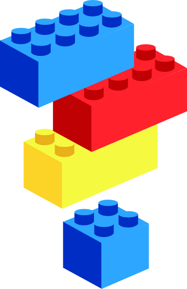

# Mi a HTML?



## Mi a HTML?

A HTML egy a webes szabványok közül. A webes szabványok közül a legfontosabb a **HTML**, a **CSS és** a **JavaScript**, ezek hármasa együtt alkotja a weboldalak technológiai alapját.

**HTML** egy mozaikszó, jelentése **H**yper**T**ext **M**arkup **L**anguage, vagyis **hiperszöveges jelölőnyelv.**

A **HTML** egy leírónyelv, ami a webalkalmazások strukturális vázát, tartalmát adja.

A **HTML**-t mint szabványt a [**W3C**](https://hu.wikipedia.org/wiki/W3C) \(World Wide Web Consortium\) kezeli.

A **HTML** nyelv elsajátítása az első lépés azon az úton aminek a végén képessé válunk weboldalakat, web alapú alkalmazásokat készíteni.

## Építőelemek

A **HTML** dokumentum **tag**-ekből \(címke\) épül fel, ezekből képezi le a böngésző a HTML **elemeket**, miután beolvasta és feldolgozta a dokumentumot. 

Egy lehetséges HTML elem:

```markup
<elem tulajdonsag="ertek">tartalom</elem>
```

## **Hiperhivatkozások**

A weboldalak legfontosabb építőelemei a hiperhivatkozások \(link vagy hyperlink\). Ezek kötik össze egy globális egységgé a weben található dokumentumokat.

```markup
<a href="fontos.html">Fontos információ!<a>
```


