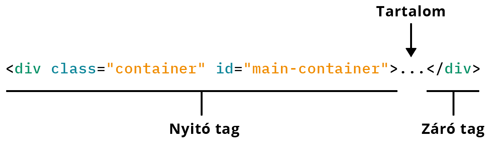
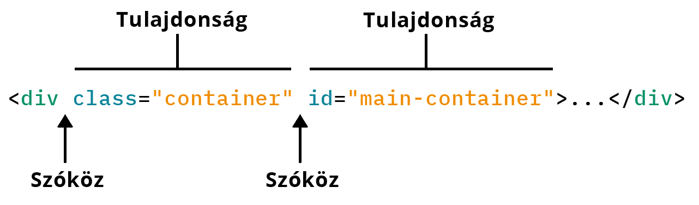
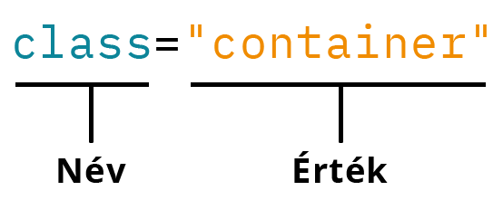

# HTML állomány felépítése

## HTML állomány kiterjesztése

A HTML állományok kiterjesztése `.html` vagy `.htm` lehet.

A böngészők, és a fejlesztésre használt szövegszerkesztők automatikusan felismerik, és statikus weboldalként kezelik ezeket az állományokat.

## Doctype

A HTML dokumentum a típusmeghatározással kezdődik, ez a `!DOCTYPE`.

Ez alapján azonosítja be a böngésző a dokumentum típusát, ettől függ az elemek megjelenítésének módja.

Kötelezően a HTML állomány **első sorában, a többi elem előtt** kell elhelyezni.

A `!DOCTYPE` **nem érzékeny** a kis- és nagybetűk különbözőségére

### **XHTML 1.0**:

```markup
<!DOCTYPE html PUBLIC "-//W3C//DTD XHTML 1.0 Transitional//EN" ".../xhtml1-transitional.dtd">
```

```markup
<!DOCTYPE html PUBLIC "-//W3C//DTD XHTML 1.0 Strict//EN" ".../xhtml1-strict.dtd">
```

```markup
<!DOCTYPE html PUBLIC "-//W3C//DTD XHTML 1.0 Frameset//EN" ".../xhtml1-frameset.dtd">
```

Régebbi verzióknál a `!DOCTYPE` tartalmazta a **DTD** \(Document Type Definition\) állományokra mutató hivatkozást, a **HTML 5** esetében ez az elem is egyszerűsödött.

### HTML 5

```markup
<!DOCTYPE html>
```


Mi történik akkor ha elhagyjuk a dokumentum típusát? A böngésző megpróbálja kitalálni a dokumentum tartalma alapján, hogy hogyan kell azt megjelenítenie. Ez a _quirks mode_, ami erőforrás igényesebb a normális futásnál, így lassabban tölti be az oldalt, mintha eleve megmondanánk neki, hogy hogyan jelenítse meg azt \(spórolva a kliens gép erőforrásaival\).


## Megjegyzések \(Comment\)

A HTML állományban elhelyezhetők megjegyzések:

```markup
<!-- Ez egy megjegyzés -->
```

A megjegyzés nyitó `<!--`, és záró `-->` karaktersorozata közötti részt a böngésző figyelmen kívül hagyja.

A megjegyzés lehet kód magyarázat, jelölhetjük vele szekciók elejét és végét, ez a forráskód olvashatóságát könnyíti.

Elrejthetünk vele HTML elemeket is:

```markup
<ul>
    <li>Alma</li>
    <!--<li>Körte</li>-->
    <li>Barack</li>
</ul>
```

A fenti példában a középső lista elemet nem hozza létre a böngésző.

## HTML Címkék \(Tag\)

A **HTML** dokumentum **tag**-ekből \(címke\) épül fel, ezekből képezi le a böngésző a **HTML** **elemeket**, miután beolvasta a dokumentumot.

Egy lehetséges HTML elem:

```markup
<elem tulajdonsag="ertek">tartalom</elem>
```

A **HTML** elemek **nyitó** és **záró** **tagből** állnak, amennyiben lehet tartalmuk:



Az elemek egymásba ágyazhatóak:

```markup
<ul>
    <li>Ez egy lista elem</li>
    <li>Ez egy másik lista elem</li>
    <li>Ez pedig egy harmadik!</li>
</ul>
```

A fenti példában az `ul` egy lista, amiben lista elemek `li` vannak, ez a **tartalma**. Az `li`-k az `ul` **gyermek elemei**, és egymásnak **testvér elemei**.

Vannak **HTML elemek**, amiknek nem lehet tartalma, így záró tag-re nincs szükség:

```markup
<br> <!-- Sortörés -->

<hr> <!-- Vízszintes vonal -->

 <!-- Kép -->
```

## Tulajdonságok \(Atributes\)

A HTML elemeket fel lehet ruházni tulajdonságokkal, illetve egyes HTML elemeknek kötelező megadni bizonyos tulajdonságokat.

Korábbi példa:

```markup
<elem tulajdonsag="ertek">tartalom</elem>
```

A tulajdonságok a nyitó tag-ben helyezhetőek el, szóközökkel elválasztva egymástól, és HTML tag nevétől.



Minden tulajdonság egy **név-érték** pár, balra a tulajdonság neve, jobbra az értéke, egyenlőségjellel elválasztva.



Az értéket idézőjelbe kell tenni, ha tartalmaz szóközt. Bár nem kötelező, az olvashatóság megkönnyítése érdekében ezt érdemes minden esetben kitenni.

Egyes tulajdonságok a HTML elemünk azonosítását könnyítik meg.

Az `id` \(egyedi azonosító\) tulajdonsággal egyedi nevet adhatunk elemeinknek:

```markup
<h1 id="main-title">Ez a főcím</h1>
```

Az `class` \(osztály\) tulajdonság csoportokba szervezi az elemeket:

```markup
<p class="red">Én a pirosak közé tartozom?</p>
<p class="blue">Igen, én kék vagyok, de ettől még lehetünk barátok...</p>
```

További példák tulajdonságokra:

```markup
<input type="text">      <!-- Szövegbeviteli mező -->
<input type="button">    <!-- Gomb --> 
<input type="checkbox">  <!-- Pipa --> 
<input type="password">  <!-- Jelszó -->
```

Az `input` \(beviteli mező\) elem megjelenése és viselkedése a `type` tulajdonságától függ.

Következő példában egy `img` \(kép\), az `src` a képállományra mutató hivatkozás, a `title` a kép címe, az `alt` pedig a kép tartalmának szöveges leirata:

```markup

```

## Példa HTML állomány

Ebben a példában egy egyszerű HTML állomány tartalma látható:



```markup
<!DOCTYPE html>
<html lang="hu">
    <head>
        <meta charset="UTF-8">
        <title>Helló Világ!</title>
    </head>
    <body>
        <h1>Helló Világ</h1>
    </body>
</html>
```



