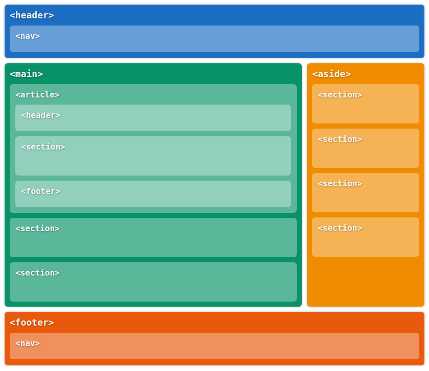

# HTML elemek

## Gyökérelem

A **html** tag az összes többi elem szülője. Ebbe kerül az oldal teljes tartalma.

```markup
<html>
<!-- Ide kerül az oldal tartalma -->
</html>
```

Jellemző, hogy az oldalak nyelvét a html elemen a **lang** tulajdonsággal határozhatjuk meg.

```markup
<html lang="hu">
```

## HTML dokumentum fejléce

A **head** a dokumentum fejléce, ezt nem jeleníti meg a böngésző, a dokumentum metaadatait tartalmazza.

```markup
<html>
    <head>
        ...
    </head>
</html>
```

## HTML elemek a fejlécben


### **Az oldal címe**

A &lt;title&gt; tagben megadott szöveg azonosítja a HTML dokumentumot, és ez jelenik meg a böngészőablak címsorában. Kötelezően szerepelnie kell a &lt;head&gt; elemben.

```markup
<title>Az oldal címe</title>
```


### **Az oldal meta adatai**

A &lt;meta&gt; elemben helyezhetünk el információkat a weboldalunkról \(ez nem jelenik meg a látható tartalomban\). A &lt;meta&gt; elemeknek egy **név** \(name\) és egy **tartalom** \(content\) tulajdonsága van. A név határozza meg a meta információ típusát, a tartalom pedig a hozzá rendelt információt.

```markup
<meta name="description" content="Oldal rövid leírása">
```

Kivétel a **charset** amivel az oldal karakter kódolását határozhatjuk meg, ez csak egy charset tulajdonsággal rendelkezik.

```markup
<meta charset="UTF-8">
```

**Példák meta információra:**

* **Description:** rövid leírás az oldalról
* **Keywords:** Az oldalhoz kapcsolódó kulcsszavak
* **Author:** Az oldal szerzője
* **Viewport:** Utasítás a böngészőnek az oldal megjelenítésének módjáról

```markup
<meta name="description" content="Oldal rövid leírása">
<meta name="keywords" content="Kulcsszavak, vesszővel, elválasztva">
<meta name="author" content="Szerző Krisztina">
<meta name="viewport" content="width=device-width, initial-scale=1.0">
```

### **Linkek**

A **&lt;link&gt;** elemmel hivatkozhatunk külső állományokra, ezek egy részét be fogja tölteni a böngésző. Linkkel köthetünk be például egy CSS állományt a dokumentumunkba.

```markup
<link rel="shortcut icon" type="image/png" href="favicon.ico" />
<link rel="stylesheet" type="text/css" href="style.css" />
```

## HTML dokumentum törzse

A **&lt;body&gt;** a dokumentum törzse, ezt jeleníti meg a böngésző vizuálisan, ennek az elemnek a gyermeke az összes böngészőben megjelenő elem.

```markup
<html>
    <head>
        ...
    </head>
    <body>
        ...
    </body>    
</html>
```

## Szöveges elemek

### **Címek**

A HTML dokumentum tartalmát 6 cím mélységig lehet fejezetekre, alfejezetekre bontani, ezt a **&lt;h1&gt;** - **&lt;h6&gt;** elemekkel tehetjük meg.

```markup
<h1>1-es cím</h1>
<h2>2-es cím</h2>
<h3>3-as cím</h3>
<h4>4-es cím</h4>
<h5>5-ös cím</h5>
<h6>6-os cím</h6>
```

### **Bekezdések**

Az oldal szöveges tartalmát bekezdésekben **&lt;p&gt;** helyezhetjük el.

```markup
<p>Lorem ipsum dolor sit amet, consectetur 
adipiscing elit. Praesent et ligula magna. 
Aliquam vestibulum fringilla tincidunt. 
Etiam in leo mi. Nunc magna quam, 
consectetur eget elit in, cursus lacinia 
justo. Aenean condimentum suscipit lectus 
sit amet pharetra. Maecenas varius ac 
libero nec varius. Praesent aliquam 
tincidunt tortor, nec imperdiet nisi 
pharetra a.</p>
```

### **Listák**

Két típusát különböztetjük meg, számozott lista **&lt;ol&gt;**, és pontozott lista **&lt;ul&gt;**, mindkettőnek gyermekei a lista elemek **&lt;li&gt;**.

#### **Számozott lista:**

```markup
<ol>
    <li>Ez egy lista elem</li>
    <li>Ez is egy lista elem</li>
    <li>És ez is</li>
</ol>
```

#### **Pontozott lista:**

```markup
<ul>
    <li>Ez egy lista elem</li>
    <li>Ez is egy lista elem</li>
    <li>És ez is</li>
</ul>
```

A listákat egymásba is lehet ágyazni, így lehet több szintű listákat létrehozni.

```markup
<ol>
    <li>Ez egy lista elem</li>
    <li>Ez is egy lista elem</li>
    <li>És ez is, de ennek vannak gyermekei
        <ul>
            <li>Ez egy lista elem</li>
            <li>Ez is egy lista elem</li>
            <li>És ez is</li>
        </ul>
    </li>
</ol>
```


[ Kódpélda](https://codepen.io/_lacus/pen/qPXBjQ)


## Képek

Képeket a HTML dokumentumba az **&lt;img&gt;** elem segítségével tudunk beilleszteni. Két _kötelező_ tulajdonsága van, az **src**, ami a behivatkozott kép elérési útvonala, és az **alt,** a kép tartalmának szöveges leírata.

```markup

```

Ha a képünk csak dekorációs célokat szolgál, és nem kapcsolódik szorosan a dokumentum szöveges tartalmához, akkor is kötelező az alt tulajdonság, de üresen hagyhatjuk az értékét.

```markup

```

A képeket a böngésző megpróbálja eredeti méretükben megjeleníteni, amennyiben a megfelelő ablakméret rendelkezésre áll. A szélesség \(width\) és a magasság \(height\) tulajdonságokkal ezt felülbírálhatjuk. Ha csak az egyik értéket adjuk meg a böngésző az oldalarányok megtartásával számolja ki a másikat.  
Az értékek pixelben értendőek.

```markup

```


Fontos kitölteni a képek alternatív leírását, mert ha a kép nem tud betöltődni ez a szöveg fog megjelenni a felhasználóknak, illetve a gyengénlátó felhasználók csak ezt "látják", ezt olvassa fel nekik a szövegfelolvasó programjuk. Az internetes keresők \(a szövegkörnyezet mellett\) az alternatív leírás alapján kategorizálják be a honlapokon található képeket \(ennek hiányában nem fog megjelenni a kép a képkeresőkben\).


## Szövegközi elemek

A HTML elemekben lévő szöveget szövegközi \(inline\) elemekkel módosíthatjuk.

```markup
<p>A <strong>Web</strong> alapelveit <em>Tim Berners-Lee</em>, a
CERN részecskefizikai kutatóközpont munkatársa dolgozta ki
1989-ben. Eredeti  célja a különböző intézményekben világszerte 
dolgozó kutatók közötti  automatizált <em>információmegosztás</em> 
volt.</p>
```

A fenti példakódban a bekezdés egyes szakaszai fontosként \(&lt;strong&gt;\), vagy hangsúlyosként \(&lt;em&gt;\) vannak megjelölve.

 **&lt;b&gt;** Vastagon szedett szöveg, szemantikus jelentése nincs.  
**&lt;strong&gt;** Fontos szövegrészlet, vastagon jelenik meg.  
**&lt;i&gt;** Dőlt betűs szöveg, szemantikus jelentése nincs.  
**&lt;em&gt;** Hangsúlyos szöveg, dőlt betűvel jelenik meg.  
**&lt;mark&gt;** Megjelölt szöveg, sárga háttérrel jelenik meg

```markup
<p>
    <b>Vastagon szedett szöveg</b> <br>
    <strong>Fontos szöveg</strong> <br>
    <i>Dőlt betűs szöveg</i> <br>
    <em>Hangsúlyos szöveg</em> <br>
    <mark>Kiemelt szöveg</mark>
</p>
```


**&lt;big&gt;** Növeli a font méretet.  
**&lt;small&gt;** Csökkenti a font méretet.  
**&lt;time&gt;** Időt, dátumot jeleníthetünk meg vele.  
**&lt;sup&gt;** Felső index, megemeli a szöveget  
**&lt;sub&gt;** Alsó index, lesüllyeszti a szöveget  
**&lt;s&gt;** Elavult információt jelöl, vonallal áthúzva jelenik meg.

```markup
<p>
    <big>Nagy méretű szöveg</big> <br>
    <small>Kis méretű szöveg</small> <br>
    <time>20:00</time> <br>
    E=mc<sup>2</sup> <br>
    H<sub>2</sub>O <br>
    <s>Elavult imformáció</s>
</p>
```



Egyes szövegközi elemek csak vizuális hatást érnek el, egyes elemek jelentésbeni külömbséget is hordoznak. Például a **strong** elemben található szöveget nagyobb súllyal veszi figyelembe a google kereső, vagy az _em_ elemben lévő szöveget más hangsúllyal ejtik ki a szövegfelolvasó programok. Ezek az elemek elsősorban a webalkalmazás szövegét feldolgozó programoknak szolgáltatnak fontos információkat.


### Span

Van egy szövegközi elem, ami nem hordoz jelentéstartalmat, és nem módosítja a bele foglalt szöveget vizuálisan. ez a **span** elem \(szabad fordításban dirib-darab\).  

```markup
<p>Ebben a szövegben van egy <span>szakasz</span>, aminek 
nem módosul a kinézete, és a szemantikai jelentése</p>
```


Felmerül a kérdés, hogy mi az értelme egy elemnek, ami nem ad jelentést konteksztustól függően, és megjelenésben sem okoz érzékelhető változást. Több okból is előnyös lehet: segíti a dokumentum tartalmának struktúrálását, illetve CSS segítségével módosíthatjuk a megjelenését.


## Strukturális elemek

### **Div**

A **&lt;div&gt;** elemmel hozhatunk létre általános gyűjtőelemeket, úgynevezett konténereket. A **&lt;div&gt;** nem hordoz semmilyen jelentéstartalmat, és a megjelenése is teljesen semleges \(hasonlóan a korábban tárgyalt _span_ elemhez\).

### **A div szemantikus variációi**

A HTML korábbi verzióiban a **&lt;div&gt;** elemet ruháztuk fel szerepekkel a role tulajdonság segítségével, ez a lehetőség most is megvan, de megjelentek a HTML5-ben új elemek amik kiváltják ezt az igényt.

 **&lt;nav&gt;** Navigációt tartalmaz, rendszerint &lt;a&gt; ****elemeket listába rendezve.  
**&lt;header&gt;** Egy tartalmi blokk, vagy akár az egész dokumentum fejléce.  
**&lt;main&gt;** Fő tartalmi terület \(egy dokumentumban csak egy lehet\)  
**&lt;aside&gt;** Másodlagos tartalom \(sidebar\)  
**&lt;footer&gt;** Egy tartalmi blokk, vagy akár az egész dokumentum lábléce.  
**&lt;section&gt;** Tartalmilag összefüggő egység  
**&lt;article&gt;** Összefüggő cikk, bejegyzés, fejezet.



## Űrlapok

### **Az űrlap elem**

Űrlapokat a **&lt;form&gt;** elemmel hozhatunk létre, az összes kitölthető űrlap mező \(pár kivételtől eltekintve\) ebben az elemben helyezendő el. A &lt;form&gt; elem képes a tartalmát elküldeni a webszervernek.

```markup
<form>
    ...
</form>
```

### **A beviteli elem**

Az űrlap mezőit az **&lt;input&gt;** elemmel hozhatjuk létre. Az input elem viselkedését, kinézetét meghatározza a típus \(type\) tulajdonsága.

```markup
<form>
    <input id="name" type="text" placeholder="Your name">
</form>
```

```markup
<form>
    <label>Szövegbeviteli mező</label> <input type="text"> <br>
    <label>E-mail</label> <input type="email"> <br>
    <label>Jelszó</label> <input type="password"> <br>
    <label>Állomány feltöltés</label> <input type="file"> <br>
    <label>Rádiógomb</label> <input type="radio"> <br>
    <label>Jelölőnégyzet</label> <input type="checkbox"> <br>
    <label>Gomb</label> <input type="button" value="Elküldés">
</form>
```


### **Címke elem**

Az űrlap beviteli mezőit a **&lt;label&gt;** elem látja el feliratokkal. A label elem "for" tulajdonságában megadott egyedi azonosító összeköti a labelt az azonosítóval ellátott beviteli mezővel. Ekkor ha a címkére kattintunk, a kurzor automatikusan beáll a beviteli mezőbe.

```markup
<form>
    <label for="name">Your Name</label>
    <input id="name" type="text">
</form>
```

Ez a kötés létrejön akkor is, ha a beviteli mező a &lt;label&gt; gyermeke:

```markup
<form>
    <label>
        Your Name
        <input id="name" type="text">
    </label>
</form>
```

### **Szövegdoboz**

A **&lt;textarea&gt;** hasonló a szöveges beviteli mezőhöz, csak ez egy több soros, és átméretezhető beviteli eszköz.

A "rows" és "cols" tulajdonságaival meghatározhatjuk a kiinduló méretét is.

```markup
<form>
    <textarea rows="4" cols="50"></textarea>
</form>
```

### **Lenyíló lista**

A **&lt;select&gt;** elem **&lt;option&gt;** elemeket tartalmaz, ezek a lenyíló lista választható opciói.  
Az &lt;option&gt; elemek közül az lesz az alapértelmezett, amelyik rendelkezik selected tulajdonsággal.

```markup
<select>
    <option selected>Almafa</option>
    <option>Körtefa</option>
    <option>Barackfa</option>
</select>
```


## Táblázatok

### **Táblázat**

A **&lt;table&gt;** elem a táblázat szülőeleme, a sorokat a **&lt;tr&gt;** elemek képzik, az oszlopokat, vagy cellákat a **&lt;td&gt;** elemek.

```markup
<table>
    <tr>
        <td>Első sor, első oszlop</td>
        <td>Első sor, második oszlop</td>
    </tr>
    <tr>
        <td>Második sor, első oszlop</td>
        <td>Második sor, második oszlop</td>
    </tr>
</table>
```

### **Táblázat fejléc**

Táblázat cella helyett lehet táblázat fejléc cellát alkalmazni, ez a **&lt;th&gt;** elem. A táblázat fejléc cellában lévő tartalom vizuálisan hangsúlyosabban jelenik meg.

```markup
<!-- Fejléc cellák vízszintesen -->
<table>
    <tr>
        <th>Fejléc</th>
        <th>Fejléc</th>
        <th>Fejléc</th>
    </tr>
    <tr>
        <td>Cella</td>
        <td>Cella</td>
        <td>Cella</td>
    </tr>
</table>


<!-- Fejléc cellák függőlegesen -->
<table>
    <tr>
        <th>Fejléc</th>
        <td>Cella</td>
        <td>Cella</td>
    </tr>
    <tr>
        <th>Fejléc</th>
        <td>Cella</td>
        <td>Cella</td>
    </tr>
</table>
```

