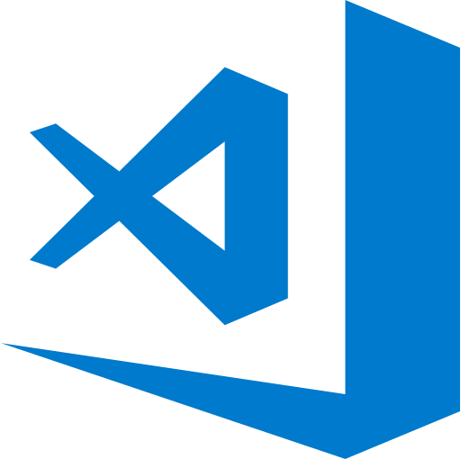
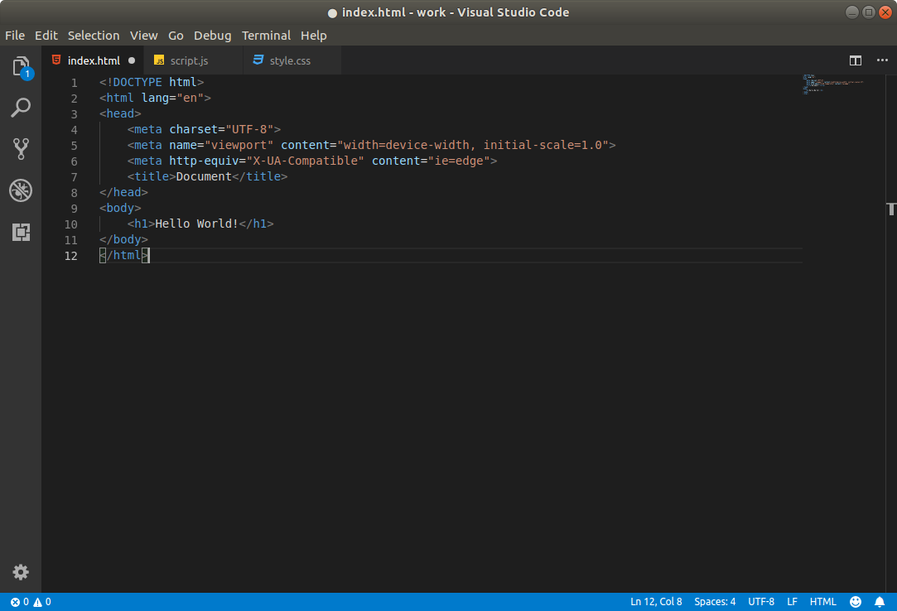

# Mi a VS Code?

A Visual Studio Code \(röviden VS code vagy Code\) a Microsoft cég által fejlesztett ingyenes és nyílt forráskódú **szövegszerkesztő**. 

Támogatja az automatikus kódkiegészítést \(InteliSense, Emmet\), rendelkezik beépített hibakeresővel, és Git verziókezelő támogatással, és még számos egyéb szolgáltatással. [Bővítmények](https://marketplace.visualstudio.com/VSCode) segítségével további szolgáltatások, és funkciók adhatóak hozzá.

A felhasználói igényeknek megfelelően testreszabható, ebben sokat segítenek a letölthető [színsémák](https://marketplace.visualstudio.com/search?target=VSCode&category=Themes&sortBy=Downloads).

 A VS Code több platformos alkalmazás, elérhető **Windows, Linux** és **OS X** operációs rendszerekre. 

A VS Code honlapja: [https://code.visualstudio.com/](https://code.visualstudio.com/)

Videó kezdőknek: [https://www.youtube.com/watch?v=Sdg0ef2PpBw](https://www.youtube.com/watch?v=Sdg0ef2PpBw)

A VS Code forráskódja megtekinthető a Github-on: [https://github.com/Microsoft/vscode](https://github.com/Microsoft/vscode)

