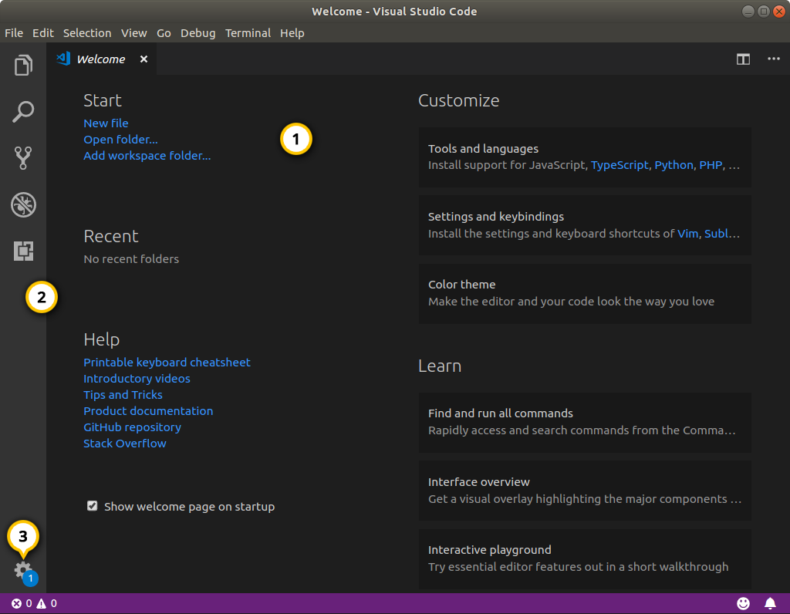
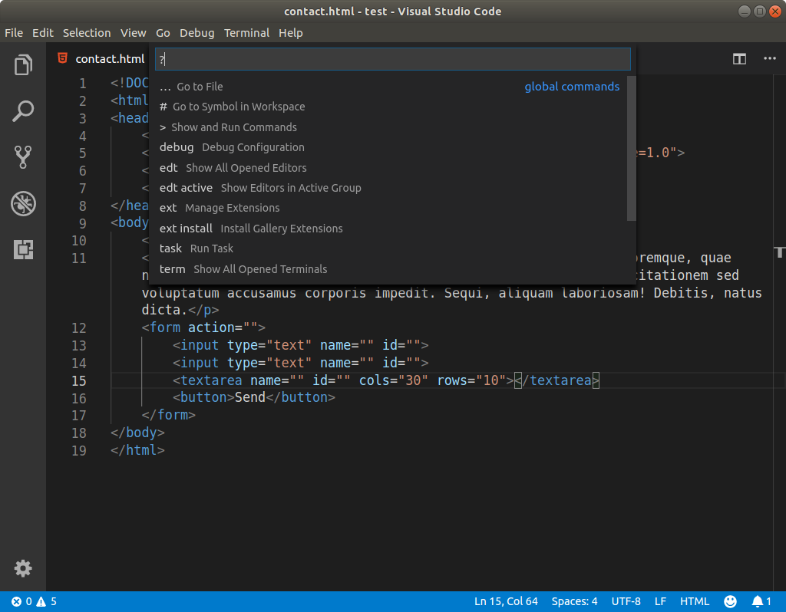
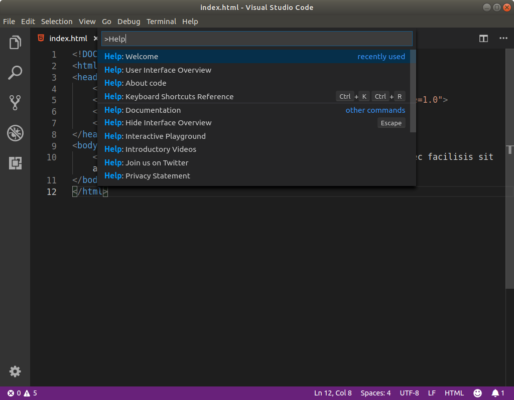
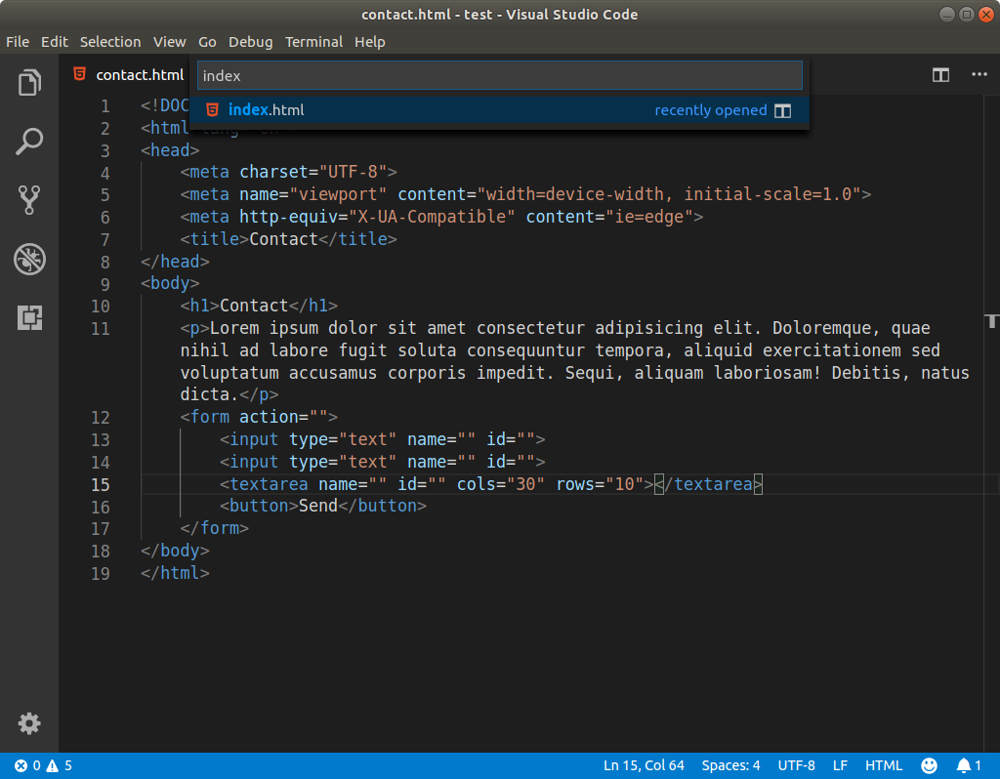
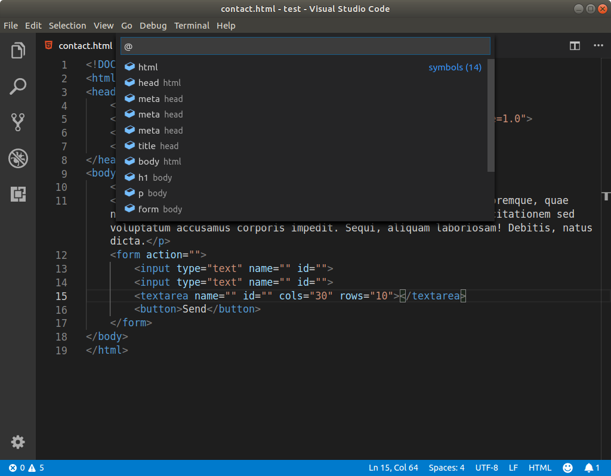

# VS Code anatómiája

## Első lépések

Első indításkor egy üdvözlő képernyőt kapunk, itt azonnal elérünk pár funkciót, többek között egy segítség listát a kezdeti lépésekhez. Az üdvözlőképernyőt újra elő tudjuk hozni a **Help** menüből, válasszuk a **Wolcome** menüpontot..

1 - Üdvözlő képernyő  
2 - Tevékenységek \(Activity bar\)  
3 - Beállítások

## Parancs paletta

A legfontosabb, legsokoldalúbb eszköze a VS Code-nak a **parancs paletta**, több funkciója van, ezekhez a funkciókhoz különböző billentyű kombinációk társulnak. Ezeket a funkciókat áttekinthetjük, ha csak egy kérdőjelet írunk a parancs palettába.

### VS Code parancsok - Ctrl + Shift + p

Ez megnyitja a parancs palettát, és a paletta keresője az összes VS Code parancs között szűr. Például ha beírjuk, hogy _help_, a parancs paletta felsorolja az összes parancsot, ami a VS Code dokumentációjável, a a segítség menüpontokkal kapcsolatos.

Figyeljük meg, hogy ebben a módban egy &gt; karakter jelenik meg a paletta szűrőjében.

### Navigáció az állományok között - Ctrl + p  

Így a megnyitott mappa állományai között lehet keresni, gépeljük be az állomány nevét, és a VS Code a megfelelő állományt fogja megnyitni.

Ha az állomány neve után kettőspontot írunk, és beírunk egy számot, a VS Code a megfelelő számú sorra fog ugrani.

### Navigáció az állományon belül - Ctrl + g 

A kettőspontos módszer működik állománynév nélkül is, ebben az esetben a szerkesztő a megnyitott állomány megfelelő sorára ugrik.

### Navigáció a megnyitott állományok \(tabok\) között - Ctrl + Shift + Tab

A megnyitott tabok között tudunk így váltani, ez akkor hasznos ha sok tabunk van megnyitva.

### **Navigáció szimbólumok között - Ctrl + Shift + o**

Egy állományon belül tudunk így navigálni a HTML elemek, vagy CSS stílusok között, esetleg a JavaScript funkciók között.

Ha a listából kiválasztunk egy elemet, a szerkesztő automatikusan a megfelelő sorra ugrik.

