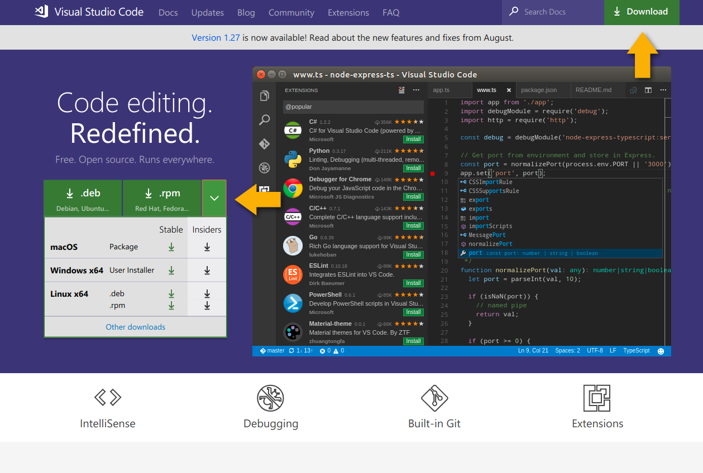
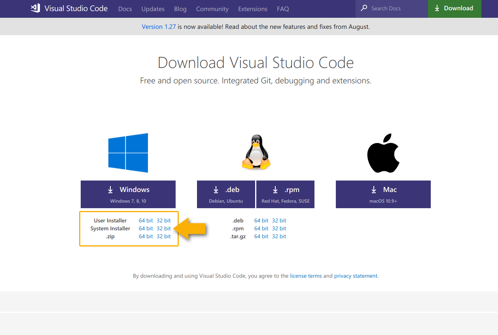

# VS Code beszerzése, telepítése

## Beszerzés

A  Visual Studio Code ingyenesen beszerezhető a gyártó honlapján, a letöltések alatt: [https://code.visualstudio.com/](https://code.visualstudio.com/)

Válasszuk az operációs rendszerünknek leginkább megfelelő verziót, és a letöltött telepítőt futtassuk.

A **.zip** verzió Microsoft Windows operációs rendszereken telepítés nélkül is futtatható pendrive-ról is. A futtatáshoz csomagoljuk ki a tömörített csomagot, és futtassuk a **Code.exe** állományt.

