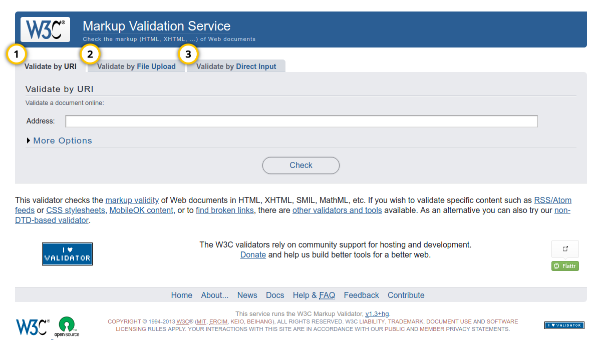
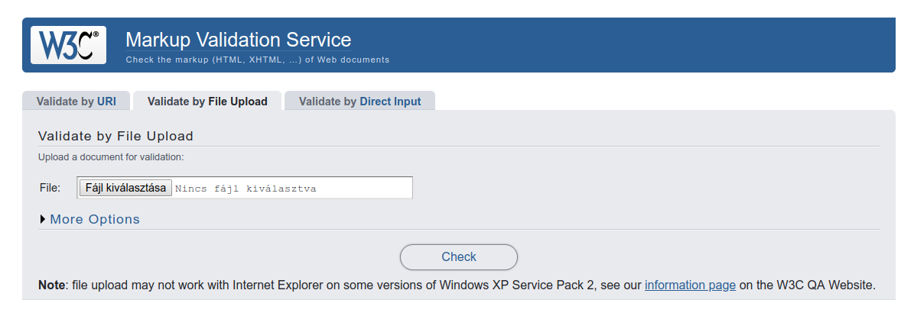
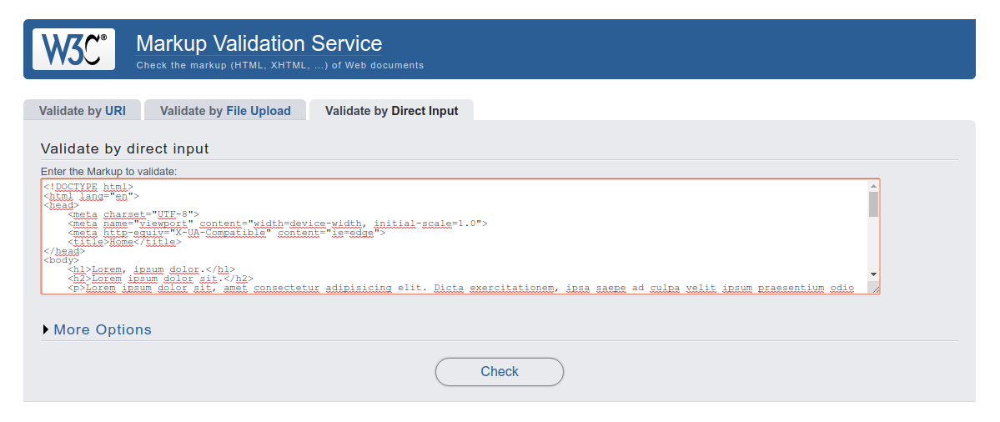

# W3C Validator használata

## Kód beküldése ellenőrzésre

Három módon küldhetünk be HTML kódot ellenőrzésre, a nekünk megfelelő módot a validátor űrlapjának tetején a tabokon választhatjuk ki.

1. Megadhatunk egy URL-t vagy webcímet ellenőrzésre.
2. Feltölthetünk egy állományt a számítógépünkről, a feltöltött állományt fogja ellenőrizni a validator.
3. Copy/paste-el bevághatunk egy teljes, vagy részleges HTML állomány tartalmat ellenőrzésre.

## További beállítások

...

